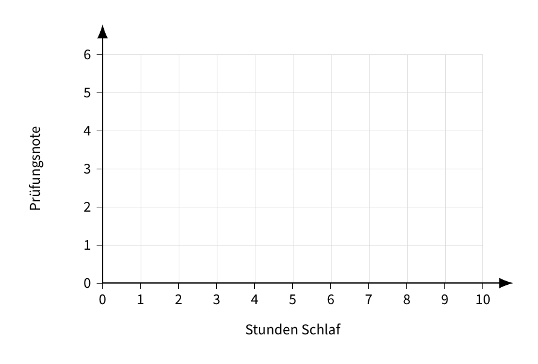
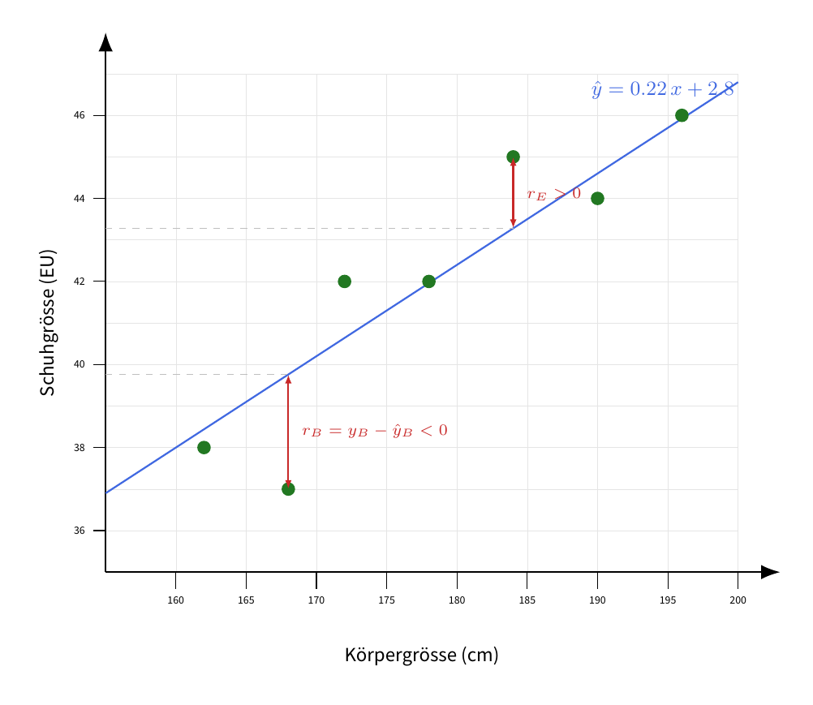
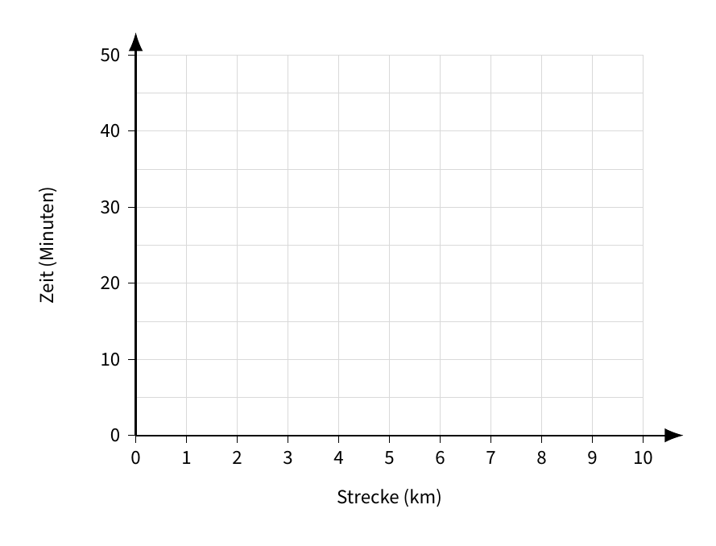

# Lineare Regression

## Vorhersagen mit Linien

Wir betrachten Beobachtungen der Form $x \rightarrow y$ (Eingabe $\rightarrow$ Ausgabe).

Wir suchen eine Funktion, die $y$ *schätzt*:

$$\hat{y} = f(x)$$

::: {.callout-tip icon=false}
## Aufgabe 1 — Daten sammeln

Überlege für das Beispiel **«Stunden schlafen → Prüfungsnote»**: Schreibe für jede Stundenzahl auf der $x$-Achse eine Schätzung für die erwartete Prüfungsnote auf und trage die Punkte im Koordinatensystem ein.

$$
(0,\ \underline{\hspace{1cm}}),\quad
(4,\ \underline{\hspace{1cm}}),\quad
(6,\ \underline{\hspace{1cm}}),\quad
(7,\ \underline{\hspace{1cm}}),\quad
(8,\ \underline{\hspace{1cm}}),\quad
(9,\ \underline{\hspace{1cm}}),\quad
$$

{width=100%}
:::

## Die Linie

Eine **lineare Funktion** hat die Form

$$\hat{y} = \underline{\hspace{2cm}} \cdot x + \underline{\hspace{2cm}}$$

Bezeichne die zwei Teile:

- **Steigung**: $m =$ \_\_\_\_\_\_\_\_\_\_\_\_\_\_\_\_\_\_\_\_\_\_\_\_\_\_
- \_\_\_\_\_\_\_\_\_\_\_\_: \_\_\_\_\_ $=$ Wert von $\hat{y}$ bei $x =$ \_\_\_\_

::: {.callout-tip icon=false}
## Aufgabe 2 — Beste Linie schätzen

Was ist ungefähr die beste Linie, um die Punkte aus Aufgabe 1 zu beschreiben? Schreibe die Gleichung auf:

$$\hat{y} = \underline{\hspace{2cm}} \cdot x + \underline{\hspace{2cm}}$$

Würde die Linie immer noch gut passen, wenn wir noch mehr Punkte von vielen anderen Personen hätten?
:::

::: {.callout-tip icon=false}
## Aufgabe 3 — Bedeutung der Linie

Stell dir vor, wir hätten die Daten (Schlafdauer, Prüfungsnote) von allen Schülerinnen und Schülern der Kantonsschule Kreuzlingen gesammelt und daraus die «beste» Linie gefunden.

a) Welche praktische Bedeutung hat der Wert bei $x = 0$?
b) Werden die meisten Punkte genau auf der Linie liegen?
c) Für wen könnte eine solche Linie nützlich sein und zu welchem Zweck?
:::

## Wie messen wir «gut»?

Angenommen, wir haben eine Linie $f(x) = mx + b$ gewählt. Wir bezeichnen die Vorhersage für einen Punkt $x$ mit $\hat{y} = f(x)$.

Für einen Datenpunkt $(x, y)$ und eine Vorhersage $\hat{y}$ definieren wir den **Fehler** (Residuum):

$$r = y - \hat{y}$$

*Beispiel:* Für $x = 4$ sagt eine Linie $\hat{y} = 7$, das echte $y$ ist $8$.
$$r = 8 - 7 = 1$$

Das folgende Bild zeigt einen Scatter-Plot mit einer Regressionslinie und zwei eingezeichneten Residuen:

{width=100%}

### Mean Squared Error (MSE)

So bestimmst du den MSE für $n$ Punkte Schritt für Schritt:

1. Für jeden Punkt $i = 1, 2, \dots, n$: berechne die Vorhersage $\hat{y}_i$ mit deiner Linie.
2. Berechne den Fehler (Residuum) $r_i = y_i - \hat{y}_i$.
3. Quadriere den Fehler: $r_i^2$.
4. Bilde den Durchschnitt der quadrierten Fehler:

$$
\text{MSE}
= \frac{r_1^2 + r_2^2 + \dots + r_n^2}{n}
= \frac{1}{n} \sum_{i=1}^{n} r_i^2
= \frac{1}{n} \sum_{i=1}^{n} (y_i - \hat{y}_i)^2
$$

**Warum wird quadriert?**

&nbsp;

&nbsp;

Ziel: Finde die Linie mit dem \_\_\_\_\_\_\_\_\_\_ MSE.

::: {.callout-tip icon=false}
## Aufgabe 4 — MSE von Hand berechnen

Die folgenden Daten stammen von 10 Messungen für die **Fahrzeit** ($y$, in Minuten) in Abhängigkeit von der **Strecke** ($x$, in Kilometern).  
Prüfe den Vorschlag $\hat{y} = 6 + 3x$.  
Trage Vorhersage, Fehler und quadrierten Fehler ein und berechne den MSE.

| $x_i$ | 1.0 | 2.0 | 2.5 | 3.0 | 4.0 | 5.5 | 6.0 | 7.5 | 8.0 | 9.5 |
|---|---|---|---|---|---|---|---|---|---|---|
| $y_i$ | 9.2 | 12.3 | 15.2 | 15.9 | 21.0 | 24.8 | 29.0 | 32.9 | 35.7 | 40.2 |
| $\hat{y}_i$ | | | | | | | | | | |
| $r_i = y_i - \hat{y}_i$ | | | | | | | | | | |
| $r_i^2$ | | | | | | | | | | |

Summe $\sum r_i^2 =$ \_\_\_\_\_\_ $\qquad$ Anzahl $n = 10$ $\qquad$ MSE $= \dfrac{1}{n}\sum r_i^2 =$ \_\_\_\_\_\_

Ist das ein guter MSE?
:::

::: {.callout-tip icon=false}
## Aufgabe 5 — MSE in Python berechnen

Zwei weitere Personen haben Linien vorgeschlagen:

- $\hat{y} = 5 + 3.5x$
- $\hat{y} = 4.5 + 4.0x$

Öffne VS Code und berechne die MSEs in Python:

```python
x = [1.0, 2.0, 2.5, 3.0, 4.0, 5.5, 6.0, 7.5, 8.0, 9.5]
y = [9.2, 12.3, 15.2, 15.9, 21.0, 24.8, 29.0, 32.9, 35.7, 40.2]

# Dein Code hier
```

Notiere:

$$\text{MSE}_B = \underline{\hspace{3cm}} \qquad \text{MSE}_C = \underline{\hspace{3cm}}$$
:::

::: {.callout-tip icon=false}
## Aufgabe 6 — Beste Linie mit Python finden

Versuche mithilfe eines Python-Programms die beste Linie zu finden, also eine Gerade $\hat{y} = mx + b$, die den MSE für die obigen Fahrrad-Daten *minimiert*. Starte mit sinnvollen Werten für $m$ und $b$ und verbessere sie.

Beste gefundene Werte: $m =$ \_\_\_\_\_, $b =$ \_\_\_\_\_ $\quad$ mit MSE $=$ \_\_\_\_\_

Zeichne die gefundene Linie in das folgende Koordinatensystem ein:

{width=100%}
:::
