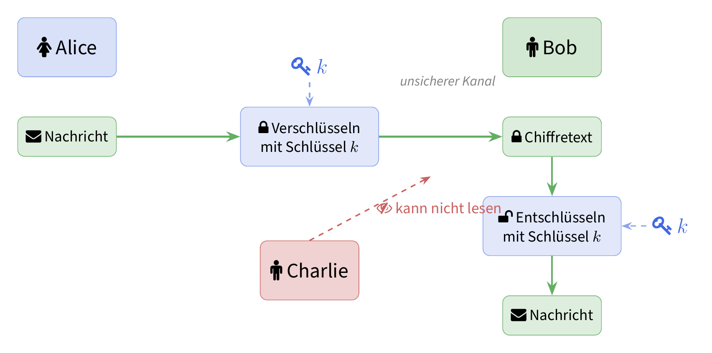

# Einstieg: Geheime Kommunikation

Stellen Sie sich folgende Situation vor: **Alice** möchte eine geheime Nachricht an **Bob** schicken. Das Problem: **Charlie** kann alle Nachrichten mitlesen, die zwischen Alice und Bob verschickt werden.

::: {.callout-tip title="Aufgabe 1: Eigenes Verschlüsselungsverfahren" icon=true}
Überlegen Sie sich in Zweiergruppen ein Verfahren, mit dem Alice eine Nachricht so verschlüsseln kann, dass nur Bob sie lesen kann — nicht aber Charlie.

- Wie wird die Nachricht verändert (verschlüsselt)?
- Was muss Bob wissen, um die Nachricht wieder lesen zu können?
- Könnte Charlie Ihr Verfahren knacken? Wie?

**Halten Sie Ihr Verfahren schriftlich fest und testen Sie es mit einer kurzen Beispielnachricht.**
:::

## Das Grundprinzip

Die folgende Grafik zeigt das Grundprinzip der **symmetrischen Verschlüsselung**: Alice verschlüsselt eine Nachricht mit einem Schlüssel $k$, schickt den Chiffretext über einen unsicheren Kanal an Bob, und Bob entschlüsselt mit demselben Schlüssel $k$. Charlie sieht zwar den Chiffretext, kann ihn aber ohne den Schlüssel nicht lesen.

{fig-align="center" width=70%}

Zentrale Begriffe:

| Begriff | Bedeutung |
|---|---|
| **Klartext** | Die ursprüngliche, lesbare Nachricht |
| **Chiffretext** | Die verschlüsselte, unlesbare Nachricht |
| **Schlüssel** | Die geheime Information zum Ver-/Entschlüsseln |
| **Verschlüsseln** | Klartext → Chiffretext |
| **Entschlüsseln** | Chiffretext → Klartext |

# Caesar-Verschlüsselung

Eines der ältesten bekannten Verschlüsselungsverfahren ist die **Caesar-Verschlüsselung**, benannt nach Julius Caesar, der sie zur Kommunikation mit seinen Generälen verwendet haben soll.

## Das Prinzip

Jeder Buchstabe im Klartext wird um eine feste Anzahl Positionen im Alphabet verschoben. Bei einer Verschiebung von $k = 3$:

| A | B | C | D | E | F | ... | X | Y | Z |
|---|---|---|---|---|---|-----|---|---|---|
| D | E | F | G | H | I | ... | A | B | C |

Das Wort **HALLO** wird mit $k = 3$ zu **KDOOR**.

Mathematisch ausgedrückt:

$$
c = (p + k) \mod 26
$$

wobei $c$ der Chiffrebuchstabe, $p$ der Klartextbuchstabe (als Zahl 0–25) und $k$ der Schlüssel ist.

## Interaktive Caesar-Drehscheibe

Verwenden Sie die Drehscheibe unten, um Nachrichten zu verschlüsseln und zu entschlüsseln. Der äussere Ring zeigt das Klartextalphabet, der innere Ring das verschobene Chiffrealphabet. Verändern Sie die Verschiebung mit dem Schieberegler.

```{=html}
<style>
  .caesar-widget {
    font-family: 'Source Sans Pro', sans-serif;
    max-width: 500px;
    margin: 1.5em auto;
    text-align: center;
  }
  .caesar-widget .disk-container {
    position: relative;
    width: 340px;
    height: 340px;
    margin: 0 auto 1em;
  }
  .caesar-widget svg {
    width: 340px;
    height: 340px;
  }
  .caesar-widget .controls {
    margin: 0.5em 0;
  }
  .caesar-widget .controls label {
    font-weight: 600;
    font-size: 1.05em;
  }
  .caesar-widget input[type=range] {
    width: 250px;
    margin: 0.3em 0;
  }
  .caesar-widget .shift-display {
    font-size: 1.4em;
    font-weight: 700;
    color: #4169E1;
    margin: 0.2em 0 0.6em;
  }
  .caesar-widget .io-area {
    display: flex;
    gap: 1em;
    justify-content: center;
    flex-wrap: wrap;
  }
  .caesar-widget .io-area div {
    flex: 1;
    min-width: 200px;
  }
  .caesar-widget textarea {
    width: 100%;
    height: 60px;
    font-family: monospace;
    font-size: 1em;
    padding: 0.4em;
    border: 1.5px solid #ccc;
    border-radius: 6px;
    resize: none;
  }
  .caesar-widget .io-area label {
    font-weight: 600;
    display: block;
    margin-bottom: 0.2em;
  }
</style>

<div class="caesar-widget" id="caesarWidget">
  <div class="disk-container">
    <svg id="caesarDisk" viewBox="0 0 340 340"></svg>
  </div>
  <div class="controls">
    <label for="shiftSlider">Verschiebung (k):</label><br>
    <input type="range" id="shiftSlider" min="0" max="25" value="3">
    <div class="shift-display">k = <span id="shiftValue">3</span></div>
  </div>
  <div class="io-area">
    <div>
      <label for="plainInput">Klartext:</label>
      <textarea id="plainInput" placeholder="Nachricht eingeben..."></textarea>
    </div>
    <div>
      <label for="cipherOutput">Chiffretext:</label>
      <textarea id="cipherOutput" placeholder="Verschlüsselt..." readonly></textarea>
    </div>
  </div>
</div>

<script>
(function() {
  const ABC = 'ABCDEFGHIJKLMNOPQRSTUVWXYZ';
  const cx = 170, cy = 170;
  // Outer ring (plain): 160 → 132, text at midpoint 146
  const rOO = 160, rOI = 132, rTO = 146;
  // Inner ring (cipher): 128 → 95, text at midpoint 112
  const rIO = 128, rII = 95, rTI = 112;

  function drawDisk(shift) {
    const svg = document.getElementById('caesarDisk');
    let html = '';
    // Outer ring
    html += `<circle cx="${cx}" cy="${cy}" r="${rOO}" fill="#e8ecf4" stroke="#4169E1" stroke-width="2"/>`;
    html += `<circle cx="${cx}" cy="${cy}" r="${rOI}" fill="white" stroke="#4169E1" stroke-width="1.5"/>`;
    // Inner ring
    html += `<circle cx="${cx}" cy="${cy}" r="${rIO}" fill="#e6f4ea" stroke="#228B22" stroke-width="2"/>`;
    html += `<circle cx="${cx}" cy="${cy}" r="${rII}" fill="white" stroke="#228B22" stroke-width="1.5"/>`;

    for (let i = 0; i < 26; i++) {
      const angle = (i * 360 / 26 - 90) * Math.PI / 180;
      // Outer letter (plain)
      const xo = cx + rTO * Math.cos(angle);
      const yo = cy + rTO * Math.sin(angle);
      html += `<text x="${xo}" y="${yo}" text-anchor="middle" dominant-baseline="central"
                font-size="13" font-weight="700" fill="#4169E1">${ABC[i]}</text>`;
      // Inner letter (cipher, shifted)
      const xi = cx + rTI * Math.cos(angle);
      const yi = cy + rTI * Math.sin(angle);
      html += `<text x="${xi}" y="${yi}" text-anchor="middle" dominant-baseline="central"
                font-size="13" font-weight="700" fill="#228B22">${ABC[(i + shift) % 26]}</text>`;
      // Tick marks between rings
      const x1 = cx + rOI * Math.cos(angle);
      const y1 = cy + rOI * Math.sin(angle);
      const x2 = cx + rIO * Math.cos(angle);
      const y2 = cy + rIO * Math.sin(angle);
      html += `<line x1="${x1}" y1="${y1}" x2="${x2}" y2="${y2}" stroke="#bbb" stroke-width="0.5"/>`;
    }
    // Center label
    html += `<text x="${cx}" y="${cy}" text-anchor="middle" dominant-baseline="central"
              font-size="16" font-weight="700" fill="#333">k = ${shift}</text>`;
    svg.innerHTML = html;
  }

  function caesarEncrypt(text, shift) {
    return text.toUpperCase().split('').map(ch => {
      const idx = ABC.indexOf(ch);
      if (idx === -1) return ch;
      return ABC[(idx + shift) % 26];
    }).join('');
  }

  const slider = document.getElementById('shiftSlider');
  const shiftDisp = document.getElementById('shiftValue');
  const plainIn = document.getElementById('plainInput');
  const cipherOut = document.getElementById('cipherOutput');

  function update() {
    const k = parseInt(slider.value);
    shiftDisp.textContent = k;
    drawDisk(k);
    cipherOut.value = caesarEncrypt(plainIn.value, k);
  }

  slider.addEventListener('input', update);
  plainIn.addEventListener('input', update);
  update();
})();
</script>
```

## Aufgaben

::: {.callout-note title="Aufgabe 2: Verschlüsseln" icon=true}
Verschlüsseln Sie die folgende Nachricht von Hand und überprüfen Sie Ihr Ergebnis mit der Drehscheibe.

> **TREFFPUNKT AM BAHNHOF**

Verwenden Sie den Schlüssel $k = 7$.
:::

::: {.callout-note title="Aufgabe 3: Knacken" icon=true}
Die folgende Nachricht wurde mit einer Caesar-Verschlüsselung verschlüsselt. Finden Sie den Schlüssel und den Klartext!

> **LQIRUPDWLN LVW HLQH VSDQQHQGH ZLVVHQVFKDIW**

*Tipp: Probieren Sie verschiedene Verschiebungen aus. Verwenden Sie die Drehscheibe zur Hilfe.*
:::

::: {.callout-warning title="Aufgabe 4: Sicherheit der Caesar-Verschlüsselung" icon=true}
Beantworten Sie die folgenden Fragen:

a) Wie viele mögliche Schlüssel gibt es bei der Caesar-Verschlüsselung?
b) Wenn Sie pro Sekunde einen Schlüssel ausprobieren können — wie lange dauert es maximal, alle Schlüssel durchzuprobieren?
c) Ist die Caesar-Verschlüsselung ein sicheres Verfahren? Begründen Sie Ihre Antwort.
d) Wie könnte man die Caesar-Verschlüsselung verbessern?
:::

# Monoalphabetische Substitution

## Das Prinzip

Bei der **monoalphabetischen Substitution** wird jeder Buchstabe des Klartexts durch einen fest zugeordneten anderen Buchstaben ersetzt — die Zuordnung ist beliebig wählbar. Die Caesar-Verschlüsselung ist ein Spezialfall: Die Zuordnung ist immer eine gleichmässige Verschiebung.

Allgemeines Beispiel einer Zuordnung:

| Klartext    | A | B | C | D | E | F | G | H | I | J | K | L | M | N | O | P | Q | R | S | T | U | V | W | X | Y | Z |
|-------------|---|---|---|---|---|---|---|---|---|---|---|---|---|---|---|---|---|---|---|---|---|---|---|---|---|---|
| Chiffretext | Q | W | E | R | T | Z | U | I | O | P | A | S | D | F | G | H | J | K | L | Y | X | C | V | B | N | M |

::: {.callout-note title="Aufgabe 5: Schlüsselraum" icon=true}
Bei der Caesar-Verschlüsselung gibt es nur 25 sinnvolle Schlüssel — *Brute Force* reicht vollkommen aus.

Wie viele verschiedene Schlüssel gibt es bei der allgemeinen monoalphabetischen Substitution mit 26 Buchstaben?

::: {.callout-tip title="Hinweis" collapse=true icon=true}
Auf wie viele Buchstaben kann A abgebildet werden? Danach B (A ist bereits vergeben)? Danach C? …
:::
:::

## Häufigkeitsanalyse

Mit 
<!-- $26! \approx 4 \times 10^{26}$  -->
$\dots$
möglichen Schlüsseln ist Brute Force nicht mehr praktikabel. Trotzdem ist die monoalphabetische Substitution unsicher — denn die **Häufigkeiten der Buchstaben bleiben erhalten**.

```{=html}
<div id="freqChart" style="font-family:'Source Sans Pro',sans-serif; max-width:520px; margin:1.5em auto;"></div>
<script>
(function() {
  const freqs = [
    ['E',17.40],['N',9.78],['I',7.55],['S',7.27],['R',7.00],
    ['A',6.51],['T',6.15],['D',5.08],['H',4.76],['U',4.35],
    ['L',3.44],['C',3.06],['G',3.01],['M',2.53],['O',2.51],
    ['B',1.89],['W',1.89],['F',1.66],['K',1.21],['Z',1.13],
    ['P',0.79],['V',0.67],['ẞ',0.31],['J',0.27],['Y',0.04],['X',0.03],['Q',0.02]
  ];
  const max = freqs[0][1];
  const container = document.getElementById('freqChart');
  let html = '<div style="font-size:0.85em;color:#555;margin-bottom:0.6em;">Buchstabenhäufigkeiten im Deutschen (in %)</div>';
  html += '<div style="display:grid;grid-template-columns:1.6em 1fr 3.2em;gap:4px 8px;align-items:center;">';
  for (const [letter, freq] of freqs) {
    const pct = (freq / max * 100).toFixed(0);
    const color = freq >= 7 ? '#4169E1' : freq >= 3 ? '#6688cc' : '#99aadd';
    html += `<span style="font-weight:700;color:${color};text-align:right;">${letter}</span>` +
            `<div style="background:#e8ecf4;border-radius:3px;height:15px;">` +
            `<div style="width:${pct}%;background:${color};border-radius:3px;height:100%;"></div></div>` +
            `<span style="font-size:0.85em;color:#555;">${freq.toFixed(1)}</span>`;
  }
  html += '</div>';
  container.innerHTML = html;
})();
</script>
```

Kommt ein Buchstabe im Chiffretext häufig vor, entspricht er wahrscheinlich einem häufigen Klartextbuchstaben. Durch systematisches Zuordnen lässt sich der Schlüssel Schritt für Schritt rekonstruieren.

## Aufgaben

::: {.callout-note title="Aufgabe 6: Häufigkeiten in normalem Text" icon=true}
Analysieren Sie die Häufigkeiten in einem selbst gewählten deutschen Text:

[CyberChef öffnen](https://gchq.github.io/CyberChef/#recipe=Frequency_distribution(false,true)){target="_blank"}

Fügen Sie einen beliebigen deutschen Text ein und beobachten Sie die Häufigkeitsanalyse. Welcher Buchstabe kommt am häufigsten vor? Stimmt das Ergebnis mit der Grafik oben überein?
:::

::: {.callout-warning title="Aufgabe 7: Entschlüsseln per Häufigkeitsanalyse" icon=true}
Gegeben ist ein verschlüsselter Text. 

```
JAW FPJDOAS ADLHQEADUQ EQUSTQEWWVWUQF ZTSJ CPN WPLUZASQQNUZTYMOQSN ADL JQS HANKQN ZQOU ZQTUQSQNUZTYMQOU, JTQ AN JQN CQSWYXTQJQNQN RSPBQMUQN FTUASEQTUQN. AN JQS QNUZTYMODNH WTNJ DNUQSNQXFQN, NPNRSPLTU-PSHANTWAUTPNQN DNJ CTQOQ LSQTZTOOTHQ EQUQTOTHU. EQTF HQESADYX ADL YPFRDUQSN MPFFQN FQTWU WPHQNANNUQ OTNDG-JTWUSTEDUTPNQN KDF QTNWAUK. QTNQ JTWUSTEDUTPN LAWWU JQN OTNDG-MQSNQO FTU CQSWYXTQJQNQS WPLUZASQ KD QTNQF EQUSTQEWWVWUQF KDWAFFQN, JAW LDQS JTQ QNJNDUKDNH HQQTHNQU TWU. JAEQT RAWWQN CTQOQ JTWUSTEDUPSQN DNJ CQSWTQSUQ EQNDUKQS JTQ WPLUZASQ AN TXSQ QTHQNQN KZQYMQ AN.

OTNDG ZTSJ CTQOLAQOUTH DNJ DFLAWWQNJ QTNHQWQUKU, EQTWRTQOWZQTWQ ADL ASEQTUWROAUKSQYXNQSN, WQSCQSN, FPETOUQOQLPNQN, SPDUQSN, NPUQEPPMW, QFEQJJQJ WVWUQFW, FDOUTFQJTA-QNJHQSAQUQN DNJ WDRQSYPFRDUQSN. JAEQT ZTSJ OTNDG DNUQSWYXTQJOTYX XAQDLTH HQNDUKU: WP TWU OTNDG TF WQSCQS-FASMU ZTQ ADYX TF FPETOQN EQSQTYX QTNQ LQWUQ HSPQWWQ, ZAQXSQNJ QW ADL JQF JQWMUPR DNJ OARUPRW QTNQ HQSTNHQ SPOOQ WRTQOU. TF NPCQFEQS 2023 ZAS QW TN JQDUWYXOANJ ADL YA. 2,8 % JQS JQWMUPR-WVWUQFQ TNWUAOOTQSU, DNJ QSSQTYXUQ ANLANH 2024 QSWUFAOW QTNQ ZQOUZQTUQ CQSESQTUDNH CPN DQEQS 4 %.
```

Entschlüsseln Sie ihn mithilfe der Häufigkeitsanalyse.

**Schritt 1** — Öffnen Sie den Chiffretext und analysieren Sie die Buchstabenhäufigkeiten:

[Chiffretext mit Häufigkeitsanalyse öffnen](https://gchq.github.io/CyberChef/#recipe=Frequency_distribution(false,true)&input=SkFXIEZQSkRPQVMgQURMSFFFQURVUSBFUVVTVFFFV1dWV1VRRiBaVFNKIENQTiBXUExVWkFTUVFOVVpUWU1PUVNOIEFETCBKUVMgSEFOS1FOIFpRT1UgWlFUVVFTUU5VWlRZTVFPVSwgSlRRIEFOIEpRTiBDUVNXWVhUUUpRTlFOIFJTUEJRTVVRTiBGVFVBU0VRVFVRTi4gQU4gSlFTIFFOVVpUWU1PRE5IIFdUTkogRE5VUVNOUVhGUU4sIE5QTlJTUExUVS1QU0hBTlRXQVVUUE5RTiBETkogQ1RRT1EgTFNRVFpUT09USFEgRVFVUVRPVEhVLiBFUVRGIEhRRVNBRFlYIEFETCBZUEZSRFVRU04gTVBGRlFOIEZRVFdVIFdQSFFOQU5OVVEgT1ROREctSlRXVVNURURVVFBOUU4gS0RGIFFUTldBVUsuIFFUTlEgSlRXVVNURURVVFBOIExBV1dVIEpRTiBPVE5ERy1NUVNOUU8gRlRVIENRU1dZWFRRSlFOUVMgV1BMVVpBU1EgS0QgUVROUUYgRVFVU1RRRVdXVldVUUYgS0RXQUZGUU4sIEpBVyBMRFFTIEpUUSBRTkpORFVLRE5IIEhRUVRITlFVIFRXVS4gSkFFUVQgUkFXV1FOIENUUU9RIEpUV1VTVEVEVVBTUU4gRE5KIENRU1dUUVNVUSBFUU5EVUtRUyBKVFEgV1BMVVpBU1EgQU4gVFhTUSBRVEhRTlFOIEtaUVlNUSBBTi4KCk9UTkRHIFpUU0ogQ1RRT0xBUU9VVEggRE5KIERGTEFXV1FOSiBRVE5IUVdRVUtVLCBFUVRXUlRRT1daUVRXUSBBREwgQVNFUVRVV1JPQVVLU1FZWE5RU04sIFdRU0NRU04sIEZQRVRPVVFPUUxQTlFOLCBTUERVUVNOLCBOUFVRRVBQTVcsIFFGRVFKSlFKIFdWV1VRRlcsIEZET1VURlFKVEEtUU5KSFFTQVFVUU4gRE5KIFdEUlFTWVBGUkRVUVNOLiBKQUVRVCBaVFNKIE9UTkRHIEROVVFTV1lYVFFKT1RZWCBYQVFETFRIIEhRTkRVS1U6IFdQIFRXVSBPVE5ERyBURiBXUVNDUVMtRkFTTVUgWlRRIEFEWVggVEYgRlBFVE9RTiBFUVNRVFlYIFFUTlEgTFFXVVEgSFNQUVdXUSwgWkFRWFNRTkogUVcgQURMIEpRRiBKUVdNVVBSIEROSiBPQVJVUFJXIFFUTlEgSFFTVE5IUSBTUE9PUSBXUlRRT1UuIFRGIE5QQ1FGRVFTIDIwMjMgWkFTIFFXIFROIEpRRFVXWVhPQU5KIEFETCBZQS4gMiw4ICUgSlFTIEpRV01VUFItV1ZXVVFGUSBUTldVQU9PVFFTVSwgRE5KIFFTU1FUWVhVUSBBTkxBTkggMjAyNCBRU1dVRkFPVyBRVE5RIFpRT1VaUVRVUSBDUVNFU1FUVUROSCBDUE4gRFFFUVMgNCAlLg){target="_blank"}

**Schritt 2** — Öffnen Sie die Substitutions-Funktion und passen Sie die Zuordnung an:

[Substitution öffnen](https://gchq.github.io/CyberChef/#recipe=Substitute('ABCDEFGHIJKLMNOPQRSTUVWXYZ','ABCDEFGHIJKLMNOPQRSTUVWXYZ',false)&input=SkFXIEZQSkRPQVMgQURMSFFFQURVUSBFUVVTVFFFV1dWV1VRRiBaVFNKIENQTiBXUExVWkFTUVFOVVpUWU1PUVNOIEFETCBKUVMgSEFOS1FOIFpRT1UgWlFUVVFTUU5VWlRZTVFPVSwgSlRRIEFOIEpRTiBDUVNXWVhUUUpRTlFOIFJTUEJRTVVRTiBGVFVBU0VRVFVRTi4gQU4gSlFTIFFOVVpUWU1PRE5IIFdUTkogRE5VUVNOUVhGUU4sIE5QTlJTUExUVS1QU0hBTlRXQVVUUE5RTiBETkogQ1RRT1EgTFNRVFpUT09USFEgRVFVUVRPVEhVLiBFUVRGIEhRRVNBRFlYIEFETCBZUEZSRFVRU04gTVBGRlFOIEZRVFdVIFdQSFFOQU5OVVEgT1ROREctSlRXVVNURURVVFBOUU4gS0RGIFFUTldBVUsuIFFUTlEgSlRXVVNURURVVFBOIExBV1dVIEpRTiBPVE5ERy1NUVNOUU8gRlRVIENRU1dZWFRRSlFOUVMgV1BMVVpBU1EgS0QgUVROUUYgRVFVU1RRRVdXVldVUUYgS0RXQUZGUU4sIEpBVyBMRFFTIEpUUSBRTkpORFVLRE5IIEhRUVRITlFVIFRXVS4gSkFFUVQgUkFXV1FOIENUUU9RIEpUV1VTVEVEVVBTUU4gRE5KIENRU1dUUVNVUSBFUU5EVUtRUyBKVFEgV1BMVVpBU1EgQU4gVFhTUSBRVEhRTlFOIEtaUVlNUSBBTi4KCk9UTkRHIFpUU0ogQ1RRT0xBUU9VVEggRE5KIERGTEFXV1FOSiBRVE5IUVdRVUtVLCBFUVRXUlRRT1daUVRXUSBBREwgQVNFUVRVV1JPQVVLU1FZWE5RU04sIFdRU0NRU04sIEZQRVRPVVFPUUxQTlFOLCBTUERVUVNOLCBOUFVRRVBQTVcsIFFGRVFKSlFKIFdWV1VRRlcsIEZET1VURlFKVEEtUU5KSFFTQVFVUU4gRE5KIFdEUlFTWVBGUkRVUVNOLiBKQUVRVCBaVFNKIE9UTkRHIEROVVFTV1lYVFFKT1RZWCBYQVFETFRIIEhRTkRVS1U6IFdQIFRXVSBPVE5ERyBURiBXUVNDUVMtRkFTTVUgWlRRIEFEWVggVEYgRlBFVE9RTiBFUVNRVFlYIFFUTlEgTFFXVVEgSFNQUVdXUSwgWkFRWFNRTkogUVcgQURMIEpRRiBKUVdNVVBSIEROSiBPQVJVUFJXIFFUTlEgSFFTVE5IUSBTUE9PUSBXUlRRT1UuIFRGIE5QQ1FGRVFTIDIwMjMgWkFTIFFXIFROIEpRRFVXWVhPQU5KIEFETCBZQS4gMiw4ICUgSlFTIEpRV01VUFItV1ZXVVFGUSBUTldVQU9PVFFTVSwgRE5KIFFTU1FUWVhVUSBBTkxBTkggMjAyNCBRU1dVRkFPVyBRVE5RIFpRT1VaUVRVUSBDUVNFU1FUVUROSCBDUE4gRFFFUVMgNCAlLg){target="_blank"}

Vergleichen Sie die häufigsten Chiffrebuchstaben mit der deutschen Häufigkeitstabelle und ordnen Sie diese zu. Verfeinern Sie die Zuordnung schrittweise, bis der Klartext lesbar wird.

**Extra Challenge**

[Substitution öffnen](https://gchq.github.io/CyberChef/#recipe=Substitute('ABCDEFGHIJKLMNOPQRSTUVWXYZ','ABCDEFGHIJKLMNOPQRSTUVWXYZ',false)&input=VUhJIFNIUElEWFggWURSVUxZUSAoSFJQVERRQ0YsIFZUTUlOVCBYTUhJIOKAnlhIUlFHSEnigJwpIERRRyBIRFJIIFNIWkhEQ0ZSTVJQIFhNSEkgUUxYR1lOSUgtTFNISVhUTkhDRkhSSFRIT0hSR0ggTVJVIFBIRkcgTk1YIFVOUSBEUiBVSFIgWElNSEZIUiAxOTcwSEkgS05GSUhSIERPIFdISUxXIFZOSUMgSFJHWURDQUhUR0ggWURPVi1WTklOVURQT04gKFlEUlVMWSwgRENMUiwgT0hSTSwgVkxEUkdEUlAtVUhCRENIKSBYTUhJIFVIUiBOTVhTTk0gQkxSIFNIUk1HWkhJUUNGUkRHR1FHSFRUSFIgWk1JTUhDQS4gT0RDSUxRTFhHIFlEUlVMWVEgUEhGTEhJRyBaTSBVSFIgUElOWERRQ0ZIUiBTSEdJREhTUVFKUUdIT0hSLCBVREggVURIUUhRIFZOSU5VRFBPTiBNT1FIR1pIUi4gTFhHIFFHSEZHIFlEUlVMWVEg4oCTIFlESCBOTUNGIFVISSBTSFBJRFhYIFlEUlVMWVEtVkMgWE1ISSBZRFJVTFlRIE5NWCBVSEkgVzg2LU5JQ0ZER0hBR01JIFVIUSBNSVFWSU1IUlBURENGSFIgRFNPIFZDIOKAkyBOVFEgVlROR0dYTElPIE1SVSBRVkRIVEhWVE5HR1hMSU8gWE1ISSBWSUxQSU5PT0ggTVJVIENMT1ZNR0hJUVZESFRILCBVREggTVJHSEkgWURSVUxZUS1CSElRRExSSFIgVE5NWEhSLCBVREggWk1JIFpIREcgREZJSEkgQkhJTEhYWEhSR1REQ0ZNUlAgTVJHSElRR01IR1pHIFlNSVVIUi4gTlRRIFlEUlVMWVEgQ0ggWURJVSBVTlEgU0hHSURIU1FRSlFHSE8gTk1DRiBEUiBIRFJQSFNIR0dIR0hSIFBISU5IR0hSIEhEUlBIUUhHWkc7IEhRIERRRyBOTVFRSElVSE8gU0hHSURIU1FRSlFHSE8gTlRUSEkgUEhSSElOR0RMUkhSIFVISSBXU0xXLUFMUlFMVEhSLgoKWURSVUxZUS1WSUxQSU5PT0ggU1pZLiBZRFJVTFlRLVFWREhUSCBBTEhSUkhSIE5NQ0YgTVJHSEkgUkhNSElIUiAoUUhUR0hSIE5NQ0YgTkhUR0hJSFIpIEJISVFETFJIUiBCTFIgWURSVUxZUSBQSFJNR1pHIFlISVVIUiwgTFNZTEZUIFlIVUhJIE9EQ0lMUUxYRyBSTENGIFVISSBGSElRR0hUVEhJIFVOWE1ISSBQSFlOSEZJVEhEUUdNUlBIUiBOU1BIU0hSLiBHSERUUSBQRFNHIEhRIE5NQ0YgTVZVTkdIUSBMVUhJIFZOR0NGSFEsIFVESCBBTE9WTkdEU0RUREdOSEcgWk0gSERSSEkgUkhNSElIUiAoTFVISSBOSFRHSElIUikgWURSVUxZUS1CSElRRExSIEZISVFHSFRUSFIu){target="_blank"}

:::
