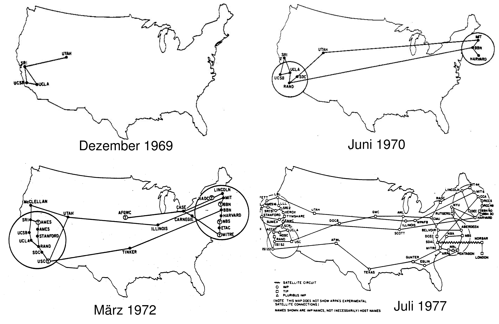
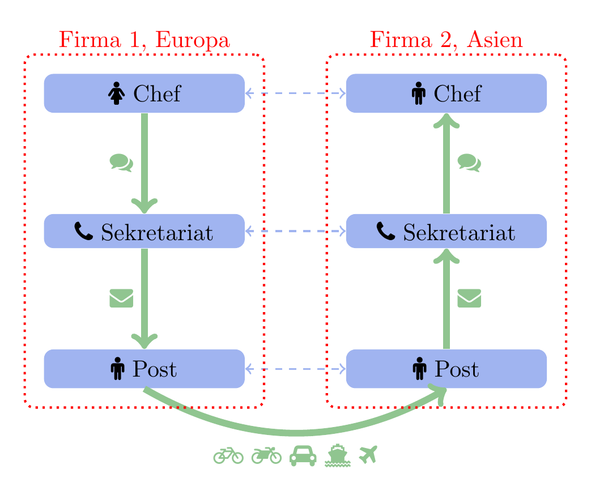
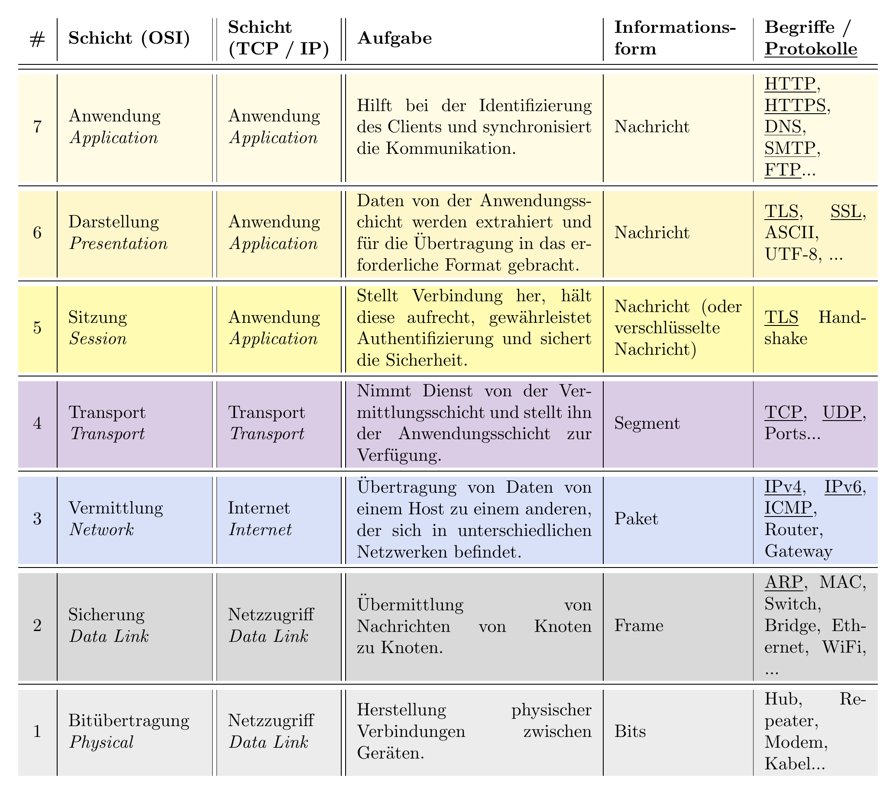
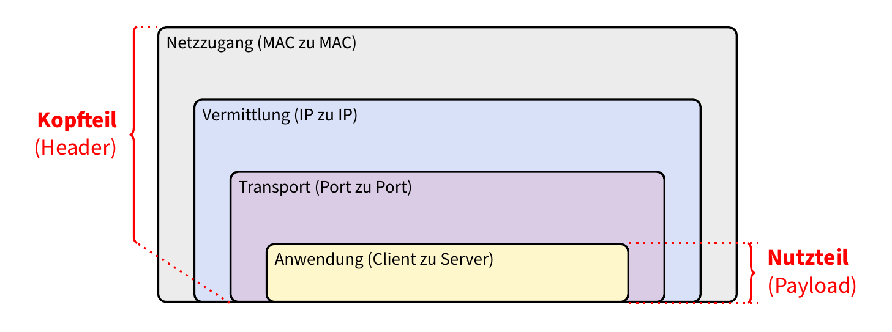
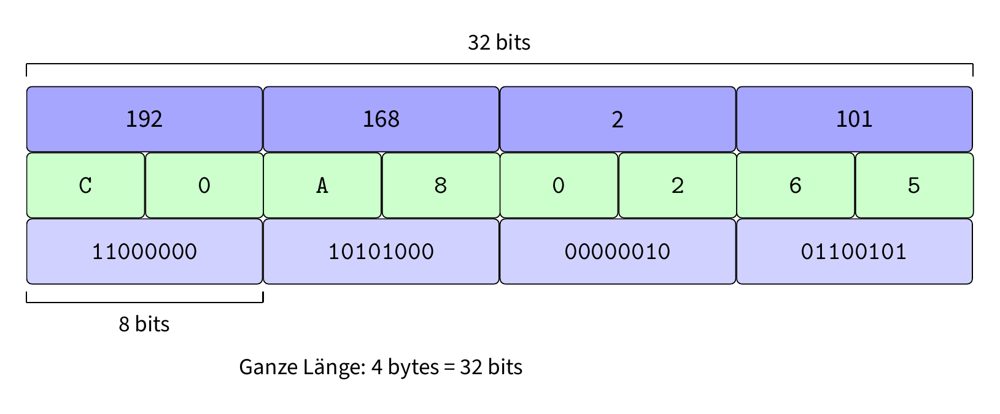

# Netzwerke und das Internet

Bevor wir uns mit dem Internet als spezielles Netzwerk befassen, wollen wir allgemein nochmals auf Netzwerke eingehen. Im Alltag treffen Sie Netzwerke an unterschiedlichsten Orten an, zum Beispiel:

- **Transport-Netzwerke**: Die Post, DHL, Planzer, etc.
- **Soziale Netzwerke**: TikTok, Youtube, Instagram, etc.
- **Mobilitäts-Netzwerke**: Das Strassennetz, SBB, Flixbus, etc.
- **Shopping-Netzwerke**: Aliexpress, Uber, etc.
- **Computer-Netzwerke**: **Das Internet**, Firmen-Netzwerke etc.

All diese Netzwerke können als Graphen visualisiert und veranschaulicht werden. Gemeinsam ist allen Netzwerken, dass die einzelnen Knoten ihren "Wert" (ihren Nutzen) erst durch die Verbindung mit anderen Knoten erhalten. Anders gesagt, mit den Worten des "Erfinders des Internets", Tim Berners-Lee:

> *The web is more a social creation than a technical one.*

Häufig werden die Begriffe "Internet" und "Computer-Netze", bzw. "Rechner-Netze" austauschbar verwendet. Dabei ist es jedoch wichtig zu verstehen, dass dies zwei unterschiedliche Konzepte sind: während dem mit dem *Internet* ein höchst komplexes, den gesamten Globus umspannendes Netzwerk von Computern gemeint ist, können lediglich zwei miteinander verbundene Computer bereits ein Rechnernetz bilden. Das Internet wird häufig auch als *Netz von (Rechner-)Netzen* bezeichnet. Es ist daher wichtig, dass wir uns zuerst mit einfacheren Rechnernetzen befassen, da diese die Grundbausteine für das Internet bilden.

Wir verwenden dazu das Simulationsprogramm [**Filius**](https://www.lernsoftware-filius.de/Herunterladen) (siehe [Anhang: Installation Filius](#anhang-installation-filius)).

## Geschichte des Internets

Kommunikation war schon seit jeher ein zentrales Bedürfnis der Menschheit. Mit der Erfindung des Telefons, des Radios und später des Internets hat sich die Art und Weise, wie wir kommunizieren, jedoch grundlegend vereinfacht sowie verändert. Im Folgenden schauen wir kurz die wichtigsten Schritte an, die zur Erfindung des Internets geführt haben.

### Die Anfänge: ARPANET und die 1960er Jahre {.unnumbered}

Die Motivation für die Entwicklung des ARPANET (Advanced Research Projects Agency Network) lag darin, ein robustes, dezentrales Kommunikationsnetzwerk zu schaffen, das auch im Falle von Ausfällen einzelner Knoten funktionsfähig bleibt. Insbesondere sollte das Netzwerk den Austausch von Informationen zwischen Universitäten und Forschungseinrichtungen ermöglichen und die Zusammenarbeit fördern. Ein weiterer wichtiger Beweggrund war die Suche nach einer Kommunikationsinfrastruktur, die im Kontext des Kalten Krieges auch militärischen Anforderungen an Ausfallsicherheit und Flexibilität genügte.

- 1969: Die erste Nachricht wird zwischen zwei Computern am ARPANET übertragen.
- 1972: Die erste E-Mail wird verschickt.
- 1973: ARPANET wird international, erste Verbindungen nach Norwegen und Grossbritannien.

{width=75%}


### Die Entwicklung von Protokollen: TCP/IP {.unnumbered}

Ein entscheidender Schritt in der Geschichte des Internets war die Entwicklung von Kommunikationsprotokollen, die es verschiedenen Netzwerken ermöglichten, miteinander zu kommunizieren. Insbesondere das TCP/IP-Protokoll, das 1983 als Standard eingeführt wurde, bildete die Grundlage für das moderne Internet.

- 1983: Umstellung des ARPANET auf TCP/IP.
- 1980er: Entstehung weiterer Netzwerke (z.B. CSNET, BITNET) und deren Zusammenschluss.

### Das WWW und die 1990er Jahre {.unnumbered}

Die Erfindung des ersten Browsers namens WWW (World Wide Web) durch Tim Berners-Lee im Jahr 1990 revolutionierte die Nutzung des Internets. Kernstück des WWW ist das Hypertext Transfer Protocol (HTTP), das es ermöglicht, Webseiten zu erstellen und diese gegenseitig zu verlinken. Mit der Einführung von HTML konnten Inhalte strukturiert und formatiert werden. Dies führte zu einer explosionsartigen Zunahme von Webseiten und Nutzern. Eine typische Webseite, wie wir sie heute kennen, ist über eine Web-Adresse, oder genauer gesagt URL (Uniform Resource Locator) erreichbar, wie in folgendem Beispiel:

```html
https://www.beispielseite.ch/unterseite.html
```

Eine URL (Uniform Resource Locator) ist eine eindeutige Adresse, die auf eine Ressource (meistens eine Datei) im Internet verweist. Sie besteht aus mehreren Teilen, darunter das Protokoll (`http://` oder `https://`), der Domain-Name (`www.beispielseite.ch`) und der Pfad zur Datei (`/unterseite.html`).

Der Domain-Name steht für einen Computer im Internet, auf dem die Webseite gespeichert ist. Dieser Computer wird auch als **Webserver** bezeichnet.

Jede Webseite ist dabei als einfache Textdatei gespeichert, mit der Dateiendung `.html` (oder `.htm`). HTML ist dabei eine Art Code-Sprache, die es ermöglicht, Text, Bilder und Links zu strukturieren. Eine einfache HTML-Datei könnte zum Beispiel so aussehen:

```html
<!DOCTYPE html>
<html>
<head>
    <title>Beispielseite</title>
</head>
<body>
    <h1>Willkommen auf der Beispielseite</h1>
    <p>Dies ist ein einfacher Textabschnitt.</p>
    <a href="https://www.example.com">Andere Webseite</a>
</body>
```

Auf der vorletzten Zeile sehen Sie den Link zu einer anderen Webseite. Dieser Link ist ein sogenannter **Hyperlink**, der es ermöglicht, von einer Webseite zu einer anderen zu navigieren. Hyperlinks sind das Herzstück des WWW und ermöglichen die Vernetzung von Informationen im Internet. Ein Protokoll namens HTTP regelt, wie diese Links angefragt und die entsprechenden Seiten übertragen werden.

Ein Browser kann den HTML-Code benutzerfreundlich anzeigen und Verweise auf andere Webseiten als anklickbare Links anzeigen. Die Kombination von HTML, HTTP und der URL ermöglichte es, Informationen auf einfache Weise zu teilen und zu durchsuchen. Mit der Einführung von grafischen Webbrowsern wurde das Internet für die breite Öffentlichkeit zugänglich und erlebte einen massiven Popularitätsschub.

- 1991: Das WWW wird der Öffentlichkeit vorgestellt.
- 1993: Der erste grafische Webbrowser (Mosaic) erscheint.
- 1995: Kommerzielle Nutzung des Internets wird möglich, Gründung von Unternehmen wie Amazon und eBay.

::: {.callout-caution icon=false}
## ✏️ Übung: Website als Datei

1. Öffnen Sie einen Texteditor (z.B. Notepad, TextEdit, VSCode, etc.) und kopieren Sie den obigen HTML-Code hinein.
2. Speichern Sie die Datei mit dem Namen `beispielseite.html` auf Ihrem Desktop.

::: {.callout-warning icon=false}
## Achtung: Dateiendung

Die Dateiendung muss unbedingt `.html` sein, damit der Browser die Datei als Webseite erkennen kann. Falls Sie die Datei mit einer anderen Endung speichern, könnte es sein, dass sie nicht korrekt angezeigt wird.
:::

3. Öffnen Sie die Datei in einem Webbrowser (z.B. Chrome, Firefox, Safari, etc.) durch Doppelklick oder Rechtsklick → Öffnen mit → Browser auswählen.
:::

### Das Internet im 21. Jahrhundert {.unnumbered}

Im 21. Jahrhundert hat das Internet weiterhin rasant an Bedeutung gewonnen. Mit der Verbreitung von schnellem Breitband-Internet, Smartphones und sozialen Medien ist das Internet zu einem unverzichtbaren Bestandteil des täglichen Lebens geworden.

Eine der wichtigsten Erfindungen, um das Internet jederzeit und überall verfügbar zu machen, war das **Mobile Internet**. Mit der Einführung von Smartphones und mobilen Datenverbindungen wurde es möglich, jederzeit auf das Internet zuzugreifen. Insbesondere die Einführung des iPhones durch die Firma Apple im Jahr 2007 und die damit verbundene Verbreitung von Smartphones haben das Internet revolutioniert.

- 2000er: Verbreitung von schnellem Breitband-Internet, Aufstieg von Google, Facebook, YouTube.
- 2007: Einführung des iPhones, Beginn der Smartphone-Revolution (siehe [Video der Produktvorstellung im Jahr 2007](https://www.youtube.com/watch?v=MnrJzXM7a6o)).
- 2010er: Mobile Internetnutzung, Smartphones, IoT (Internet of Things).
- Heute: Künstliche Intelligenz, 5G, weltweite Vernetzung.

)](figures/internet_use_by_income_class.png){width=75%}

)](figures/internet_use_map_2024.png){width=75%}


# TCP/IP und das Schichtenmodell

## Schichtenmodell: Analogie

Die Kommunikation über das Internet verläuft in unterschiedlichen Teilschritten. Man spricht von dem *Schichtenmodell*. Als Analogie sei folgende Situation gegeben, in der die Chefs zweier unterschiedlicher Firmen miteinander kommunizieren wollen:

1. Chef 1 (in Europa) möchte mit Chef 2 (in Asien) sprechen.
2. Dazu übermittelt Chef 1 dem Sekretariat ihre Nachricht an Chef 2. Das Sekretariat schreibt die Nachricht nieder und übermittelt der lokalen Post den Brief an Chef 2.
3. Die lokale Post kümmert sich nun um den Transport zur asiatischen Post, wo der Brief an das Sekretariat von Firma 2 übergeben und schlussendlich an Chef 2 gelangt.

{fig-align="center" width=50%}

Dieser Kommunikationsablauf kann in Schichten mit jeweiligen dazugehörigen Prozessen aufgeteilt werden:

1. **Schicht "Chefs"**: damit die beiden Chefs miteinander sinnvolle Gespräche führen können, verfügen Sie über gemeinsame Standards (Sprache, Wissen etc.) sowie Protokolle (standardisierte Abläufe der Begrüssung etc.).
2. **Schicht "Sekretariat"**: Damit die Sekretariate miteinander kommunizieren können, benötigen auch sie standardisierte Abläufe oder Protokolle, etwa, wie man einen Brief korrekt verfasst, datiert und adressiert.
3. **Schicht "Post"**: Die Post verfügt ebenfalls über standardisierte Protokolle (wie werden Briefe und Pakete von A nach B transportiert? Mit welchen Transportmitteln, über welche Routen?)


Die Vorteile des Schichtenmodells scheinen offensichtlich:

- **Unabhängigkeit der Schichten**: Falls die Post das Transportmittel ändert, müssen die Sekretariate die Briefe nicht neu verfassen.
- **Modularität und Spezialisierung**: Statt dass jemand alles tun muss (Chef 1 reist nach Asien zu Chef 2), kann der Prozess für die jeweiligen Beteiligten schnell und effizient abgewickelt werden.

## Schichtenmodelle TCP/IP und OSI

Im Zusammenhang mit dem Internet werden häufig zwei Schichtenmodelle gegenübergestellt: Das vollständige, detaillierte **OSI**-Modell (Open Systems Interconnection) mit 7 Schichten sowie das etwas vereinfachte **TCP/IP**-Modell mit 4 Schichten.

{#tbl-osi-layers width=100%}

Im Folgenden verwenden wir hauptsächlich das etwas vereinfachte TCP/IP-Modell und gehen kurz auf jede Schicht ein.

Im echten Internet werden Daten häufig als **Frame** (Paket) verschickt. Jedes Paket besteht dabei aus einem **Header** (Kopfteil) und einem **Payload** (Nutzteil). Der Header enthält dabei wichtige Informationen über das Paket, wie zum Beispiel die Quell- und Zieladresse, die Sequenznummer und andere Metadaten. Der Payload enthält die eigentlichen Daten, die übertragen werden sollen (z.B. eine Nachricht, ein Bild, ein Video etc.). Jede Schicht fügt dabei ihren eigenen Header hinzu, bevor das Paket an die nächste Schicht weitergegeben wird. Beim Empfänger werden die Header in umgekehrter Reihenfolge entfernt, um die ursprünglichen Daten wiederherzustellen.

{fig-align="center" width=75%}

::: {.callout-caution icon=false}
## ✏️ Übung: Schichtenmodell anwenden — Bestellung bei Digitec

Sie bestellen bei Digitec ein Produkt. Von der Produktauswahl bis zur Lieferung laufen mehrere Kommunikationsschritte ab. Übertragen Sie das **Schichtenprinzip** auf diesen Prozess.

a) Skizzieren Sie den Ablauf als **Schichtenmodell** mit **4 Schichten**. Geben Sie jeder Schicht einen passenden Namen.

b) Für **jede** Schicht:

   - Notieren Sie **wer mit wem** kommuniziert (z.B. *Kunde ↔ Digitec-Website*, *Portmonaie ↔ Zahlungsanbieter*, ...).
   - Beschreiben Sie in **1–2 Sätzen**, **worüber** auf dieser Ebene gesprochen wird (welche Information / welches Ziel).

c) Beschreiben Sie zwei Situationen, in denen etwas schiefgeht (z.B. falsche Lieferadresse, Paket kommt nicht an, Zahlung klappt nicht, Bestellung doppelt, ...). Ordnen Sie **jeweils** zu, **auf welcher Schicht** das Problem am sinnvollsten erkannt oder behoben wird, und begründen Sie kurz.

d) (Optional) Ändern Sie **eine** Sache am Prozess (z.B. anderes Zahlungsmittel, anderer Zusteller, ...). Welche Schichten bleiben gleich, welche ändern sich? Begründen Sie kurz.
:::

## Begriffe: Client, Server und Host

::: {.callout-note}
## Definition: Client, Server und Host

Je nach Rolle der Computer in einem Rechner-Netz ist häufig von **Client**, **Server** oder **Host** die Rede.

- Der **Client** (von en. *client* = "Kunde") bezeichnet den Computer (genauer gesagt ein Programm auf einem Computer), der etwas von einem anderen Computer will. Beispiel: Ihr Browser, der eine Webseite anfordert.
- Der **Server** (von en. *to serve* = "dienen") bezeichnet den Computer (genauer gesagt das Computer-Programm), das dem Client gibt, was er will. Der Server kann Verbindungsanfragen von anderen Computern akzeptieren oder ablehnen.
- Bei einem **Host** (von en. *host* = "Wirt" / "Gastgeber") ist im allgemeinen ein Computer in einem Netzwerk gemeint, der je nach Situation die Rolle des Servers oder Clients einnehmen kann. Der Name eines Computers in einem Netzwerk wird häufig als **Host Name** bezeichnet.
:::

# Netzzugriff-Schicht

## MAC-Adressen

Eine IP-Adresse (welche wir im nächsten Kapitel noch genauer betrachten werden) kann mit der Adresse eines Hauses verglichen werden. Allerdings legt der Briefträger die Briefe und Pakete nicht an einer Adresse ab, sondern in einem Briefkasten, also einem konkreten Objekt. Falls sich der Briefkasten oder sogar das ganze Haus ändert, so bleibt die Adresse doch dieselbe. Ähnlich dieser Analogie kann in einem Computer die gesamte Hardware ausgetauscht werden, inklusive der Netzwerkkarte, und trotzdem sollte der Datentransport zum Computer weiterhin funktionieren. Damit dies klappt, benötigen wir ein weiteres Protokoll, welches die IP-Adresse in eine sogenannte MAC-Adresse umwandelt.

::: {.callout-note}
## Definition: MAC-Adresse

Die **MAC-Adresse** (Media Access Control) ist die physische Adresse der Netzwerkkarte in einem Computer, also sozusagen der "Fingerabdruck" der Netzwerkkarte. Sie wird normalerweise mit **48 Bit** (= 6 Bytes) angegeben, welche der Kürze wegen in hexadezimaler Schreibweise notiert werden. Ein Beispiel einer MAC-Adresse: `48-2C-6A-1E-59-3D`.
:::

## ARP — Address Resolution Protocol

Damit ein Gerät innerhalb eines lokalen Netzwerks eine Nachricht an ein anderes Gerät senden kann, muss die IP-Adresse des Empfängers in eine MAC-Adresse umgewandelt werden. Da es jedoch keine direkte Möglichkeit gibt, eine MAC-Adresse aus einer IP-Adresse zu berechnen, muss ein spezielles Protokoll verwendet werden: das **ARP** (Address Resolution Protocol, auf Deutsch: *Adressauflösungsprotokoll*).

Dieses wird jedes Mal ausgeführt, wenn ein Computer eine Nachricht an eine bestimmte IP-Adresse senden will, aber die MAC-Adresse des nächsten Empfängers (*Gateway*) noch *nicht* kennt. Ein Beispiel:

- Computer `192.168.0.33` will Nachricht senden an `192.168.0.34` im selben Subnetz (Subnetz-Maske: `255.255.255.0`)
- `192.168.0.33` sendet daher eine Nachricht an alle Computer in `192.168.0.x`: "Wer hat die IP `192.168.0.34`?"
- Computer `192.168.0.34` antwortet: "Ich! Meine MAC ist `60:4E:46:F5:08:09`."
- Nun kann der Computer seine Nachricht direkt an den nächsten Empfänger übergeben.

Die Resultate aller ARP-Anfragen werden in einer sogenannten **ARP-Tabelle** gespeichert, damit nicht jedes Mal eine neue Anfrage gesendet werden muss. Diese Tabelle wird periodisch aktualisiert. Um die ARP-Tabelle auf einem Computer anzuzeigen, kann der Befehl `arp -a` im Terminal (MacOS, UNIX) bzw. `cmd` oder PowerShell (Windows) verwendet werden.

## Ping

Mit dem Befehl `ping` kann überprüft werden, ob ein Rechner im Netzwerk erreichbar ist. Dabei wird eine minimale, inhaltslose Nachricht an einen anderen Rechner (= IP-Adresse) geschickt. Ziel ist es zu überprüfen, ob eine gewisse IP-Adresse im Netzwerk existiert. Der Befehl "ping" ist vergleichbar mit einem Ping-Pong-Spiel: Der Absender-Rechner, der eine "ping"-Nachricht schickt, erhält vom Ziel-Rechner, sofern dieser erreicht wird, viermal eine "pong"-Nachricht zurückgeschickt.

Der `ping`-Befehl kann im Terminal (MacOS, UNIX) bzw. `cmd` oder PowerShell (Windows) wie folgt ausgeführt werden:

```bash
ping [ip-adresse]
```

z.B.

```bash
ping 8.8.8.8
```

Der Ping-Befehl verwendet das ICMP (Internet Control Message Protocol) der Internetschicht, um die Nachrichten zu verschicken.

<!-- ::: {.callout-warning}
## Ping of Death ☠️

Eine Spezial-Variante des `ping`-Befehls ist der sogenannte **Ping of Death**, bei dem ein bösartiger Computer ein zu grosses Datenpaket an einen anderen Computer schickte, das beim Zusammensetzen zum Absturz des Zielrechners führte. Dies ist seit Ende der 90er-Jahre auf den meisten Computern nicht mehr möglich: Die Sicherheitslücke wurde behoben, indem beispielsweise die Paketgrösse vor dem Zusammensetzen überprüft wurde.
::: -->

::: {.callout-caution icon=false}
## ✏️ Übung: Filius-Anwendung — ARP beobachten

Die Minimalversion der digitalen Kommunikation besteht darin, dass zwei direkt durch ein Kabel verbundene Computer miteinander Daten austauschen können. Erstellen Sie in Filius ein Netzwerk mit zwei Computern, die direkt durch ein Kabel verbunden sind. Ändern Sie die letzte Zahl der IP-Adresse auf einem der Computer, sonst würden die Computer sich einfach selbst eine Nachricht schicken.

1. Starten Sie das Netzwerk in Filius. (Grüner Play-Button)
2. Installieren Sie auf einem der Geräte eine Befehlszeile. (Klick auf das Gerät → Software-Installation → Befehlszeile doppelt anklicken)
3. Senden Sie eine Ping-Nachricht an den anderen Computer: `ping [IP-Adresse des anderen Computers]`
4. Überprüfen Sie die Ausgabe des Ping-Befehls. Wurde der andere Computer wirklich auch erreicht?
5. Das erste Ping-Paket braucht länger als die folgenden drei. Warum? (Tipp: Rechts-Klick auf den Computer → Datenaustausch anzeigen)
6. Wie viele Pakete wurden insgesamt gesendet und empfangen? Wie viele für ARP, wie viele für ICMP?
7. Den ARP-Cache kann man mit dem Befehl `arp` anzeigen lassen. Führen Sie diesen Befehl in der Befehlszeile aus und notieren Sie die angezeigten Informationen.
8. Testen Sie noch die anderen verfügbaren Befehle in der Befehlszeile (mit `help` werden alle Befehle angezeigt).

Der `ping`-Befehl lässt sich auch ausserhalb von Filius in der Befehlszeile (Windows: `cmd` oder PowerShell, MacOS: Terminal) verwenden. Probieren Sie es aus, indem Sie eine bekannte Webseite anpingen, z.B. `ping www.google.ch`. Versuchen Sie, eine Website zu finden, die eine möglichst langsame Antwortzeit hat (z.B. eine Webseite, die weit weg gehostet wird) und notieren Sie diese.
:::

## Switches

Jede Netzwerkkarte kann nur mit genau einem anderen Gerät in einem lokalen Netzwerk kommunizieren. Damit mehrere Geräte in einem lokalen Netzwerk miteinander kommunizieren können, werden sogenannte **Switches** verwendet. Ein Switch ist ein Gerät, das mehrere Netzwerkkarten miteinander verbindet und es ihnen ermöglicht, Datenpakete direkt aneinander zu senden. Der Switch lernt dabei die MAC-Adressen der angeschlossenen Geräte und leitet die Datenpakete nur an das Gerät weiter, für das sie bestimmt sind. Dadurch wird der Datenverkehr im Netzwerk effizienter gestaltet, da nicht alle Geräte jedes Datenpaket empfangen müssen.

::: {.callout-caution icon=false}
## ✏️ Übung: Filius-Anwendung — Switch beobachten

Üblicherweise sind in einem Subnetz mehr als nur zwei Geräte miteinander verbunden. Weil aber normale Computer nur einen Ethernet-Eingang haben, braucht es für die physische Verbindung noch ein zentrales Gerät, an das alle Computer angeschlossen werden.

1. Verbinden Sie in Filius drei Rechner physisch mithilfe eines Switches. Stellen Sie IPs und Netzmasken so ein, dass die Geräte auch logisch in ein Subnetz passen, das heisst die IP-Adressen fangen mit den gleichen drei Zahlen an, z.B. `192.168.1.x`. Überprüfen Sie mithilfe von Pings, dass die Einstellungen funktionieren.
2. Installieren Sie einen Echo-Server auf einem der Geräte, einen einfachen Client auf einem anderen. Öffnen Sie die beiden zugehörigen Benutzeroberflächen, starten Sie den Server und testen Sie den Dienst.
3. Auf welcher Schicht ist das Echo-Protokoll angesiedelt? (Tipp: Schauen Sie sich den Datenaustausch an)
4. Wie die Oberfläche des Clients schon sagt, wird hier eine Verbindung aufgebaut. Erläutern Sie, was das in Bezug auf den Datenaustausch bedeutet.
:::

<!-- ## Topologie

Beim Erstellen eines Netzwerks stellt sich als Erstes die Frage, welche Computer man mit welchen anderen Computern verbinden soll. Die Struktur der Verbindungen in einem Netzwerk kann als Graphen-Problem formuliert werden: Welche Knoten eines Graphen sollen über Kanten verbunden werden? In den folgenden Graphen bezeichnen Knoten die Computer und Kanten die Verbindungen (Kabel). Die verschiedenen möglichen Strukturen eines Netzwerks werden als **Topologie** bezeichnet.

### Bus-Topologie

Alle Geräte teilen sich ein gemeinsames Kabel:

```
●───────●───────●
```

### Ring-Topologie

Jedes Gerät ist mit genau zwei Nachbarn verbunden (geschlossener Ring):

```
    ●───●
   / \   \
  ●       ●
   \     /
    ●───●
```

### Stern-Topologie

Alle Geräte sind mit einem zentralen Gerät (z.B. Switch) verbunden:

```
      ●
      │
  ●───◉───●
     /│\
    ● ● ●
```

Da Computer in der Realität häufig nur über eine einzige Netzwerkkarte verfügen, trifft man in einem lokalen Netzwerk (LAN) häufig die Stern-Topologie an, bei der alle Computer mit einem zentralen Switch verbunden sind.

### Vollvermaschte Topologie

Jeder Knoten ist mit jedem anderen verbunden:

```
    ●─────●
   /|╲   /|
  / | ╲ / |
 ●──┼──●  |
  \ | / \ |
   \|/   \|
    ●─────●
```

### Baum-Topologie

Hierarchische Struktur mit Verzweigungen:

```
        ●
       /|\
      ● ● ●
     /|   |\
    ● ●   ● ●
```

::: {.callout-caution icon=false}
## ✏️ Übung: Topologien vergleichen

Vergleichen Sie die Stern-Topologie mit der Vollvermascht-Topologie:

- In welcher Topologie ist es einfacher, ein neues Gerät anzuschliessen?
- In welcher Topologie funktioniert die Kommunikation immer noch gut, selbst wenn einzelne Kabel oder Geräte ausfallen?
- In welcher Topologie müssen mehr Kabel gekauft werden?
:::

::: {.callout-note collapse="true"}
## Lösung

- In der **Stern-Topologie** ist es einfacher, ein neues Gerät anzuschliessen, da nur ein Kabel zum zentralen Switch benötigt wird.
- In der **Vollvermaschten Topologie** funktioniert die Kommunikation immer noch gut, selbst wenn einzelne Kabel oder Geräte ausfallen.
- In der **Vollvermaschten Topologie** müssen mehr Kabel gekauft werden.
:::

::: {.callout-caution icon=false}
## ✏️ Übung: Kabelanzahl in Stern-Topologien

Wie viele Kabel müssen in der Stern-Topologie gekauft werden...

- Für 6 Geräte?
- Für 10 Geräte?
- Allgemeine Formel?
:::

::: {.callout-note collapse="true"}
## Lösung

- Für 6 Geräte: 5 Kabel
- Für 10 Geräte: 9 Kabel
- Allgemeine Formel: $n - 1$ Kabel, wobei $n$ die Anzahl der Geräte ist.
:::

::: {.callout-caution icon=false}
## ✏️ Übung: Kabelanzahl in Vollvermascht-Topologien

Wie viele Kabel müssen in der Vollvermascht-Topologie gekauft werden...

- Für 6 Geräte?
- Für 10 Geräte?
- Allgemeine Formel?
:::

::: {.callout-note collapse="true"}
## Lösung

- Für 6 Geräte: 15 Kabel
- Für 10 Geräte: 45 Kabel
- Allgemeine Formel: $\frac{n(n-1)}{2}$ Kabel, wobei $n$ die Anzahl der Geräte ist.
:::

## Unicast, Multicast und Broadcast

Je nachdem, für wie viele Teilnehmer eines Netzwerks eine Sendung bestimmt ist, unterscheidet man bei der Datenübertragung zwischen **Unicast**, **Multicast** und **Broadcast**.

| Art | Beschreibung | Schema |
|-----|-------------|--------|
| **Unicast** | Nachricht an **einen** bestimmten Empfänger | 1:1 |
| **Multicast** | Nachricht an **eine Gruppe** von Empfängern | 1:n (Gruppe) |
| **Broadcast** | Nachricht an **alle** Geräte im Netzwerk | 1:alle |

::: {.callout-caution icon=false}
## ✏️ Übung: Alltagsbeispiele für Übertragungsarten

Welche Art der Datenübertragung verwenden die folgenden Alltagssituationen?

- Whatsapp-Nachricht an eine befreundete Person
- Lautsprecherdurchsage im gesamten Flughafen
- Lautsprecherdurchsage auf dem Gleis bei der SBB
- Info-Box im Intranet
- Frage einer Person an eine Gruppe der Klasse
- Email der Schulleitung an alle Eltern
:::

::: {.callout-note collapse="true"}
## Lösung

- Whatsapp-Nachricht: **Unicast** (1:1)
- Lautsprecherdurchsage im Flughafen: **Broadcast** (an alle Anwesenden)
- Lautsprecherdurchsage auf dem Gleis: **Multicast** (an alle auf dem Gleis, aber nicht an alle im Bahnhof)
- Info-Box im Intranet: **Broadcast** (an alle Nutzer des Intranets)
- Frage an eine Gruppe der Klasse: **Multicast** (an eine bestimmte Gruppe)
- Email der Schulleitung an alle Eltern: **Multicast** (an eine definierte Empfängergruppe)
::: -->

# Vermittlungsschicht / Internetschicht

## IP-Adressen

Eine **IP-Adresse** (Internet Protocol) ist eine Netzwerk-Adresse eines Computers. Somit ist sie in gewisser Weise der Wohnadresse einer Person ähnlich. Häufig werden IP-Adressen noch im **IPv4**-Format angegeben: Dieses besteht aus 4 Bytes, also 4 Zahlen von 0 bis 255 (von `0x00` bis `0xFF`). Die IPv4-Adresse wird meist dezimal angegeben. Beispiel der Adresse `192.168.2.101`:

{fig-align="center" width=75%}

::: {.callout-caution icon=false}
## ✏️ Übung: IPv4 binär → dezimal

Bringen Sie folgende IPv4-Adresse in die dezimale Schreibweise:

`10101100000100000000000100011111`

::: {.callout-note collapse="true"}
## Lösung

- $10101100_2 = 172_{10}$
- $00010000_2 = 16_{10}$
- $00000001_2 = 1_{10}$
- $00011111_2 = 31_{10}$

→ Dezimale Schreibweise: `172.16.1.31`
:::

:::


::: {.callout-caution icon=false}
## ✏️ Übung: Anzahl IPv4-Adressen

Wie viele IPv4-Adressen gibt es?

::: {.callout-note collapse="true"}
## Lösung

$4 \cdot 1 \text{ Byte} = 4 \cdot 8 \text{ Bits} = 32 \text{ Bits}$

$2^{32} \approx 4.3 \text{ Milliarden Adressen}$

→ Zu wenig, da es heute deutlich mehr als 4 Milliarden Geräte gibt!
:::

:::

::: {.callout-caution icon=false}
## ✏️ Übung: IP-Adresse einer Website

Finden Sie die IPv4-Adresse einer Website heraus, z.B. `www.google.com`.
:::

Wie wir gesehen haben, gibt es zu wenige Adressen bei IPv4. Daher wird IPv4 graduell durch einen neuen Standard abgelöst, **IPv6**, in welchem jede Adresse über 128 Bits verfügt, womit fast unendlich viele Geräte adressiert werden können.

::: {.callout-note}
## Definition: IPv6-Adressen

Eine IPv6-Adresse besteht aus **128 Bits**, wobei die 128 Bits in 8 Gruppen zu je 16 Bits aufgeteilt werden, welche durch Doppelpunkte getrennt sind. Zur einfacheren Lesbarkeit werden IPv6-Adressen in hexadezimaler Schreibweise angegeben. Beispiel:

`2001:0db8:85a3:0000:0000:8a2e:0370:7334`

Zur Vereinfachung können führende Nullen in einer Gruppe weggelassen werden, sowie aufeinanderfolgende Gruppen mit dem Wert 0 durch `::` ersetzt werden:

`2001:db8:85a3::8a2e:370:7334`

Doppelte Doppelpunkt-Kürzungen sind jedoch nicht erlaubt (z.B. `2001::85a3::8a2e:370:7334` ist ungültig).
:::

::: {.callout-caution icon=false}
## ✏️ Übung: Anzahl IPv6-Adressen

Wie viele Adressen gibt es bei IPv6?

::: {.callout-note collapse="true"}
## Lösung

$$2^{128} \approx 3.4 \cdot 10^{38}$$
:::

:::


::: {.callout-caution icon=false}
## ✏️ Übung: Gültige IP-Adressen

Entscheiden Sie für jede der folgenden Adressen, ob es sich um eine gültige IPv4-Adresse, eine gültige IPv6-Adresse oder keine gültige IP-Adresse handelt:

- `256.100.50.25`
- `192.168.1.1`
- `10.0.0`
- `2001:0db8:85a3:0000:0000:8a2e:0370:7334`
- `2001:db8::1`
- `1234:5678:9abc:def0:1234:5678:9abc:def0`
- `2001:db8:::1`
- `192.168.1.1.1`

::: {.callout-note collapse="true"}
## Lösung

- `256.100.50.25` — ❌ Keine gültige IP-Adresse (erstes Byte > 255)
- `192.168.1.1` — ✅ Gültige IPv4-Adresse
- `10.0.0` — ❌ Keine gültige IP-Adresse (falsches IPv4-Format)
- `2001:0db8:85a3:0000:0000:8a2e:0370:7334` — ✅ Gültige IPv6-Adresse
- `2001:db8::1` — ✅ Gültige IPv6-Adresse
- `1234:5678:9abc:def0:1234:5678:9abc:def0` — ✅ Gültige IPv6-Adresse
- `2001:db8:::1` — ❌ Keine gültige IP-Adresse
- `192.168.1.1.1` — ❌ Keine gültige IP-Adresse (zu viele Bytes für IPv4)
:::

:::


::: {.callout-caution icon=false}
## ✏️ Übung: Grösste IP-Adressen

Was ist die grösste mögliche IPv4-Adresse in dezimaler Schreibweise? Was ist die grösste mögliche IPv6-Adresse in hexadezimaler Schreibweise?

::: {.callout-note collapse="true"}
## Lösung

- Grösste mögliche IPv4-Adresse: `255.255.255.255`
- Grösste mögliche IPv6-Adresse: `ffff:ffff:ffff:ffff:ffff:ffff:ffff:ffff`
:::

:::

::: {.callout-tip icon=false}
## 💡 Bemerkung: IPv4 vs. IPv6

In der Praxis werden IPv4-Adressen immer noch am häufigsten verwendet, da viele ältere Geräte und Netzwerke nur IPv4 unterstützen. Allerdings wird IPv6 zunehmend wichtiger, da die Anzahl der Geräte im Internet stetig zunimmt und der Adressraum von IPv4 nicht mehr ausreicht. Um den Mangel an IPv4-Adressen zu beheben, werden auch Techniken wie **NAT** (Network Address Translation) eingesetzt (dazu später mehr), die es ermöglichen, mehrere Geräte hinter einer einzigen öffentlichen IP-Adresse zu betreiben.

:::

## Netzmasken & Subnetze

**Subnetzwerke** verbinden — wie es der Name sagt — mehrere Hosts zu einem (Sub-)Netzwerk. Dabei gehören mehrere Geräte zum gleichen Subnetz, falls sie:

- Physisch miteinander verbunden sind (via Kabel, WLAN, etc.)
- Die gleiche Subnetzmaske teilen

Eine (Sub-)Netzmaske hat fast dasselbe Format wie eine IP-Adresse und fasst mehrere IPs zu einer Gruppe, d.h. einem Subnetz zusammen. Die Subnetzmaske gibt an, wie viele Stellen einer IP-Adresse innerhalb eines Subnetzes gleich sein müssen.

::: {.callout-tip icon=false}
## 💡 Beispiel: Subnetzmasken {#example-subnet}

Gegeben sei folgende Subnetzmaske:

|  | Dezimal | Binär |
|---|---|---|
| IP-Adresse Computer 1 | `159.233.1.22` | `10011111.11101001.00000001.00010110` |
| IP-Adresse Computer 2 | `159.233.1.1` | `10011111.11101001.00000001.00000001` |
| Subnetzmaske | `255.255.255.0` | `11111111.11111111.11111111.00000000` |

Um herauszufinden, ob die IP-Adressen von Computer 1 und Computer 2 zum selben Netzwerk gehören, muss überprüft werden, ob die binäre IP-Adresse an all denjenigen Stellen gleich ist, wo die Subnetzmaske = "1" ist. In diesem Beispiel bedeutet dies, dass alle IP-Adressen, welche mit `159.233.1._` beginnen, zum selben Netzwerk dazugehören.
:::

::: {.callout-caution icon=false}
## ✏️ Übung: Geräte zu Subnetzen zuordnen

Bestimmen Sie, ob sich die eigene IP und die Ziel-IP jeweils im gleichen Subnetz befinden.

→ IPs dürfen sich nur an denjenigen Stellen unterscheiden, wo in der Maske (binär!) Nullen stehen.

Umrechner dezimal → binär: [https://oinf.ch/interactive/ips-und-netzmaske/](https://oinf.ch/interactive/ips-und-netzmaske/)

| Eigene IP | Netzmaske | Ziel-IP | Gleiches Subnetz? |
|---|---|---|---|
| 213.45.19.89 | 255.255.255.0 | 213.45.17.89 | ? |
| 213.45.19.89 | 255.255.0.0 | 213.45.17.89 | ? |
| 88.100.11.17 | 255.255.255.0 | 88.100.11.254 | ? |
| 88.100.11.17 | 0.0.0.0 | 213.45.19.89 | ? |
| 10.0.0.0 | 255.255.255.252 | 10.0.0.1 | ? |
| 1.2.3.0 | 255.255.255.252 | 1.2.3.5 | ? |

::: {.callout-note collapse="true"}
## Lösung

| Eigene IP | Netzmaske | Ziel-IP | Gleiches Subnetz? |
|---|---|---|---|
| 213.45.19.89 | 255.255.255.0 | 213.45.**17**.89 | Nein |
| 213.45.19.89 | 255.255.0.0 | 213.45.17.89 | Ja |
| 88.100.11.17 | 255.255.255.0 | 88.100.11.254 | Ja |
| 88.100.11.17 | 0.0.0.0 | 213.45.19.89 | Ja (alles ✓) |
| 10.0.0.0 | 255.255.255.252 | 10.0.0.1 | Ja <br> `11111100`$_2$ = $252_{10}$ <br> `00000011`$_2$ = $3_{10}$ <br> `00000000`$_2$ = $0_{10}$ |
| 1.2.3.0 | 255.255.255.252 | 1.2.3.5 | Nein <br> `11111100`$_2$ = $252_{10}$ <br> `00000011`$_2$ = $3_{10}$ <br> `00000101`$_2$ = $5_{10}$ |
:::

:::


::: {.callout-caution icon=false}
## ✏️ Übung: Subnetzgrösse berechnen

Typischerweise beginnen alle IP-Adressen auf das lokale Netzwerk mit `192.168.xxx.xxx`. Die Subnetzmaske lautet also `255.255.0.0`. Wie viele Hosts haben in so einem Netzwerk Platz? Schreiben Sie die Subnetzmaske binär auf und rechnen Sie aus, wie viele unterschiedliche Geräte sich in diesem lokalen Netzwerk befinden können.
:::

::: {.callout-note collapse="true"}
## Lösung

Zwei Bytes (die zwei letzten Byte-Gruppen) der Subnetzmaske sind reserviert für unterschiedliche Kombinationen von IP-Adressen. Es können sich daher bis zu $2^{16} = 65\,536$ Hosts in einem solchen lokalen Netzwerk befinden.
:::

::: {.callout-caution icon=false}
## ✏️ Übung: Subnetzmasken zuordnen

Sechs Subnetze sind gegeben durch je eine Netzmaske und eine IP eines sich darin befindenden Rechners. Entscheiden Sie für jede links aufgeführte IP, zu welchen Subnetzen der Rechner gehört.

| Netzmaske | 255.255.255.0 | 255.255.255.0 | 255.255.0.0 | 255.255.0.0 | 255.255.255.240 | 255.255.255.240 |
|---|---|---|---|---|---|---|
| Subnetz-IP | 3.4.5.6 | 3.3.3.3 | 3.4.5.6 | 3.3.3.3 | 3.4.5.6 | 3.3.3.3 |
| **3.3.3.4** | ? | ? | ? | ? | ? | ? |
| **4.4.4.3** | ? | ? | ? | ? | ? | ? |
| **3.4.5.99** | ? | ? | ? | ? | ? | ? |
| **3.3.4.4** | ? | ? | ? | ? | ? | ? |
| **3.4.7.7** | ? | ? | ? | ? | ? | ? |
| **3.3.3.17** | ? | ? | ? | ? | ? | ? |

Überprüfen: [https://oinf.ch/interactive/ips-und-netzmaske/](https://oinf.ch/interactive/ips-und-netzmaske/)
:::

::: {.callout-note collapse="true"}
## Lösung

| Netzmaske | 255.255.255.0 | 255.255.255.0 | 255.255.0.0 | 255.255.0.0 | 255.255.255.240 | 255.255.255.240 |
|---|---|---|---|---|---|---|
| Subnetz-IP | 3.4.5.6 | 3.3.3.3 | 3.4.5.6 | 3.3.3.3 | 3.4.5.6 | 3.3.3.3 |
| **3.3.3.4** | Nein | Ja | Nein | Ja | Nein | Ja |
| **4.4.4.3** | Nein | Nein | Nein | Nein | Nein | Nein |
| **3.4.5.99** | Ja | Nein | Ja | Nein | Nein | Nein |
| **3.3.4.4** | Nein | Nein | Nein | Ja | Nein | Nein |
| **3.4.7.7** | Nein | Nein | Ja | Nein | Nein | Nein |
| **3.3.3.17** | Nein | Ja | Nein | Ja | Nein | Nein |
:::

### CIDR-Notation

::: {.callout-note}
## Definition: CIDR-Notation

Das Netzwerk aus dem [Beispiel oben](#example-subnet) könnte dezimal angegeben werden als: `159.233.1.0/255.255.255.0`

Die Subnetzmaske wird häufig verkürzt in der sogenannten **CIDR**-Schreibweise (Classless Inter-Domain Routing) angegeben. Dabei wird die Subnetzmaske als IP-Adresse gefolgt von einem Schrägstrich und der **Anzahl der Einsen** in der Subnetzmaske geschrieben.

Die Subnetzmaske aus dem Beispiel könnte somit auch als `159.233.1.0/24` geschrieben werden, da die Subnetzmaske 24 Einsen hat.

Durch diese Schreibweise wird zudem schnell ersichtlich, wie gross das Netzwerk maximal sein darf. Die ersten 24 Bits der IP-Adresse müssen immer gleich sein, daher bietet dieses Netzwerk Platz für maximal $2^{32-24} = 256$ unterschiedliche Hosts.
:::

::: {.callout-caution icon=false}
## ✏️ Übung: CIDR-Notation

Geben Sie die folgenden Subnetzmasken in CIDR-Notation an und notieren Sie die möglichen Adressbereiche sowie die Anzahl Hosts.

|  | CIDR-Schreibweise | Anzahl Hosts | Start | Ende |
|---|---|---|---|---|
| **Netz 1** (Beispiel): `24.10.10.0`, Maske `255.255.255.240` | `24.10.10.0/28` | $2^{32-28} = 2^4 = 16$ | `24.10.10.0` | `24.10.10.15` |
| **Netz 2**: `192.168.1.0`, Maske `255.255.255.192` | ? | ? | ? | ? |
| **Netz 3**: `10.0.0.0`, Maske `255.128.0.0` | ? | ? | ? | ? |

Zur Berechnung: [https://oinf.ch/interactive/ips-und-netzmaske/](https://oinf.ch/interactive/ips-und-netzmaske/)
:::

::: {.callout-note collapse="true"}
## Lösung

|  | CIDR | Hosts | Start | Ende |
|---|---|---|---|---|
| Netz 1 | `24.10.10.0/28` | $2^4 = 16$ | `24.10.10.0` | `24.10.10.15` |
| Netz 2 | `192.168.1.0/26` | $2^6 = 64$ | `192.168.1.0` | `192.168.1.63` |
| Netz 3 | `10.0.0.0/9` | $2^{23} = 8\,388\,608$ | `10.0.0.0` | `10.127.255.255` |
:::

## Private und öffentliche IP-Adressen

Bis jetzt haben wir IP-Adressen hauptsächlich im Kontext von lokalen Netzwerken betrachtet. In der Praxis gibt es jedoch einen fundamentalen Unterschied zwischen **privaten** (lokalen) und **öffentlichen** (globalen) IP-Adressen.

### Private IP-Adressbereiche {.unnumbered}

Aufgrund der begrenzten Anzahl verfügbarer IPv4-Adressen (etwa 4.3 Milliarden) wurden spezielle IP-Adressbereiche als **privat** definiert. Diese Adressen sind ausschliesslich für die Verwendung in lokalen Netzwerken gedacht und werden *nicht* im globalen Internet geroutet.

::: {.callout-note}
## Definition: Private IP-Adressbereiche

Die Internet Assigned Numbers Authority (IANA) hat folgende IP-Adressbereiche als privat definiert (siehe RFC 1918):

| CIDR-Block | Anzahl Adressen | Typische Nutzung |
|---|---|---|
| `10.0.0.0/8` | $2^{24}$ = 16'777'216 | Grosse Firmennetzwerke |
| `172.16.0.0/12` | $2^{20}$ = 1'048'576 | Mittlere Netzwerke |
| `192.168.0.0/16` | $2^{16}$ = 65'536 | Heimnetzwerke, kleine Büros |

Alle anderen IPv4-Adressen gelten grundsätzlich als **öffentlich** und müssen global eindeutig sein.
:::

Der am häufigsten verwendete Bereich für Heimnetzwerke ist `192.168.0.0/16`. Ihr Computer zu Hause hat wahrscheinlich eine IP-Adresse wie `192.168.1.5` oder `192.168.0.12` — genau wie Millionen andere Computer weltweit. Dies ist kein Problem, da diese Adressen nur innerhalb des jeweiligen lokalen Netzwerks gültig sind.

### Öffentliche IP-Adressen {.unnumbered}

Im Gegensatz zu privaten IP-Adressen sind **öffentliche IP-Adressen** global eindeutig und im gesamten Internet erreichbar. Öffentliche IP-Adressen werden von Internet Service Providern (ISPs) vergeben und sind eine begrenzte Ressource. In der Regel erhält Ihr Heimrouter vom ISP genau *eine* öffentliche IP-Adresse. Alle Geräte hinter diesem Router teilen sich diese eine öffentliche Adresse.

::: {.callout-tip icon=false}
## 💡 Beispiel: Öffentliche IP-Adressen

Sie können die IP-Adresse einer Website mit dem Befehl `nslookup [domain]` herausfinden, zum Beispiel:

- `nslookup www.google.com`
- `nslookup www.ethz.ch`
:::

### Warum private IP-Adressen? {.unnumbered}

1. **Adressknappheit**: IPv4 bietet nur etwa 4.3 Milliarden eindeutige Adressen — das reicht nicht für alle Geräte weltweit.
2. **Sicherheit**: Geräte mit privaten IP-Adressen sind vom Internet aus nicht direkt erreichbar.
3. **Flexibilität**: Unternehmen und Privatpersonen können ihre internen Netzwerke unabhängig strukturieren.

### Network Address Translation (NAT) {.unnumbered}

Wie können Geräte mit privaten IP-Adressen (z.B. `192.168.1.5`) mit Servern im Internet (z.B. `142.250.185.46`) kommunizieren? Die Antwort: **NAT** (Network Address Translation).

Ihr Heimrouter führt NAT durch: Wenn Ihr Computer eine Anfrage an einen Server im Internet sendet, ersetzt der Router die private Quell-IP-Adresse durch seine eigene öffentliche IP-Adresse. Wenn die Antwort zurückkommt, übersetzt der Router die öffentliche Ziel-IP-Adresse wieder zurück in die private IP-Adresse Ihres Computers.

```
                                   Anfrage                  Anfrage (übersetzt)
   ┌──────────────┐      Von: 192.168.1.5       Von: 85.5.12.34
   │   Computer   │──────────────►┌──────────┐──────────────►┌──────────────┐
   │ 192.168.1.5  │               │  Router  │               │  Webserver   │
   │              │◄──────────────┤  (NAT)   │◄──────────────┤142.250.185.46│
   └──────────────┘      An: 192.168.1.5      An: 85.5.12.34 └──────────────┘
                                   Antwort (übersetzt)        Antwort
```

Dank NAT können Millionen von Geräten mit derselben privaten IP-Adresse gleichzeitig im Internet surfen, ohne dass es zu Konflikten kommt.

::: {.callout-caution icon=false}
## ✏️ Übung: Private vs. öffentliche IP-Adresse herausfinden

1. Finden Sie die **private IP-Adresse** Ihres Computers heraus:
   - **Windows**: Eingabeaufforderung (`cmd`) → `ipconfig` → suchen Sie die "IPv4-Adresse"
   - **MacOS**: Terminal → `ifconfig`, oder Systemeinstellungen → Netzwerk
2. Überprüfen Sie, ob Ihre private IP-Adresse in einem der privaten Adressbereiche liegt.
3. Finden Sie die **öffentliche IP-Adresse** Ihres Routers heraus:
   - Besuchen Sie [https://www.whatismyip.com](https://www.whatismyip.com)
   - Oder im Terminal: `curl ifconfig.me`
4. Vergleichen Sie Ihre öffentliche IP-Adresse mit der eines Sitznachbarn:
   - Falls Sie im selben WLAN sind: Haben Sie dieselbe öffentliche IP? Warum?
   - Falls in unterschiedlichen Netzwerken: Sind die öffentlichen IPs unterschiedlich?
:::

::: {.callout-tip icon=false}
## 💡 Bemerkung: IPv6 und die Zukunft

Mit der Einführung von IPv6, das $2^{128}$ (etwa $3{,}4 \times 10^{38}$) Adressen bietet, könnte theoretisch jedes Gerät eine global eindeutige öffentliche IP-Adresse erhalten. In der Praxis werden jedoch auch bei IPv6 oft private Adressbereiche und NAT verwendet, hauptsächlich aus Sicherheitsgründen.
:::

## Router & Gateways

Bis anhin haben wir gesehen, wie wir einzelne Rechner mittels einer IP adressieren und wie wir diese mittels Subnetzen und Switches zu einem lokalen Netzwerk (LAN) verbinden. Was, wenn wir jedoch zwei Subnetze zu einem grossen Netzwerk (WAN) verbinden wollen? Genau dies geschieht im Internet, welches im Wesentlichen aus einem Netzwerk von Netzwerken besteht. Um mehrere Netzwerke miteinander zu verbinden, verwenden wir einen **Router**.

```
┌─ LAN A: 192.168.1.0/24 ─────────────┐    ┌─ LAN B: 192.168.2.0/24 ─────────────┐
│                                      │    │                                      │
│ 💻 192.168.1.10 ─┐                  │    │                  ┌─ 💻 192.168.2.10 │
│ 💻 192.168.1.11 ─┤── Switch ── Router ──── Switch ──┤─ 💻 192.168.2.11 │
│ 💻 192.168.1.12 ─┘    eth0: 192.168.1.1 │ │ eth1: 192.168.2.1    └─ 💻 192.168.2.12 │
│                                      │    │                                      │
└──────────────────────────────────────┘    └──────────────────────────────────────┘
```

Wie ein Bahnhof verbindet ein Router ein Subnetz (= Stadt) mit der Aussenwelt. Über die **Routing-Tabelle** kann ein Router entscheiden, auf welchem Weg ein Datenpaket an die Aussenwelt verschickt werden kann. Eine typische Routing-Tabelle enthält:

- **Ziel-IP und Netzmaske**: Welche Subnetze dem Router bekannt sind.
- **Gateway** (= Tor, Ein-/Ausfahrt): Der nächstgelegene Zielort, an den ein Paket geschickt werden muss. Das Gateway kann als "Tor zur Aussenwelt" angeschaut werden.
- **Interface** (= Schnittstelle): Die physikalische Schnittstelle am Router (z.B. `eth0`, `wlan0`), über die eine Ziel-Adresse erreichbar ist.

Beispiel einer minimalen Routing-Tabelle:

| Ziel-IP | Netzmaske | Gateway | Interface | Kommentar |
|---|---|---|---|---|
| `192.168.1.0` | `255.255.255.0` | `0.0.0.0` | `eth0` | Direkt verbundenes LAN A |
| `192.168.2.0` | `255.255.255.0` | `0.0.0.0` | `eth1` | Direkt verbundenes LAN B |
| `0.0.0.0` | `0.0.0.0` | `192.168.1.250` | `eth0` | Standardroute ins Internet (*default gateway*) |

Beim sogenannten *Default Gateway* handelt es sich um die Standardroute, die verwendet wird, wenn keine spezifischere Route in der Routing-Tabelle gefunden werden kann.

::: {.callout-caution icon=false}
## ✏️ Übung: Filius-Anwendung — Router & Gateway {#ex-router-gateway}

Bauen Sie ein Netzwerk mit zwei Subnetzen in Filius nach. Gehen Sie folgendermassen vor:

1. Erstellen Sie zwei Subnetze (LAN A und LAN B) mit jeweils einem Switch und 3 Rechnern. Verbinden Sie die beiden Subnetze mit einem Router (Vermittlungsrechner mit 2 Schnittstellen).
2. Testen Sie, ob Rechner innerhalb desselben LANs sich anpingen können.
3. Testen Sie, ob die Rechner in LAN A die Rechner in LAN B anpingen können (es sollte noch nicht klappen).
4. Konfigurieren Sie die IP-Adressen der Rechner in beiden Subnetzen so, dass sie zum jeweiligen Subnetz gehören (z.B. `192.168.1.x` für LAN A und `192.168.2.x` für LAN B) und setzen Sie die Subnetzmaske korrekt.
5. Konfigurieren Sie den Router so, dass er die beiden Subnetze miteinander verbindet (IP-Adressen der Schnittstellen anpassen).
6. Tragen Sie in den Rechnern in LAN A die IP-Adresse der Router-Schnittstelle als Standardgateway ein, und ebenso für LAN B.
7. Testen Sie erneut — es sollte jetzt klappen!

Beantworten Sie folgende Fragen:

- Vollziehen Sie anhand der automatisch erstellten Weiterleitungstabelle des Routers nach, welche Regeln jeweils zutreffen.
- Wie viele ARPs sind für ein Ping nötig? (Erst überlegen, dann mithilfe des Datenaustauschs nachvollziehen — in beiden Subnetzen!)
:::

::: {.callout-tip icon=false}
## 💡 Bemerkung: Automatische IP-Zuweisung via DHCP

In der Praxis ist es unpraktisch, wenn jeder Computer manuell mit einer IP-Adresse konfiguriert werden muss. Daher wird häufig das **DHCP** (Dynamic Host Configuration Protocol) verwendet, um Computern automatisch eine IP-Adresse zuzuweisen, wenn sie sich mit dem Netzwerk verbinden.

Ein DHCP-Server verwaltet einen Pool von verfügbaren IP-Adressen und weist diese dynamisch an Computer zu. Dies erleichtert die Verwaltung erheblich, insbesondere in Umgebungen mit vielen Geräten.
:::

::: {.callout-caution icon=false}
## ✏️ Übung: DHCP-Server einrichten {#ex-dhcp-server}

Benutzen Sie das Netzwerk aus der [Router-Übung](#ex-router-gateway) und richten Sie auf einem der Computer in LAN A einen DHCP-Server ein, der automatisch IP-Adressen im Bereich `192.168.1.3` bis `192.168.1.127` vergibt. Die IP-Adresse des DHCP-Servers sollen Sie manuell auf `192.168.1.2` einstellen.

1. Im Konfigurationsmodus können Sie auf einen Computer klicken und unten im Fenster auf "DHCP-Server einrichten" klicken.
2. Setzen Sie die Unter- und Obergrenze des Adressbereichs.
3. Klicken Sie auf das Kästchen neben "DHCP aktivieren".
4. Bei allen **anderen** Computern in LAN A setzen Sie ein Häkchen bei "DHCP zur Konfiguration verwenden" und "IP-Adresse als Name verwenden".
5. Starten Sie die Simulation und beobachten Sie, wie die Computer automatisch eine IP-Adresse erhalten. Überprüfen Sie mit `ping`.
6. Machen Sie das gleiche für LAN B.
:::

::: {.callout-tip icon=false}
## 💡 Bemerkung: IP-Reservierung

Falls ein gewisses Gerät immer dieselbe lokale IP-Adresse benötigt (z.B. ein Drucker oder ein Server), kann eine **IP-Reservierung** eingerichtet werden, die sicherstellt, dass dieses Gerät immer dieselbe IP-Adresse erhält. Dies wird durch die Zuordnung der MAC-Adresse zu einer bestimmten IP-Adresse im DHCP-Server erreicht.

| MAC-Adresse | Reservierte IP-Adresse |
|---|---|
| `00:1A:2B:3C:4D:5E` | `192.168.1.20` |
| `11:22:33:44:55:66` | `192.168.1.21` |
| ... | ... |
:::

::: {.callout-caution icon=false}
## ✏️ Übung: DHCP-Server mit IP-Reservierung

Fügen Sie in LAN A aus der [DHCP-Übung](#ex-dhcp-server) einen neuen Computer hinzu, der zukünftig als DNS-Server fungieren soll. Richten Sie für diesen Computer eine IP-Reservierung ein, so dass er immer die IP-Adresse `192.168.1.3` erhält. Die Einstellungen dazu finden Sie im DHCP-Server unter "Statische Adresszuweisung".

Starten Sie die Simulation mehrmals neu und überprüfen Sie, ob der neue Computer tatsächlich immer die gleiche IP-Adresse erhält.
:::

## Traceroute: Der Weg durchs Netzwerk

Wie können wir den genauen Weg nachvollziehen, den ein Datenpaket durch das Netzwerk nimmt? Das Tool **Traceroute** (unter Windows **tracert**) ermöglicht genau das.

### Funktionsweise {.unnumbered}

Traceroute nutzt das **TTL**-Feld (*Time To Live*) im IP-Header. Dieses Feld gibt an, wie viele "Hops" (Sprünge über Router) ein Paket maximal durchlaufen darf, bevor es verworfen wird.

1. Traceroute sendet ein Paket mit `TTL=1` an die Zieladresse.
2. Der erste Router reduziert den TTL-Wert auf 0 und verwirft das Paket. Er sendet eine ICMP-Fehlermeldung (*Time Exceeded*) zurück.
3. Aus dieser Fehlermeldung erfährt Traceroute die IP-Adresse des ersten Routers.
4. Nun sendet Traceroute ein Paket mit `TTL=2`, welches den ersten Router passiert, aber beim zweiten Router verworfen wird.
5. Dieser Prozess wiederholt sich, bis das Paket das Ziel erreicht.

### Anwendung {.unnumbered}

```bash
# Linux/MacOS:
traceroute www.google.com

# Windows:
tracert www.google.com
```

::: {.callout-caution icon=false}
## ✏️ Übung: Traceroute im echten Internet

1. Öffnen Sie ein Terminal (MacOS/Linux) oder die Kommandozeile (`cmd` unter Windows).
2. Führen Sie einen Traceroute zu `www.ethz.ch` aus und notieren Sie die Anzahl der Hops sowie die IP-Adressen der ersten drei Router.
3. Führen Sie einen Traceroute zu `www.mit.edu` (Massachusetts Institute of Technology, USA) aus. Notieren Sie ebenfalls die Hops.
4. Vergleichen Sie die beiden Routen:
   - Bis zu welchem Hop sind die beiden Routen identisch?
   - Ab welchem Hop divergieren die Routen? Was könnte der Grund sein?
5. **Partnerarbeit:** Suchen Sie gemeinsam zwei verschiedene Ziel-Adressen, die:
   a) **möglichst lange** die gleiche Route haben (erst spät divergieren).
   b) **möglichst schnell** unterschiedliche Routen nehmen.

::: {.callout-tip icon=false}
## 💡 Bemerkung: Leere Hops

Nicht alle Router antworten auf Traceroute-Anfragen. In solchen Fällen sehen Sie `* * *` statt einer IP-Adresse. Das ist normal.
:::
:::

## Unterseekabel: Die physische Infrastruktur des Internets

Wenn wir uns mit Traceroute die Routen von Datenpaketen anschauen, sehen wir IP-Adressen und Hostnamen von Routern. Was wir nicht sehen, ist die **physische Infrastruktur**, über die diese Daten übertragen werden. Dabei spielen **Unterseekabel** eine zentrale Rolle.

### Bedeutung {.unnumbered}

Heute werden rund **99% des interkontinentalen Datenverkehrs** über Unterseekabel übertragen. Satelliten spielen hingegen nur eine untergeordnete Rolle, da sie deutlich höhere Latenzzeiten und geringere Bandbreiten aufweisen.

### Geschichte {.unnumbered}

Bereits im 19. Jahrhundert wurden die ersten transatlantischen Telegrafenkabel verlegt. Das erste erfolgreiche transatlantische Kabel wurde 1866 zwischen Irland und Neufundland (Kanada) verlegt. Mit der Entwicklung der Glasfasertechnologie in den 1980er Jahren begann eine neue Ära: Moderne Glasfaserkabel können mehrere Terabits pro Sekunde übertragen.

### Aufbau {.unnumbered}

Ein modernes Unterseekabel besteht aus mehreren Schichten: Polyethylen, Mylar-Band, Stahldrähte, Aluminium-Wasserschutz, Polycarbonat, Kupfer-/Aluminiumrohr, Vaseline und dem innersten Kern: den **Lichtwellenleitern** (Glasfaser), die die eigentlichen Daten als Lichtsignale übertragen.

### Warum schneller als Satelliten? {.unnumbered}

- **Latenz**: Ein Signal zu einem geostationären Satelliten (~36'000 km) und zurück: ~240 ms. Unterseekabel: oft nur 50–100 ms transatlantisch.
- **Bandbreite**: Glasfaser > Satellit
- **Zuverlässigkeit**: Kabel sind weniger anfällig für Wetterstörungen.

### Geopolitische Bedeutung {.unnumbered}

Tech-Giganten wie Google, Meta, Microsoft und Amazon haben begonnen, eigene Unterseekabel zu finanzieren. Unterseekabel sind zudem ein potenzielles Ziel für Spionage und Sabotage.

::: {.callout-caution icon=false}
## ✏️ Übung: Unterseekabel erkunden

1. Besuchen Sie [https://www.submarinecablemap.com](https://www.submarinecablemap.com) und erkunden Sie die interaktive Karte.
2. Suchen Sie ein Kabel, das Europa verbindet. Notieren Sie: Name, Länge, verbundene Länder/Städte, Inbetriebnahme.
3. Welche Unterseekabel wurden in den letzten 5 Jahren neu verlegt? Welche Unternehmen/Länder haben diese finanziert?
4. Warum ist es wichtig, dass mehrere Kabel zwischen zwei Kontinenten existieren?
:::

# Transportschicht

In der Transportschicht geht es darum, wie Daten von einem Host zum nächsten transportiert werden.

Die Daten zwischen zwei Computern werden als **Nutzdaten** oder *Payload* bezeichnet. Zu diesen kommen **Metadaten** hinzu, die in einem sogenannten **Header** zusammengefasst werden. Diese Metadaten werden vom TCP (Transmission Control Protocol) bereitgestellt.

## TCP-Header

Der TCP-Header enthält wichtige Steuerinformationen (vereinfachte Darstellung):

| TCP Header |  |
|---|---|
| Source Port | Destination Port |
| Sequence # (SEQ) |  |
| Acknowledgement # (ACK) |  |
| Weitere TCP-Header-Felder |  |
| **Nutzdaten** |  |
| ... Anwendungsdaten ... |  |

Einige der wichtigsten Metadaten sind:

## Ports

Der **Port** (von engl. *port* = Hafen): Eine Zahl, mit der der Computer weiss, welche Anwendung (z.B. Mail, Browser, Gaming-Programm) Daten verschickt. Für bekannte Protokolle werden Standard-Portnummern verwendet:

| Port | Anwendung | Verwendung |
|---|---|---|
| 20 | FTP | Dateitransfer |
| 21 | FTP | Befehlssteuerung |
| 22 | SSH | Sichere Shell-Zugriffe |
| 25 | SMTP | E-Mail-Versand |
| 53 | DNS | Namensauflösung |
| 80 | HTTP | Webseiten-Abruf |
| 110 | POP3 | E-Mail-Abholung |
| 143 | IMAP | E-Mail-Management |
| 443 | HTTPS | Verschlüsselter Webseiten-Abruf |
| 993 | IMAP | E-Mail-Management über SSL |
| 995 | POP3 | E-Mail-Abholung über SSL |

: Gängige TCP-Ports, Anwendungen und deren Verwendung {#tbl-tcp-ports}

Sowohl der *Client* wie auch der *Server* versehen die Daten mit jeweils einer Zahl für den Ursprungs-Port (*Source Port*) und den Ziel-Port (*Destination Port*).

Weitere wichtige Metadaten:

- **Sequence** und **Acknowledgement**-Nummern, die die richtige Reihenfolge der gesendeten und erhaltenen Daten garantieren.

::: {.callout-caution icon=false}
## ✏️ Übung: Ports für HTTP-Verbindungen

Testen Sie, was beim Aufrufen von [http://www.sbb.ch:80](http://www.sbb.ch:80) und [http://www.sbb.ch:81](http://www.sbb.ch:81) passiert. Erklären Sie den Unterschied.
:::

::: {.callout-note collapse="true"}
## Lösung

- `http://www.sbb.ch:80` funktioniert, da Port 80 der Standard-Port für HTTP-Verbindungen ist.
- `http://www.sbb.ch:81` funktioniert nicht, da Port 81 kein Standard-Port für HTTP ist und der Webserver der SBB wahrscheinlich nicht auf diesem Port hört.
:::

## UDP — User Datagram Protocol

Nebst TCP gibt es noch ein weiteres Protokoll: **UDP**. Im Gegensatz zu TCP stellt UDP keine zuverlässige Datenübertragung sicher, sondern sendet die Daten einfach los, ohne zu überprüfen, ob sie angekommen sind. Dies ist nützlich für Anwendungen, bei denen Geschwindigkeit wichtiger ist als Zuverlässigkeit, wie z.B. bei Online-Gaming, Video-Streaming oder VPN-Verbindungen.

::: {.callout-caution icon=false}
## 🏆 Challenge: Weitere Port-Aufgaben

Lösen Sie die Socket- und Port-Aufgaben auf: [https://www.inf-schule.de/rechnernetze/anwendung/socketprogrammierung/Anfragen_an_einen_Server_Stellen](https://www.inf-schule.de/rechnernetze/anwendung/socketprogrammierung/Anfragen_an_einen_Server_Stellen).
:::

## Three-Way Handshake (Drei-Wege-Handschlag)

TCP-Metadaten können genutzt werden, um die erste Verbindung zwischen zwei Computern herzustellen. Dies erfolgt über das **3-Wege-Handschlag-Protokoll**:

```
   Alice (Client)                         Bob (Server)
   10.0.0.1                               10.0.0.2
      │                                      │
      │ ─── "Ich möchte mit dir sprechen"──► │
      │      SYN, SEQ = x                    │
      │                                      │
      │ ◄── "Ok, lass uns reden!" ────────── │
      │      SYN+ACK, SEQ = y, ACK = x+1    │
      │                                      │
      │ ─── "Ok, danke." ───────────────►    │
      │      ACK = y+1                       │
      │                                      │
      │ ════ Verbindung steht! ══════════    │
```

Die drei Schritte im Detail:

1. **Schritt 1 (SYN):** Computer A (*Client*) möchte eine Verbindung zu Computer B (*Server*) aufbauen und sendet ein TCP-Segment mit gesetztem `SYN`-Flag. Damit signalisiert der Client, dass er die Kommunikation starten möchte, und teilt zugleich seine initiale Sequenznummer (`SEQ`) mit.
2. **Schritt 2 (SYN + ACK):** Computer B antwortet mit einem Segment, bei dem `SYN` und `ACK` gesetzt sind. Das `ACK`-Flag bestätigt den Empfang (Sequenznummer plus 1), und das `SYN`-Flag gibt die eigene initiale Sequenznummer an.
3. **Schritt 3 (ACK):** Computer A bestätigt abschliessend mit einem `ACK`-Segment. Damit ist der Verbindungsaufbau abgeschlossen: Beide Computer haben die Start-Sequenznummern synchronisiert.

Die Sequenznummern werden im Folgenden nach dieser Logik erhöht:

- Für jedes gesendete Byte wird die Sequenznummer um 1 erhöht.
- Für jedes empfangene Byte wird die Acknowledgement-Nummer um 1 erhöht.
- Spezielle TCP-Flags wie `SYN` und `FIN` erhöhen die Sequenznummer jeweils um 1.

::: {.callout-caution icon=false}
## ✏️ Übung: Warum nicht 2 Schritte? (Teil 1)

Bob fragt Alice: "Treffen wir uns morgen um 20:00 im Kino?" (SYN). Alice hat die Nachricht aber nie erhalten. Erklären Sie, weshalb es nicht sinnvoll wäre, dass Bob morgen einfach ins Kino geht.
:::

::: {.callout-note collapse="true"}
## Lösung

Bob sollte nicht einfach ins Kino gehen, weil er keine Bestätigung von Alice erhalten hat. Ohne Antwort weiss Bob nicht, ob Alice die Nachricht erhalten hat oder überhaupt kommen wird.
:::

::: {.callout-caution icon=false}
## ✏️ Übung: Warum nicht 2 Schritte? (Teil 2)

Bob fragt Alice: "Treffen wir uns morgen um 20:00 im Kino?" (SYN). Alice antwortet: "Ja, gerne." (SYN+ACK). Bob hat Alices Antwort aber nie erhalten. Erklären Sie, weshalb es nicht sinnvoll wäre, dass Alice morgen einfach ins Kino geht.
:::

::: {.callout-note collapse="true"}
## Lösung

Alice sollte nicht einfach ins Kino gehen, weil sie keine Bestätigung von Bob erhalten hat. Ohne Bobs ACK weiss Alice nicht, ob Bob ihre Antwort erhalten hat oder überhaupt kommen wird.
:::

# Anwendungsschicht

## Echo-Server

Ein einfacher Anwendungsfall eines Servers ist der **Echo-Server**. Er empfängt Nachrichten von einem Client und sendet diese unverändert zurück. Dies kann nützlich sein, um die Erreichbarkeit eines Servers zu testen oder die Latenzzeit zu messen.

::: {.callout-caution icon=false}
## ✏️ Übung: Filius-Anwendung — Echo-Server {#ex-echo-server}

Schauen Sie sich das [Filius-Video Nummer 5](https://www.youtube.com/watch?v=Kn8v_HrckUM&list=PLUfZiVdJui-57k0VcRecHX0JTEhOMgiKP) an. Erstellen Sie selber einen Echo-Server sowie zwei Clients in Filius, die mit dem Echo-Server kommunizieren können. Testen Sie die Konfiguration durch Senden von Nachrichten.
:::

::: {.callout-caution icon=false}
## ✏️ Übung: Datenaustausch des Echo-Servers analysieren

Schauen Sie sich das Datenaustausch-Fenster der [Echo-Server-Übung](#ex-echo-server) genauer an.

1. Erklären Sie, was auf jeder Zeile passiert.
2. Über welche Ports erfolgt die Kommunikation beim Server und beim Client?
:::

::: {.callout-note collapse="true"}
## Lösung

Typischer Ablauf:

1. **ARP**: Client sendet ARP-Anfrage (Broadcast) um MAC-Adresse des Servers zu finden.
2. **ARP**: Server antwortet mit seiner MAC-Adresse (Unicast).
3. **TCP**: Client startet den Drei-Wege-Handschlag mit einem SYN-Paket.
4. **TCP**: Server antwortet mit SYN+ACK.
5. **TCP**: Client sendet ACK — TCP-Verbindung ist etabliert.
6. **Anwendung**: Client sendet Nachricht (z.B. "hello!").
7. **TCP**: Server bestätigt den Empfang mit ACK.
8. **Anwendung**: Echo-Server sendet Nachricht unverändert zurück.
9. **TCP**: Client bestätigt den Empfang mit ACK.

**Ports**: Der Client verwendet einen dynamisch zugewiesenen Port (z.B. 14060) und den Zielport des Servers (z.B. 55555). Der Server verwendet umgekehrt.
:::

## Email-Server

Ein **Email-Server** ist dafür verantwortlich, E-Mails zu empfangen, zu speichern und zu senden. Es gibt verschiedene Protokolle:

- **SMTP** (Simple Mail Transfer Protocol, Port 25): zum **Senden** von E-Mails
- **POP3** (Post Office Protocol, Port 110): zum **Abrufen** von E-Mails (lädt herunter und löscht auf Server)
- **IMAP** (Internet Message Access Protocol, Port 143): zum **Abrufen** von E-Mails (synchronisiert mit Server)

Weshalb braucht es überhaupt einen Email-Server? Ohne einen Email-Server müsste jeder Computer direkt mit dem Computer des Empfängers kommunizieren. Falls der Empfänger offline ist, müsste der Sender warten oder die Mail würde verloren gehen. Server sind rund um die Uhr online und können E-Mails speichern, bis der Empfänger sie abruft.

::: {.callout-caution icon=false}
## 🏆 Challenge: Filius-Anwendung — Email-Server

Erstellen Sie in Filius eine Client-Server-Architektur. Der Server soll als Email-Server fungieren und sowohl SMTP als auch POP3 unterstützen. Installieren Sie auf dem Server einen "E-Mail-Server" und auf den Clients je einen "E-Mail-Client".

Zunächst müssen Sie auf dem Server alle Konten anlegen und die Maildomain festlegen (z.B. `filius.ch`, sodass alle Email-Adressen auf `@filius.ch` enden). Auf der Client-Seite muss ebenfalls ein Konto eingerichtet werden. Testen Sie die Konfiguration.
:::

## Web-Server

Eine Ihnen bekannte Situation: Ein Client fordert eine Webseite von einem Server an. Dies geschieht, wenn Sie eine Webseite im Browser aufrufen.

1. Sie rufen Ihren **Browser** auf (Chrome, Firefox, Safari, Edge, etc.) — Programme, die HTML-Dateien aus dem Internet anfordern und darstellen.
2. Sie geben eine **URL** ein:

$$
\underbrace{\texttt{http://}}_{\text{Protokoll}}
\underbrace{\texttt{www.}}_{\text{Subdomain}}
\underbrace{\texttt{beispiel.}}_{\text{Domain}}
\underbrace{\texttt{ch}}_{\text{TLD}}
\underbrace{\texttt{/dokumente/}}_{\text{Ordner}}
\underbrace{\texttt{reglemente.html}}_{\text{Dateiname}}
$$

- Das **Protokoll** (z.B. `http://`) bestimmt, wie die Datei angefordert wird.
- Der **Servername** (`www.beispiel.ch`) entspricht einer IP-Adresse. Die Endung `.ch` (TLD = Top Level Domain) steht für eine Schweizer Webseite.
- Alles nach der TLD ist ein Ordnerpfad zur Datei.

Der schematische Ablauf eines Webseiten-Abrufs:

```
┌──────────────────┐                              ┌──────────────────┐
│      Client      │   HTTP-Anfrage                │    Web-Server    │
│  (Browser) 💻    │─── GET /index.html ──────────►│    🖥️            │
│                  │                               │                  │
│  Sammelt Daten,  │◄── HTTP-Antwort ──────────────│ Sucht Dateien,   │
│  stellt Webseite │    (Statuscode + Daten)       │ sendet zurück    │
│  dar             │                               │                  │
└──────────────────┘                              └──────────────────┘
```

::: {.callout-caution icon=false}
## ✏️ Übung: Filius-Anwendung — Web-Server

Erstellen Sie in Filius eine Client-Server-Architektur, ähnlich derjenigen aus [Filius-Video Nummer 6](https://www.youtube.com/watch?v=Kn8v_HrckUM&list=PLUfZiVdJui-57k0VcRecHX0JTEhOMgiKP). Der Server soll als Web-Server fungieren. Installieren Sie auf dem Server einen "Webserver" und auf dem Client einen "Webbrowser". Installieren Sie auf dem Server zusätzlich die Software "Text-Editor" und öffnen Sie die Datei `index.html` im Ordner `webserver`, um den Inhalt anzupassen. Fügen Sie einen neuen Titel und Text hinzu und testen Sie von einem Client aus, ob die Änderungen korrekt angezeigt werden.
:::

::: {.callout-caution icon=false}
## 🏆 Challenge: HTML genauer verstehen

Besuchen Sie [https://www.w3schools.com/html](https://www.w3schools.com/html) und lesen Sie die Grundlagen von HTML. Erstellen Sie anschliessend eine einfache HTML-Datei mit einem Titel, einer Überschrift und einem Absatz. Speichern Sie die Datei als `meine_erste_webseite.html` und öffnen Sie sie in Ihrem Webbrowser.
:::

::: {.callout-caution icon=false}
## 🏆 Challenge: "Echter" Webserver via Modem (zu zweit)

In Filius können Sie auch einen "echten" Webserver einrichten, der über ein Modem den anderen Rechnern im gleichen LAN zur Verfügung steht.

Diese Aufgabe funktioniert nur im gleichen Subnetz. Erstellen Sie daher einen persönlichen Hotspot (z.B. via Mobiltelefon).

Richten Sie in Filius einen Webserver ein, der über ein Modem mit dem LAN verbunden ist. Das Modem muss Ihre lokale IP-Adresse haben. Auf einem zweiten Rechner richten Sie einen Client mit Modem ein, der die lokale IP des Webserver-Rechners verwendet. Testen Sie zuerst mit `ping`, dann über den Webbrowser.
:::

::: {.callout-tip icon=false}
## 💡 Bemerkung: Modem vs. Router

Ein **Modem** (**Mo**dulator-**Dem**odulator) wandelt digitale in analoge Signale um und umgekehrt. Ein **Router** leitet Datenpakete zwischen Netzwerken weiter. Moderne Geräte vereinen oft beide Funktionen.
:::

::: {.callout-tip icon=false}
## 💡 Bemerkung: HTTP vs. HTTPS

**HTTP** (Hypertext Transfer Protocol) ist das grundlegende Protokoll für die Übertragung von Webseiten. **HTTPS** (HTTP Secure) fügt eine Verschlüsselungsschicht (TLS) hinzu, um die Kommunikation zu schützen. Nur weil Webseiten verschlüsselt übertragen werden, sind sie aber nicht automatisch sicher — die Seite selbst kann immer noch Schadcode enthalten.
:::

## DNS-Server

Wie wir bereits gesehen haben, besteht eine URL aus der Angabe eines Servers und einem Dateipfad. Allerdings möchte man sich nicht für jeden Server die IP-Adresse merken müssen: Ähnlich Ihrer Kontakteliste auf dem Mobiltelefon ist das **DNS** (Domain Name System) essentiell eine Liste von merkbaren Webseiten-Namen (wie `sbb.ch`) und deren dazugehörigen IP-Adressen.

| Domain Name | IP-Adresse |
|---|---|
| `beispiel.ch` | `192.168.0.11` |
| `schule.ch` | `192.168.0.12` |
| `test.org` | `192.168.0.13` |
| `insta.com` | `192.168.0.14` |
| ... | ... |

: Beispiel einer DNS-Tabelle {#tbl-dns}

Wenn eine Adresse wie `insta.com` im Browser eingetippt wird, schickt der Client eine Anfrage an einen nahegelegenen DNS-Server, der die IP-Adresse retourniert (ähnlich einem Telefonbuch). Die Übersetzung wird als **Namensauflösung** bezeichnet.

```
                1. DNS-Anfrage                    3. HTTP-Anfrage
Client ─────── "Wer ist beispiel.ch?" ──►  DNS-Server           ─────────────────►  Webserver
192.168.0.10   ◄── "192.168.0.11" ────── 192.168.2.1            ◄───────────────── 192.168.0.11
                2. DNS-Antwort                    4. HTTP-Antwort
```

::: {.callout-caution icon=false}
## ✏️ Übung: DNS-Server — Verständnisfrage

Weshalb kann ein Client nicht auf die Webseite `ksimlee.ch` zugreifen, wenn diese nicht in der Tabelle des DNS-Servers abgespeichert ist?
:::

::: {.callout-note collapse="true"}
## Lösung

Die Webseite `ksimlee.ch` ist nicht in der DNS-Tabelle abgespeichert, daher kann der DNS-Server die entsprechende IP-Adresse nicht zurückgeben und der Client findet den Webserver nicht.
:::

::: {.callout-caution icon=false}
## ✏️ Übung: IP-Adresse einer Webseite herausfinden

Verwenden Sie den Befehl `nslookup [domainname]` in der Befehlszeile (MacOS: Terminal, Windows: Powershell), um herauszufinden, welche IP-Adresse zur Webseite `sbb.ch` gehört. Geben Sie diese IP im URL-Fenster Ihres Browsers ein und beobachten Sie, was passiert.
:::

::: {.callout-note collapse="true"}
## Lösung

Die IP-Adresse von `sbb.ch` kann mit `nslookup sbb.ch` ermittelt werden (z.B. `194.150.245.142`). Wenn wir die Adresse im Browser eingeben, landen wir trotzdem nicht auf der Seite der SBB. Der Webserver ist so konfiguriert, dass er den Domain-Namen im HTTP-Header erwartet (**Virtual Hosting**: mehrere Domainnamen zeigen auf die gleiche IP-Adresse). Ohne den korrekten Domain-Namen weiss der Server nicht, welche Webseite er ausliefern soll.
:::

::: {.callout-caution icon=false}
## ✏️ Übung: Filius-Anwendung — DNS-Server

Erstellen Sie in Filius eine Client-Server-Architektur gemäss [Filius-Video Nummer 7](https://www.youtube.com/watch?v=Kn8v_HrckUM&list=PLUfZiVdJui-57k0VcRecHX0JTEhOMgiKP). Ihre Konfiguration sollte aus 2 Servern bestehen: ein DNS-Server und ein Web-Server. Der DNS-Server soll dem Client die IP-Adresse des Web-Servers bereitstellen.

Vergessen Sie nicht, den DNS-Server zu starten sowie dessen IP-Adresse bei jedem Client unter "DNS-Server" einzutragen!
:::

# Weitere Aufgaben

::: {.callout-caution icon=false}
## ✏️ Übung: Video zu Netzwerkschichten und Protokollen (Zusammenfassung)

Schauen Sie sich folgendes [Youtube-Video (13')](https://www.youtube.com/watch?v=PBWhzz_Gn10) an.

Notieren Sie sich dabei Ihre Antworten auf folgende Fragen:

- Welche **Schichten**, **Geräte** und **Protokolle** werden genannt?
  - Namen (Abkürzung und ganz)
  - Wofür sind sie zuständig?
  - Welche Protokolle gehören zu welchen Schichten?
  - Welche Geräte gehören zu welchen Protokollen / Schichten?
- Notieren Sie Ihre **Fragen**: Welche Begriffe verstehen Sie (noch) nicht?
:::

::: {.callout-caution icon=false}
## ✏️ Übung: Austausch zu Netzwerkschichten und Protokollen

Tauschen Sie sich in 3er- bis 4er-Gruppen aus und tragen Sie Ihre Notizen zusammen. Beantworten Sie danach folgende Fragen:

- Was ist eine URL?
- Was macht "Mr. IP"?
- Was macht der Router?
- Was macht die Firewall?
- Was macht der Proxy Server?
- Was macht der "Ping of Death"? ☠️
:::

::: {.callout-caution icon=false}
## 🏆 Challenge: Weitere Filius-Aufgaben (Troubleshooting)

Lösen Sie die Troubleshooting-Aufgaben 2.13 auf folgendem [Link](https://mychallenge.mygymer.ch/base/?book=network).
:::

::: {.callout-caution icon=false}
## 🏆 Challenge: Vertiefung Schichtenmodell

Lesen Sie zur Vertiefung des Schichtenmodells folgende Webseite (ohne Übungen):
[https://oinf.ch/kurs/vernetzung-und-systeme/kommunikation-in-netzwerken/](https://oinf.ch/kurs/vernetzung-und-systeme/kommunikation-in-netzwerken/)
:::

# Lernziele: Rechnernetze {.unnumbered}

- [ ] Ich kann den Unterschied zwischen Internet und Rechnernetz erklären und Beispiele für verschiedene Netzwerke nennen.
- [ ] Ich kann die Funktionsweise von IP, IPv4 und IPv6 erklären und die Adressräume vergleichen.
- [ ] Ich kann die Erreichbarkeit eines Hosts mit `ping` prüfen und typische Diagnoseschritte durchführen.
- [ ] Ich kann die Funktionen und Arbeitsweisen von Routern und Switches in einem Netzwerk verstehen und erläutern.
- [ ] Ich kann Subnetzmasken anwenden und einfache Subnetze planen.
- [ ] Ich kann eine Routing-Tabelle interpretieren und für einfache Routing-Entscheidungen nutzen.
- [ ] Ich kann eine Subnetzmaske erstellen und anwenden, um Netzwerke in verschiedene Subnetze zu unterteilen.
- [ ] Ich kann die grundlegenden Konzepte von TCP beschreiben und dessen Einsatz im Kontext von Netzwerkprotokollen verstehen.
- [ ] Ich kann die Rolle von Ports anhand einer Client-Server-Kommunikation erklären.
- [ ] Ich kann Header und Payload eines Datenpakets beschreiben und deren Zweck erklären.
- [ ] Ich kann grundlegende HTML-Strukturen erstellen und verstehen, wie HTML-Seiten über HTTP übertragen werden.
- [ ] Ich kann den Ablauf eines Abrufs von Webinhalten über das Internet in einzelnen Schritten und den darin involvierten Protokollen erläutern.
- [ ] Ich kann die Rolle eines DNS-Servers im Netzwerk erklären und wie DNS-Anfragen bearbeitet und beantwortet werden.
- [ ] Ich kann die grundlegenden Schritte zur Fehlerbehebung einer nicht funktionierenden Verbindung in Filius durchführen und dokumentieren.
- [ ] Ich kann eine lokale Chat-Verbindung über `localhost` aufbauen und testen.
- [ ] Ich kann ein einfaches Socket-Programm in Python analysieren und anpassen (Client und Server).
- [ ] Ich kann eine Chat-Verbindung im LAN einrichten und notwendige Einstellungen (Ports) berücksichtigen.
- [ ] Ich kann die Funktionsweise eines Relay-Servers erklären und einfache Nachrichtenformate definieren.
- [ ] Ich kann mit Netzwerkanalyse-Tools (z.B. Wireshark) gängige Protokolle in einem Abruf identifizieren (DNS, TCP, HTTP).
- [ ] Ich kann Chancen und Risiken zentraler Serverarchitekturen hinsichtlich Datenschutz und Souveränität reflektieren.
- [ ] Ich kann konkrete Massnahmen zur Datenminimierung und zum Schutz der Privatsphäre in einem Chat-Design vorschlagen.

# Anhang: Installation Filius {.unnumbered}

## Windows {.unnumbered}

Laden Sie folgende Datei herunter und installieren Sie das Programm: [https://www.lernsoftware-filius.de/Herunterladen](https://www.lernsoftware-filius.de/Herunterladen).

Falls Sie dazu aufgefordert werden, klicken Sie immer auf "erlauben" bzw. "weiter". Danach:

1. Das heruntergeladene Installationsprogramm (`.exe`) löschen
2. Auf der Tastatur: ⊞ Win + `Filius` eingeben
3. Filius öffnen

## MacOS {.unnumbered}

::: {.callout-warning}
Falls Probleme beim Ausführen der unten stehenden Schritte auftreten, schauen Sie sich die genauen Anleitungen mit Screenshots auf [https://oinf.ch/wp-content/uploads/Anleitung_Filius_Mac-OS.pdf](https://oinf.ch/wp-content/uploads/Anleitung_Filius_Mac-OS.pdf) an.
:::

### Installation Java SDK (Voraussetzung für Filius) {.unnumbered}

Damit Filius ausgeführt werden kann, muss zuerst Java SDK in der neusten Version installiert werden.

1. Laden Sie Java als DMG-Installer herunter: [https://www.oracle.com/java/technologies/downloads/](https://www.oracle.com/java/technologies/downloads/)
   - Überprüfen Sie, ob Sie über einen Mac mit Apple- oder Intel-Chip verfügen: 🍎-Zeichen → "Über diesen Mac" → Chip-Beschreibung lesen.
   - Bei neuerem Mac mit Apple-Silicon-Chip (M1, M2, M3...): **ARM**-Version als `.dmg` herunterladen.
   - Bei Mac mit Intel-Chip: **x64**-Version herunterladen.
2. Installieren Sie Java SDK, indem Sie auf die heruntergeladene Datei klicken.
3. Gegebenenfalls in den Systemeinstellungen unter "Sicherheit" erlauben.

### Installation Filius {.unnumbered}

- Laden Sie Filius in der neusten Version **als `.zip`-Datei** herunter: [https://www.lernsoftware-filius.de/Herunterladen](https://www.lernsoftware-filius.de/Herunterladen)
- Verschieben Sie den Ordner in Ihren Anwendungs-Ordner.
- Öffnen Sie den Ordner und starten Sie `filius.jar` mit Rechtsklick (⌥ Alt + Klick) → "Öffnen". Dies müssen Sie nur beim ersten Mal machen.
