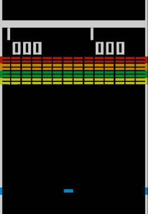
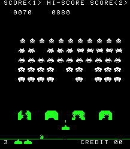
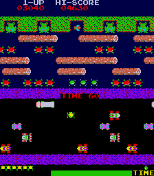

# Auftrag {#sec-auftrag}

Wir wollen ein einfaches Spiel mit **Pygame** erstellen. Pygame ist eine Bibliothek für Python, die es uns ermöglicht, Spiele zu programmieren. In diesem Kapitel wird der Auftrag für unser erstes Pygame-Projekt beschrieben und welche Spiele zur Auswahl stehen.

## Rahmenbedingungen

- Das Spiel soll in Python mit der Pygame-Bibliothek erstellt werden.
- Es wird in Gruppen von 2 Personen gearbeitet.
- Der Code muss komplett selbst erarbeitet werden.

## Abgabe und Zeitplan

- Mitteilung der Gruppenmitglieder bis zum 13.02.2026.
- Abgabe des Projekts: 18.04.2026 um 23:59 Uhr (Ende Frühlingsferien) über den ILIAS-Abgabeordner oder per E-Mail.
- Besprechung des Projekts ab 20.04.2026 (zufällige Reihenfolge).

## Spielauswahl

Die folgenden Spiele stehen zur Auswahl. Es ist auch möglich, ein eigenes Spiel zu entwickeln, solange ein klares Spielkonzept bis zum 13.02.2026 eingereicht wird und von der Lehrperson genehmigt wird.

### Breakout

{width=40%}

Breakout ist ein klassisches Arcade-Spiel, bei dem der Spieler eine Plattform steuert, um einen Ball zu treffen und Blöcke zu zerstören. Ziel ist es, alle Blöcke zu zerstören, ohne den Ball fallen zu lassen.

### Space Invaders

{width=40%}

Space Invaders ist ein klassisches Arcade-Spiel, bei dem der Spieler ein Raumschiff steuert, um Wellen von angreifenden Aliens zu zerstören. Ziel ist es, alle Aliens zu besiegen, bevor sie die Erde erreichen.

### Frogger

{width=40%}

Frogger ist ein klassisches Arcade-Spiel, bei dem der Spieler einen Frosch steuert, um eine Strasse und einen Fluss zu überqueren, ohne von Autos oder anderen Hindernissen getroffen zu werden. Ziel ist es, den Frosch sicher auf die andere Seite zu bringen.

## Anforderungen und Bewertungskriterien

Die Bewertung des Source-Codes erfolgt anhand der folgenden Kriterien:

- **Programm läuft:** Startet und stoppt ohne Fehler.
- **Spielersteuerung:** Der Spieler kann die Spielfigur mit der Tastatur oder Maus steuern.
- **Mehrere Objekte:** Es gibt mehrere Blöcke, Aliens oder Hindernisse, die gleichzeitig auf dem Bildschirm sind und mit Listen verwaltet werden.
- **Nicht Spieler gesteuerte Objekte:** Es gibt Objekte, die sich automatisch und konsistent bewegen (z.B. Ball, Aliens, Autos).
- **Kollisionserkennung:** Es gibt eine Logik, die erkennt, wenn Objekte miteinander kollidieren (z.B. Ball trifft Block, Alien trifft Spieler) und entsprechend reagiert (z.B. Block wird zerstört, Spieler verliert ein Leben).
- **Spielziel:** Es gibt ein klares Ziel, das der Spieler erreichen muss, welches auch überprüft wird und das Spiel entsprechend beendet (z.B. Alle Blöcke zerstört, Alle Aliens besiegt, Frosch sicher auf der anderen Seite).

Zum Source-Code wird zusätzlich eine kurze Dokumentation eingereicht, die die Struktur des Codes erklärt, wie die verschiedenen Teile des Spiels implementiert wurden und welche Herausforderungen es gab. Dieser Bericht kann sehr kurz sein, sollte aber die folgenden Fragen beantworten:

- Wie funktioniert die Spielersteuerung?
- Wie werden die Objekte verwaltet und bewegt?
- Was lief gut? Was lief schlecht? Was würden Sie beim nächsten Mal anders machen?
- Wie hat die Zusammenarbeit in der Gruppe funktioniert? **Weisen Sie klar aus, wer für welche Teile des Codes verantwortlich ist.** Jede Zeile Code muss mindestens einer Person zugeordnet sein!

Im Anschluss an Ihre Abgabe findet eine Besprechung Ihres Spiels in Gruppen mit der Lehrperson statt (ca. 15 Minuten pro Gruppe). Dabei werden Ihnen Fragen zu Ihrem Spiel gestellt, um Ihr Verständnis und Ihre Reflexion zu überprüfen. Achten Sie darauf, in Ihrem Schlussbericht zu erwähnen, wer für welche Teile zuständig war — das Verständnis von jedem Gruppenmitglied wird speziell überprüft. Die Besprechung resultiert in einer **individuellen** Bewertung, welche mit Ihrer Endnote kombiniert wird.

::: {.callout-important icon=false}
## KI-Tools
Es wird von Ihnen erwartet, dass Sie sich aktiv an der Entwicklung des Spiels beteiligen und die geforderten Python-Konzepte verstehen und anwenden können. ChatGPT oder andere KI-Tools dürfen Sie verwenden, **solange Sie Ihren gesamten Code verstehen und erklären können**. Ihre Note kann durch mangelndes Verständnis stark beeinträchtigt werden (bis zur Note 1). Falls Sie ChatGPT oder andere KI-Tools verwenden, müssen Sie dies im Code klar dokumentieren (z.B. mit Kommentaren oder in der Dokumentation). Jede Zeile Code muss mindestens einer Person zugeordnet sein!
:::

Die Empfehlung ist, dass Sie KI-Tools benutzen, wenn Sie bei einem spezifischen Schritt oder Problem nicht weiterkommen, um sich Erklärungen oder Beispiele zu holen. Daraufhin sollten Sie versuchen, den Code selbst zu schreiben und zu verstehen. Versuchen Sie aber zuerst selbstständig vorwärts zu kommen, Sie werden sich überraschen!

---

# Einführung und Installation {#sec-einfuehrung}

In diesem Kapitel entwickeln wir Schritt für Schritt ein eigenes 2D-Game mit `pygame-ce`. `pygame-ce` ist eine moderne, Community-gepflegte Variante von Pygame und wird genau gleich importiert mit `import pygame as pg`. Sie eignet sich hervorragend, um in Python Grafiken, Animationen, Sound und Interaktionen umzusetzen.

Essentielle Bausteine eines Games sind:

- Fenster (Auflösung, Titel) und Zeichenfläche ("screen")
- Game-Schleife mit **Ereignissen** (Tastatur, Maus) und **Zeitsteuerung** (FPS / "refresh rate")
- Zeichnen: Hintergrund, Farben, geometrische Figuren, Bilder ("Sprites")
- **Zustände** und **Objekte** (z.B. Spieler als `Rect`), **Bewegungen** und **Kollisionen**
- **Medien**: Bilder, Icon, Schrift, Sound / Musik

::: {.callout-warning icon=false appearance="simple"}
## Game-Schleife
Ein Game läuft in einer Endlosschleife, bis das Programm beendet wird. In jeder Runde werden der Eingabestatus gelesen ("Events"), der interne Zustand aktualisiert ("Update") und die Szene gezeichnet ("Render"). Eine **Clock** (= Uhr) begrenzt die Bildwiederholrate (FPS), sodass das Game stabil und gleichmässig läuft.
:::

Um **pygame-ce** in VS Code zu installieren, gehen Sie wie folgt vor:

1. Öffnen Sie ein Terminal-Fenster in VS Code ("Terminal" → "New Terminal").
2. Installieren Sie pygame-ce mit pip:
   ```bash
   pip install pygame-ce
   ```
3. Überprüfen Sie die Installation, indem Sie eine neue Python-Datei `game_test.py` mit folgendem Code ausführen:
   ```python
   import pygame as pg
   print(pg.ver)
   ```
   Dieser Code sollte, sofern `pygame-ce` korrekt installiert ist, die Versionsnummer von `pygame-ce` ausgeben. Damit ist `pygame-ce` einsatzbereit und Sie können mit den unten stehenden Übungen starten.

::: {.callout-tip icon=false collapse="true"}
## Gesamter Code: Einführung und Installation

```python
import random # Für Aufgabe 2.3

# Beispiel 2.1
import pygame as pg
pg.init() # Pygame initialisieren (starten)
HEIGHT = 600 # Höhe des Fensters
WIDTH = 800 # Breite des Fensters
WINDOW = (WIDTH, HEIGHT) # Fenstergrösse (als Tuple gespeichert)
screen = pg.display.set_mode(WINDOW) # Fenster erstellen

# Challenge 2.2 ----------------
# icon = pg.image.load("path/to/icon.png")
# pg.display.set_icon(icon)
# ------------------------------

pg.display.set_caption("Mein erstes Game") # Fenstertitel setzen
clock = pg.time.Clock() # Clock für Zeitsteuerung erstellen

running = True # Hauptschleife
while running:
    # --- Events ---
    for event in pg.event.get():
        if event.type == pg.QUIT:
            running = False
    # --- Update --- (Spielzustand aktualisieren)


    # --- render (zeichnen) ---
    # Aufgabe 2.3 ------------------
    # r = random.randint(0, 255)
    # g = random.randint(0, 255)
    # b = random.randint(0, 255)
    # ------------------------------
    # Aufgabe 2.4 ------------------
    # Rechtecke, Kreise, Linien zeichnen
    # ------------------------------
    screen.fill((255,255,255))
    pg.display.flip()
    # --- Zeitsteuerung ---
    clock.tick(60) # 60 FPS
pg.quit()
```
:::

::: {.callout-tip icon=false collapse="true"}
## Lösung

```python
import random # Für Aufgabe 2.3

# Beispiel 2.1
import pygame as pg
pg.init() # Pygame initialisieren (starten)
HEIGHT = 600 # Höhe des Fensters
WIDTH = 800 # Breite des Fensters
WINDOW = (WIDTH, HEIGHT) # Fenstergrösse (als Tuple gespeichert)
screen = pg.display.set_mode(WINDOW) # Fenster erstellen

# Challenge 2.2 ----------------
# icon = pg.image.load("path/to/icon.png")
# pg.display.set_icon(icon)
# ------------------------------

pg.display.set_caption("Mein erstes Game") # Fenstertitel setzen
clock = pg.time.Clock() # Clock für Zeitsteuerung erstellen

running = True # Hauptschleife
while running:
    # --- Events ---
    for event in pg.event.get():
        if event.type == pg.QUIT:
            running = False
    # --- Update --- (Spielzustand aktualisieren)


    # --- render (zeichnen) ---
    # Aufgabe 2.3 ------------------
    r = random.randint(0, 255)
    g = random.randint(0, 255)
    b = random.randint(0, 255)
    screen.fill((r, g, b))
    # ------------------------------
    # Aufgabe 2.4 ------------------
    # Rechtecke, Kreise, Linien zeichnen
    pg.draw.rect(screen, (255, 0, 0), pg.Rect(100, 100, 200, 100)) # rotes Rechteck
    pg.draw.circle(screen, (0, 255, 0), (400, 300), 50) # grüner Kreis
    pg.draw.line(screen, (0, 0, 255), (0, 0), (800, 600), 5) # blaue Linie
    # ------------------------------
    screen.fill((255,255,255))
    pg.display.flip()
    # --- Zeitsteuerung ---
    clock.tick(10) # 10 FPS
pg.quit()
```
:::

::: {.callout-warning icon=false appearance="simple"}
## 💡 Beispiel: Minimale Game-Schleife
Folgender Code zeigt den minimalen Aufbau eines Pygame-Programms mit Fenster, Game-Schleife und Ereignisverarbeitung. Kopieren Sie den Code in eine Datei `game_intro.py` und führen Sie ihn in VS Code aus.

```python
import pygame as pg

pg.init()  # Pygame initialisieren (starten)
HEIGHT = 600  # Höhe des Fensters
WIDTH = 800  # Breite des Fensters
WINDOW = (WIDTH, HEIGHT)  # Fenstergrösse (als Tuple gespeichert)
screen = pg.display.set_mode(WINDOW)  # Fenster erstellen
pg.display.set_caption("Mein erstes Game")  # Fenstertitel setzen
clock = pg.time.Clock()  # Clock für Zeitsteuerung erstellen

running = True  # Hauptschleife
while running:
    # --- Events ---
    for event in pg.event.get():
        if event.type == pg.QUIT:
            running = False

    # --- Update --- (Spielzustand aktualisieren)

    # --- render (zeichnen) ---
    screen.fill((30, 30, 40))
    pg.display.flip()

    # --- Zeitsteuerung ---
    clock.tick(60)  # 60 FPS

pg.quit()
```

Ein schwarzes Fenster sollte erscheinen, das Sie mit dem Schliessen-Knopf beenden können.
:::


::: {.callout-note icon=false}
## ✏️ Übung 2.1: Fenster-Titel setzen
Setzen Sie einen passenden Fenstertitel, indem Sie folgende Zeile abändern:

```python
pg.display.set_caption("IHR TITEL HIER...")
```
:::


::: {.callout-note icon=false}
## 🏆 Challenge 2.2: Fenster-Icon setzen
Laden Sie ein Fenster-Icon (`.png` oder `.jpg`):
Laden Sie ein beliebiges Bild aus dem Internet herunter, speichern Sie es unter den Downloads und ziehen Sie es in Ihren Projektordner in VS Code (dort wo auch Ihre Python-Datei ist). Fügen Sie nun diese beiden Zeilen nach `pg.display.set_mode(...)` ein:

```python
icon = pg.image.load("path/to/icon.png")
pg.display.set_icon(icon)
```

Wenn Ihr Ordner beispielsweise `Informatik/` heisst und das Bild unter `Informatik/Game/icon.png` gespeichert ist, dann verwenden Sie `pg.image.load("Game/icon.png")`.

Bei Windows ändert sich nur das Fenster-Icon, bei macOS wird das Icon nur im Dock angezeigt.

:::


::: {.callout-note icon=false}
## ✏️ Übung 2.3: Hintergrund zeichnen
Füllen Sie den Hintergrund pro Frame mit einer Farbe mittels `screen.fill((R,G,B))`. Experimentieren Sie mit zufällig generierten Farbtönen:

```python
import random
# ...
# In der Game-Schleife, im Render-Abschnitt:
r = random.randint(0, 255)
g = random.randint(0, 255)
b = random.randint(0, 255)
screen.fill((r, g, b))
```

Die Farbe muss in der Hauptschleife, aber noch vor `pg.display.flip()`, gesetzt werden.

- Was ändert sich, wenn Sie die drei Zeilen für die Farbwerte `r, g, b` vor die Hauptschleife setzen?
- Schreiben Sie den Code so um, dass die Farbe nur alle 10 Frames geändert wird.

:::


::: {.callout-note icon=false}
## ✏️ Übung 2.4: Geometrische Figuren
Zeichnen Sie geometrische Formen: Rechteck, Kreis, Linie. Nutzen Sie dafür `pg.draw.rect`, `pg.draw.circle` und `pg.draw.line`. Achten Sie darauf, **nach** dem Zeichnen `pg.display.flip()` aufzurufen. Versuchen Sie, mittels folgender Befehle einen Apfel zu zeichnen:

```python
pg.draw.rect(screen, rect_color, pg.Rect(rect_x, rect_y, rect_width, rect_height))
pg.draw.circle(screen, circle_color, (circle_x, circle_y), circle_radius)
pg.draw.line(screen, line_color, (start_x, start_y), (end_x, end_y), line_width)
```

Dabei bezeichnen die Parameter Folgendes:

- `screen`: die Zeichenfläche
- `rect_color, circle_color, line_color`: Farbe als RGB-Tupel, z.B. `(255, 0, 0)` für Rot
- `pg.Rect(...)`: Rechteck-Objekt mit Position (x, y) und Grösse (width, height)
- `(circle_x, circle_y)`: Mittelpunkt des Kreises
- `circle_radius`: Radius des Kreises
- `(start_x, start_y), (end_x, end_y)`: Start- und Endpunkt der Linie
- `line_width`: Dicke der Linie in Pixeln (optional)
:::

---

# Kollisionen und Bewegung {#sec-kollisionen}

::: {.callout-tip icon=false collapse="true"}
## Gesamter Code: Kollisionen und Bewegung

```python
 # Beispiel 3.1
import pygame as pg
pg.init()
HEIGHT = 600
WIDTH = 800 
WINDOW = (WIDTH, HEIGHT)
screen = pg.display.set_mode(WINDOW) 

mein_rechteck = pg.Rect(100, 100, 100, 50)
# Aufgabe 3.1:
# Variablen vx, vy definieren und mit einem Wert belegen

pg.display.set_caption("Bouncing Rectangle")
clock = pg.time.Clock()

running = True 
while running:
    # --- Events ---
    for event in pg.event.get():
        if event.type == pg.QUIT:
            running = False

    # --- Update --- 
    # Aufgabe 3.2:
    # Kollision mit den Wänden erkennen und die Richtung ändern

    # Aufgabe 3.1:
    # Position des Rechtecks aktualisieren


    # --- Render ---
    screen.fill((255,255,255))
    pg.draw.rect(screen, (255, 0, 0), mein_rechteck)

    # ------------------------------
    pg.display.flip()

    clock.tick(60) 
pg.quit()

```

:::

::: {.callout-tip icon=false collapse="true"}
## Lösung 

```python
 # Beispiel 3.1
import pygame as pg
import random
pg.init()
HEIGHT = 600
WIDTH = 800 
WINDOW = (WIDTH, HEIGHT)
screen = pg.display.set_mode(WINDOW) 

mein_rechteck = pg.Rect(100, 100, 100, 50)
# Aufgabe 3.1:
# Variablen vx, vy definieren und mit einem Wert belegen
vx = 3
vy = 3

rechteck_farbe = (255, 0, 0) # Rot

pg.display.set_caption("Bouncing Rectangle")
clock = pg.time.Clock()

running = True 
while running:
    # --- Events ---
    for event in pg.event.get():
        if event.type == pg.QUIT:
            running = False

    # --- Update --- 
    # Aufgabe 3.2:
    # Kollision mit den Wänden erkennen und die Richtung ändern
    if mein_rechteck.left <= 0 or mein_rechteck.right >= WIDTH:
        vx = -vx  # Richtung in x-Richtung umkehren
        rechteck_farbe = (random.randint(0, 255), random.randint(0, 255), random.randint(0, 255)) # Farbe ändern bei Kollision
    if mein_rechteck.top <= 0 or mein_rechteck.bottom >= HEIGHT:
        vy = -vy  # Richtung in y-Richtung umkehren
        rechteck_farbe = (random.randint(0, 255), random.randint(0, 255), random.randint(0, 255)) # Farbe ändern bei Kollision
    
    # Aufgabe 3.1:
    # Position des Rechtecks aktualisieren
    mein_rechteck.x += vx
    mein_rechteck.y += vy

    # --- Render ---
    screen.fill((255,255,255))
    pg.draw.rect(screen, rechteck_farbe, mein_rechteck)

    # ------------------------------
    pg.display.flip()

    clock.tick(60) 
pg.quit()

```

:::

In diesem Kapitel erweitern wir unser Game um Bewegung und Kollisionen. Wir werden lernen, wie man ein Objekt (z.B. einen Spieler) mit der Tastatur steuert und wie man Kollisionen zwischen Objekten erkennt und darauf reagiert. Diese Konzepte sind zentral für die meisten Spiele, da sie die Interaktion zwischen dem Spieler und der Spielwelt ermöglichen.

::: {.callout-warning icon=false appearance="simple"}
## 💡 Beispiel: Game-Schleife mit Rect
Folgender Code zeigt wieder eine minimale Game-Schleife. Diesmal haben wir zusätzlich noch eine Variable `mein_rechteck` definiert, die ein `Rect`-Objekt speichert. Ein `Rect` ist ein Rechteck, das durch seine obere linke Ecke (x, y) und seine Breite und Höhe definiert ist. In diesem Beispiel ist unser Rechteck 100×50 Pixel gross und startet bei (100, 100). Weiter unten im Code wird das Rechteck gezeichnet mit:

```python
pg.draw.rect(screen, (255, 0, 0), mein_rechteck)
```

Wir können diese Zeile folgendermassen interpretieren:
"Zeichne ein rotes Rechteck auf der Zeichenfläche `screen` an der Position und mit der Grösse, die durch `mein_rechteck` definiert ist."

```python
import pygame as pg

pg.init()
HEIGHT = 600
WIDTH = 800
WINDOW = (WIDTH, HEIGHT)
screen = pg.display.set_mode(WINDOW)

mein_rechteck = pg.Rect(100, 100, 100, 50)

pg.display.set_caption("Bouncing Rectangle")
clock = pg.time.Clock()

running = True
while running:
    # --- Events ---
    for event in pg.event.get():
        if event.type == pg.QUIT:
            running = False

    # --- Update ---

    # --- Render ---
    screen.fill((255, 255, 255))
    pg.draw.rect(screen, (255, 0, 0), mein_rechteck)

    # ------------------------------
    pg.display.flip()

    clock.tick(60)

pg.quit()
```
:::

Wir können die Eigenschaften eines `Rect`-Objekts wie folgt abfragen und ändern:

```python
# Abfrage der Position und Grösse
x = mein_rechteck.x
y = mein_rechteck.y
width = mein_rechteck.width
height = mein_rechteck.height
# Änderung der Position
mein_rechteck.x += 5  # Bewegt das Rechteck 5 Pixel nach rechts
mein_rechteck.y += 5  # Bewegt das Rechteck 5 Pixel nach unten
```


::: {.callout-note icon=false}
## ✏️ Übung 3.1: Bewegen des Rechtecks
Kopieren Sie den obigen Code in eine neue Datei. Definieren Sie dann zwei neue Variablen (am gleichen Ort wie `mein_rechteck`) `vx` und `vy`, die die Geschwindigkeit des Rechtecks in x- und y-Richtung speichern.

Benutzen Sie dann `vx` und `vy`, um die Position des Rechtecks in der Hauptschleife zu aktualisieren.
:::

Das Rechteck bewegt sich jetzt automatisch, wandert aber aus dem Fenster heraus. Um das zu verhindern, können wir die Position des Rechtecks überprüfen und anpassen, wenn es den Rand des Fensters erreicht.

Wir können die obere und untere Grenze sowie die linke und rechte Grenze des Rechtecks mit den Eigenschaften `top`, `bottom`, `left` und `right` abfragen. Zum Beispiel:

```python
linke_grenze = mein_rechteck.left
rechte_grenze = mein_rechteck.right
obere_grenze = mein_rechteck.top
untere_grenze = mein_rechteck.bottom
```


::: {.callout-note icon=false}
## ✏️ Übung 3.2: Kollision mit dem Fensterrand
Fügen Sie in der Hauptschleife eine Überprüfung hinzu, ob das Rechteck den Rand des Fensters erreicht hat. Wenn ja, soll die Richtung der Bewegung umgekehrt werden (was heisst das mathematisch?).

Benutzen Sie dafür die Eigenschaften `top`, `bottom`, `left` und `right` des Rechtecks und die Fenstergrösse (die Sie in `pg.display.set_mode(...)` definiert haben).
:::


::: {.callout-note icon=false}
## ✏️ Übung 3.3: Farbe ändern bei Kollision
Ändern Sie die Farbe des Rechtecks, wenn es den Rand des Fensters berührt. Zum Beispiel könnte es rot sein, wenn es sich frei bewegt, und grün, wenn es den Rand berührt.

Benutzen Sie dafür eine Variable `farbe`, die die aktuelle Farbe des Rechtecks speichert. Z.B.:

```python
farbe = (255, 0, 0)  # Rot
```

Aktualisieren Sie diese Variable entsprechend, wenn eine Kollision mit dem Rand erkannt wird, und verwenden Sie sie dann im `pg.draw.rect(…)`-Befehl.

Benutzen Sie die zufällige Farbengenerierung aus dem vorherigen Kapitel, um die Farbe bei jeder Kollision zu ändern.
:::

---

# Tastatursteuerung und Kollisionen {#sec-steuerung}


::: {.callout-tip icon=false collapse="true"}
## Gesamter Code: Tastatursteuerung und Kollisionen

```python
# Kapitel 4: Tastatursteuerung und Kollisionen
import pygame as pg
import random

pg.init()
HEIGHT = 600
WIDTH = 800 
WINDOW = (WIDTH, HEIGHT)
screen = pg.display.set_mode(WINDOW) 

# Aus vorherigem Kapitel:
mein_rechteck = pg.Rect(100, 100, 100, 50)
vx = 3
vy = 3

# Aufgabe 4.2: Spieler definieren
# spieler = pg.Rect(TODO)
# spieler_farbe = TODO

# Aufgabe 4.4: Hindernisse erstellen (3-5 Rechtecke)


# Aufgabe 4.5: Sammelobjekte erstellen (5-10 kleine Rechtecke, zufällig verteilt)


# Aufgabe 4.6: Wände für Labyrinth erstellen


speed = 5  # Spielergeschwindigkeit

pg.display.set_caption("Tastatursteuerung")
clock = pg.time.Clock()

running = True 
while running:
    # --- Events ---
    for event in pg.event.get():
        if event.type == pg.QUIT:
            running = False
        
        # Aufgabe 4.1: Event-basierte Tastaturabfrage
        # Bei KEYDOWN die Position des Spielers um 10 Pixel verschieben


    # --- Update --- 
    # Aus vorherigem Kapitel: Rechteck bewegen. TODO: Durch Aufgabe 4.1 ersetzen
    mein_rechteck.x += vx
    mein_rechteck.y += vy

    # Aufgabe 4.2: Zustandsbasierte Tastaturabfrage
    # Spieler mit Pfeiltasten bewegen (get_pressed)


    # Aufgabe 4.3: Fenster-Grenzen
    # Spieler darf nicht aus dem Fenster herauslaufen


    # Aufgabe 4.4: Kollision mit Hindernissen erkennen
    # Farbe ändern oder Spieler zurücksetzen


    # Aufgabe 4.5: Kollision mit Sammelobjekten
    # Objekt aus der Liste entfernen (pop) und Zähler erhöhen


    # Aufgabe 4.6: Kollisionsvermeidung (Labyrinth)
    # Alte Position speichern, bei Wandkollision zurücksetzen


    # --- Render ---
    screen.fill((255, 255, 255))
    
    # Aus vorherigem Kapitel: Rechteck zeichnen
    pg.draw.rect(screen, (255, 0, 0), mein_rechteck)

    # Spieler zeichnen
    # pg.draw.rect(screen, spieler_farbe, spieler)
    
    # Aufgabe 4.4: Hindernisse zeichnen (grau)
    

    # Aufgabe 4.5: Sammelobjekte zeichnen (gelb/gold)
    

    # Aufgabe 4.6: Wände zeichnen (dunkelgrau)
    

    # ------------------------------
    pg.display.flip()
    clock.tick(60) 

pg.quit()
```

:::

## Lösung

```python
# Kapitel 4: Tastatursteuerung und Kollisionen
import pygame as pg
import random

pg.init()
HEIGHT = 600
WIDTH = 800 
WINDOW = (WIDTH, HEIGHT)
screen = pg.display.set_mode(WINDOW) 

# Aus vorherigem Kapitel:
mein_rechteck = pg.Rect(100, 100, 100, 50)
vx = 3
vy = 3

# Aufgabe 4.2: Spieler definieren
spieler = pg.Rect(WIDTH//2 - 20, HEIGHT//2 - 20, 40, 40) # Spieler-Rechteck in der Mitte des Fensters
spieler_farbe = (0, 0, 255)  # Blau

# Aufgabe 4.4: Hindernisse erstellen (3-5 Rechtecke)
hindernis1 = pg.Rect(random.randint(0, WIDTH - 20), random.randint(0, HEIGHT - 20), 20, 20)
hindernis2 = pg.Rect(random.randint(0, WIDTH - 20), random.randint(0, HEIGHT - 20), 20, 20)
hindernis3 = pg.Rect(random.randint(0, WIDTH - 20), random.randint(0, HEIGHT - 20), 20, 20)

# Aufgabe 4.5: Sammelobjekte erstellen (5-10 kleine Rechtecke, zufällig verteilt)
sammelobjekt_farbe = (255, 215, 0) # Gold
sammelobjekte = []
for _ in range(10):
    x = random.randint(0, WIDTH - 20)
    y = random.randint(0, HEIGHT - 20)
    sammelobjekt = pg.Rect(x, y, 20, 20)
    sammelobjekte.append(sammelobjekt)

# Aufgabe 4.6: Wände für Labyrinth erstellen
wände = []
for _ in range(5):
    x = random.randint(0, WIDTH - 100)
    y = random.randint(0, HEIGHT - 20)
    wand = pg.Rect(x, y, 100, 20)
    wände.append(wand)

speed = 5  # Spielergeschwindigkeit

pg.display.set_caption("Tastatursteuerung")
clock = pg.time.Clock()

running = True 
while running:
    # --- Events ---
    for event in pg.event.get():
        if event.type == pg.QUIT:
            running = False
        
        # Aufgabe 4.1: Event-basierte Tastaturabfrage
        # Bei KEYDOWN die Position des Spielers um 10 Pixel verschieben
        if event.type == pg.KEYDOWN:
            if event.key == pg.K_w:
                mein_rechteck.y -= 10
            if event.key == pg.K_s:
                mein_rechteck.y += 10
            if event.key == pg.K_a:
                mein_rechteck.x -= 10
            if event.key == pg.K_d:
                mein_rechteck.x += 10

    # --- Update --- 
    # Aus vorherigem Kapitel: Rechteck bewegen. TODO: Durch Aufgabe 4.1 ersetzen
    # mein_rechteck.x += vx
    # mein_rechteck.y += vy

    alte_position = spieler.topleft # Alte Position speichern für Aufgabe 4.6

    # Aufgabe 4.2: Zustandsbasierte Tastaturabfrage
    # Spieler mit Pfeiltasten bewegen (get_pressed)
    keys = pg.key.get_pressed()
    if keys[pg.K_UP]:
        spieler.y -= speed
    if keys[pg.K_DOWN]:
        spieler.y += speed
    if keys[pg.K_LEFT]:
        spieler.x -= speed
    if keys[pg.K_RIGHT]:
        spieler.x += speed

    # Aufgabe 4.3: Fenster-Grenzen
    # Spieler darf nicht aus dem Fenster herauslaufen
    if spieler.left < 0:
        spieler.left = 0
    if spieler.right > WIDTH:
        spieler.right = WIDTH
    if spieler.top < 0:
        spieler.top = 0
    if spieler.bottom > HEIGHT:
        spieler.bottom = HEIGHT

    # Aufgabe 4.4: Kollision mit Hindernissen erkennen
    # Farbe ändern oder Spieler zurücksetzen
    if spieler.colliderect(hindernis1) or spieler.colliderect(hindernis2) or spieler.colliderect(hindernis3):
        spieler_farbe = (random.randint(0, 255), random.randint(0, 255), random.randint(0, 255)) # Farbe ändern bei Kollision
        spieler.x = WIDTH//2 - 20 # Spieler zurücksetzen
        spieler.y = HEIGHT//2 - 20

    # Aufgabe 4.5: Kollision mit Sammelobjekten
    # Objekt aus der Liste entfernen (pop) und Zähler erhöhen
    kollisionsindex = spieler.collidelist(sammelobjekte)
    if kollisionsindex != -1:
        sammelobjekte.pop(kollisionsindex) # Objekt entfernen

    # Aufgabe 4.6: Kollisionsvermeidung (Labyrinth)
    # Alte Position speichern, bei Wandkollision zurücksetzen
    kollisionsindex = spieler.collidelist(wände)
    if kollisionsindex != -1:
        spieler.topleft = alte_position # Spieler zurücksetzen bei Kollision mit Wand

    # --- Render ---
    screen.fill((255, 255, 255))
    
    # Aus vorherigem Kapitel: Rechteck zeichnen
    pg.draw.rect(screen, (255, 0, 0), mein_rechteck)

    # Spieler zeichnen
    pg.draw.rect(screen, spieler_farbe, spieler)
    
    # Aufgabe 4.4: Hindernisse zeichnen (grau)
    pg.draw.rect(screen, (128, 128, 128), hindernis1)
    pg.draw.rect(screen, (128, 128, 128), hindernis2)
    pg.draw.rect(screen, (128, 128, 128), hindernis3)

    # Aufgabe 4.5: Sammelobjekte zeichnen (gelb/gold)
    for sammelobjekt in sammelobjekte:
        pg.draw.rect(screen, (255, 215, 0), sammelobjekt)

    # Aufgabe 4.6: Wände zeichnen (dunkelgrau)
    for wand in wände:
        pg.draw.rect(screen, (64, 64, 64), wand)

    # ------------------------------
    pg.display.flip()
    clock.tick(60) 

pg.quit()
```

:::


In diesem Kapitel lernen wir, wie man ein Spielerobjekt mit der Tastatur steuert und wie man Kollisionen zwischen mehreren Objekten erkennt.

## Tastatureingaben verarbeiten


Im Gegensatz zur automatischen Bewegung aus dem vorherigen Kapitel wollen wir nun, dass der Spieler das Objekt direkt mit der Tastatur steuern kann. Dafür gibt es in Pygame zwei Hauptansätze:

::: {.callout-warning icon=false appearance="simple"}
## Event-basierte Tastaturabfrage
Bei der **event-basierten** Abfrage werden Tastaturereignisse in der Event-Schleife verarbeitet. Ein `pg.KEYDOWN`-Event wird ausgelöst, wenn eine Taste *gedrückt* wird, und ein `pg.KEYUP`-Event, wenn sie *losgelassen* wird. Dieser Ansatz eignet sich für einmalige Aktionen wie Springen oder Schiessen.
:::

::: {.callout-warning icon=false appearance="simple"}
## Zustandsbasierte Tastaturabfrage
Bei der **zustandsbasierten** Abfrage wird mit `pg.key.get_pressed()` abgefragt, welche Tasten aktuell gedrückt sind. Dies liefert kontinuierliche Bewegung und eignet sich besser für Spielersteuerung, bei der eine Taste gedrückt gehalten wird.
:::

### Event-basierte Tastaturabfrage

Folgende Code-Zeilen zeigen, wie man auf einzelne Tastendruck-Events reagiert:

```python
# --- Events ---
for event in pg.event.get():
    if event.type == pg.QUIT:
        running = False

    if event.type == pg.KEYDOWN:
        if event.key == pg.K_UP:
            print("Pfeiltaste HOCH gedrückt")
        if event.key == pg.K_DOWN:
            print("Pfeiltaste RUNTER gedrückt")
        if event.key == pg.K_LEFT:
            print("Pfeiltaste LINKS gedrückt")
        if event.key == pg.K_RIGHT:
            print("Pfeiltaste RECHTS gedrückt")
        if event.key == pg.K_SPACE:
            print("LEERTASTE gedrückt")
```

Weitere wichtige Tastencodes:

- Buchstaben: `pg.K_a`, `pg.K_b`, `pg.K_c`, ..., `pg.K_z`
- Ziffern: `pg.K_0`, `pg.K_1`, ..., `pg.K_9`
- Escape: `pg.K_ESCAPE`
- Enter: `pg.K_RETURN`


::: {.callout-note icon=false}
## ✏️ Übung 4.1: Event-basierte Bewegung
Kopieren Sie den Code aus dem vorherigen Kapitel.

1. Entfernen Sie die automatische Bewegung (die Variablen `vx` und `vy`).
2. Fügen Sie in der Event-Schleife Code hinzu, der das Rechteck bei jedem Tastendruck um 10 Pixel in die entsprechende Richtung bewegt.
3. Testen Sie das Programm. Was fällt Ihnen auf? Wie unterscheidet sich diese Steuerung von typischen Spielen?
:::

### Zustandsbasierte Tastaturabfrage (empfohlen)

Für eine flüssigere Spielersteuerung ist die zustandsbasierte Abfrage besser geeignet:

```python
# --- Update ---
keys = pg.key.get_pressed()

# Spielergeschwindigkeit
speed = 5

# Bewegung basierend auf gedrückten Tasten
if keys[pg.K_UP]:
    spieler_rechteck.y -= speed
if keys[pg.K_DOWN]:
    spieler_rechteck.y += speed
if keys[pg.K_LEFT]:
    spieler_rechteck.x -= speed
if keys[pg.K_RIGHT]:
    spieler_rechteck.x += speed
```

::: {.callout-caution icon=false appearance="simple"}
## Bemerkung: Funktionsweise
Die Funktion `pg.key.get_pressed()` gibt eine Liste zurück, in der für jede Taste angegeben ist, ob sie gerade gedrückt ist (`True`) oder nicht (`False`). Die Variablen `pg.K_UP`, `pg.K_DOWN`, `pg.K_LEFT` und `pg.K_RIGHT` entsprechen den Indizes für die Pfeiltasten in dieser Liste.

Die for-Schleife mit `pg.event.get()` funktioniert nach dem gleichen Prinzip.
:::


::: {.callout-note icon=false}
## ✏️ Übung 4.2: Flüssige Tastatursteuerung
Erstellen Sie ein neues Programm mit folgenden Eigenschaften:

1. Erstellen Sie ein `spieler_rechteck` mit Grösse 40×40 in der Mitte des Fensters.
2. Implementieren Sie die zustandsbasierte Tastaturabfrage wie oben gezeigt.
3. Zeichnen Sie den Spieler in einer Farbe Ihrer Wahl.
4. Testen Sie die Steuerung. Fühlt sich diese besser an als die event-basierte Variante?
:::


::: {.callout-note icon=false}
## ✏️ Übung 4.3: Fenster-Grenzen
Der Spieler kann aktuell aus dem Fenster herauslaufen. Fügen Sie Code hinzu, der verhindert, dass der Spieler den Fensterrand überschreitet. Benutzen Sie dafür die Eigenschaften `left`, `right`, `top` und `bottom` des Rechtecks sowie die Konstanten `WIDTH` und `HEIGHT`.

**Tipp:** Überprüfen Sie nach jeder Bewegung die Position und korrigieren Sie sie, falls nötig:

```python
if spieler_rechteck.left < 0:
    spieler_rechteck.left = 0
# ... weitere Grenzen
```
:::

## Kollisionserkennung

Pygame bietet eingebaute Kollisionserkennungs-Methoden für `Rect`-Objekte:

::: {.callout-warning icon=false appearance="simple"}
## Kollisionsmethoden

- `rect1.colliderect(rect2)`: Gibt `True` zurück, wenn sich zwei Rechtecke überschneiden.
- `rect.collidepoint(x, y)`: Gibt `True` zurück, wenn ein Punkt innerhalb des Rechtecks liegt.
- `rect.collidelist(liste_von_rects)`: Gibt den Index des ersten Rechtecks in der Liste zurück, mit dem eine Kollision vorliegt, sonst `-1`.
- `rect.collidelistall(liste_von_rects)`: Gibt eine Liste aller Indizes zurück, mit denen Kollisionen vorliegen.
:::

### Einfache Kollision zwischen zwei Objekten

Folgendes Code-Beispiel zeigt, wie man eine Kollision zwischen zwei Rechtecken erkennt:

```python
# Vor der Game-Schleife: Objekte definieren
spieler = pg.Rect(100, 100, 40, 40)
hindernis = pg.Rect(400, 300, 80, 80)

# In der Update-Sektion der Game-Schleife
if spieler.colliderect(hindernis):
    print("Kollision erkannt!")
    # Hier kann man z.B. die Farbe ändern oder Game Over auslösen
```


::: {.callout-note icon=false}
## ✏️ Übung 4.4: Hinderniskurs
Erweitern Sie Ihr Programm aus der vorherigen Übung:

1. Erstellen Sie 3–5 Hindernisse (Rechtecke) an verschiedenen Positionen.
2. Zeichnen Sie diese Hindernisse in einer anderen Farbe als den Spieler.
3. Überprüfen Sie in jedem Frame, ob der Spieler mit einem der Hindernisse kollidiert.
4. Wenn eine Kollision erkannt wird, ändern Sie die Farbe des Spielers.
5. **Bonus:** Setzen Sie den Spieler bei einer Kollision zurück zur Startposition.
:::

### Kollision mit mehreren Objekten

Wenn wir viele Objekte haben, ist es praktischer, sie in einer Liste zu speichern:

```python
# Vor der Game-Schleife
spieler = pg.Rect(100, 100, 40, 40)
hindernisse = [
    pg.Rect(200, 150, 50, 50),
    pg.Rect(400, 300, 60, 60),
    pg.Rect(600, 200, 70, 30),
    pg.Rect(300, 450, 80, 40)
]

# In der Update-Sektion
kollisionsindex = spieler.collidelist(hindernisse)
if kollisionsindex != -1:
    print(f"Kollision mit Hindernis {kollisionsindex}")
    # Reagiere auf Kollision

# Im Render-Teil: Alle Hindernisse zeichnen
for hindernis in hindernisse:
    pg.draw.rect(screen, (100, 100, 100), hindernis)
```


::: {.callout-note icon=false}
## ✏️ Übung 4.5: Sammelobjekte
Erstellen Sie ein kleines Sammel-Spiel:

1. Erstellen Sie eine Liste mit 5–10 kleinen Rechtecken, die Münzen oder Sammelobjekte darstellen.
2. Verteilen Sie diese zufällig im Fenster (benutzen Sie `random.randint(...)`).
3. Zeichnen Sie die Sammelobjekte in gelb oder gold.
4. Wenn der Spieler ein Objekt berührt, entfernen Sie es aus der Liste mit `liste.pop(index)`.
5. Zählen Sie, wie viele Objekte gesammelt wurden, und geben Sie dies in der Konsole aus.

**Hinweis:** Um ein Objekt nach Kollision zu entfernen:

```python
if kollisionsindex != -1:
    sammelobjekte.pop(kollisionsindex)
    anzahl_gesammelt += 1
```
:::

### Kollisionsvermeidung

Manchmal wollen wir nicht nur erkennen, dass eine Kollision stattgefunden hat, sondern auch verhindern, dass der Spieler durch Hindernisse hindurchgeht:

```python
# Speichere alte Position vor der Bewegung
alte_x = spieler.x
alte_y = spieler.y

# Bewege den Spieler basierend auf Tastatureingaben
keys = pg.key.get_pressed()
if keys[pg.K_UP]:
    spieler.y -= speed
if keys[pg.K_DOWN]:
    spieler.y += speed
if keys[pg.K_LEFT]:
    spieler.x -= speed
if keys[pg.K_RIGHT]:
    spieler.x += speed

# Überprüfe Kollision
if spieler.collidelist(hindernisse) != -1:
    # Setze Position zurück
    spieler.x = alte_x
    spieler.y = alte_y
```


::: {.callout-note icon=false}
## ✏️ Übung 4.6: Labyrinth
Erstellen Sie ein einfaches Labyrinth:

1. Erstellen Sie mehrere Wandrechtecke, die ein Labyrinth bilden.
2. Implementieren Sie Kollisionsvermeidung, sodass der Spieler nicht durch Wände gehen kann.
3. Erstellen Sie ein Zielrechteck (z.B. in grün).
4. Wenn der Spieler das Ziel erreicht, geben Sie eine Erfolgsmeldung aus.
:::

## Bonus: Maussteuerung

Zusätzlich zur Tastatur können wir auch die Maus zur Steuerung verwenden:

```python
# Mausposition abfragen
maus_x, maus_y = pg.mouse.get_pos()

# Spieler zur Mausposition bewegen (sanft)
spieler.x += (maus_x - spieler.centerx) * 0.1
spieler.y += (maus_y - spieler.centery) * 0.1
```

Für Mausklicks verwenden wir Events:

```python
# In der Event-Schleife
for event in pg.event.get():
    if event.type == pg.QUIT:
        running = False

    if event.type == pg.MOUSEBUTTONDOWN:
        if event.button == 1:  # Linksklick
            print("Linke Maustaste gedrückt")
        if event.button == 3:  # Rechtsklick
            print("Rechte Maustaste gedrückt")
```

Oder wir fragen den aktuellen Zustand ab:

```python
# Zustand aller Maustasten abfragen
maus_tasten = pg.mouse.get_pressed()
if maus_tasten[0]:  # Linke Maustaste
    print("Linke Maustaste ist gedrückt")
```


::: {.callout-note icon=false}
## 🏆 Challenge 4.7: Maussteuerung
Erstellen Sie ein Programm, bei dem der Spieler der Maus folgt:

1. Der Spieler bewegt sich kontinuierlich in Richtung der Mausposition.
2. Die Bewegungsgeschwindigkeit soll konstant sein (verwenden Sie Trigonometrie oder normalisieren Sie den Vektor).
3. Bei Linksklick soll ein Projektil in Richtung Mausposition abgefeuert werden.
4. Optional: Fügen Sie Hindernisse hinzu, die das Projektil zerstören.

**Tipp für konstante Geschwindigkeit:**

```python
import math

dx = maus_x - spieler.centerx
dy = maus_y - spieler.centery
distanz = math.sqrt(dx**2 + dy**2)
if distanz > 0:  # Verhindere Division durch 0
    dx = dx / distanz * speed
    dy = dy / distanz * speed
    spieler.x += dx
    spieler.y += dy
```
:::

---

# Text, Punktestand und Spielzustände {#sec-spielzustaende}

In diesem Kapitel lernen wir, wie man Text auf dem Bildschirm anzeigt (z.B. einen Punktestand oder eine Nachricht), und wie man verschiedene Spielzustände verwaltet (z.B. Startbildschirm, Spielen, Game Over). Diese Konzepte sind essenziell, um aus einer technischen Demo ein vollständiges Spiel zu machen.

## Text anzeigen mit `pg.font`

Um Text in Pygame anzuzeigen, benötigen wir zwei Schritte:

1. **Font erstellen:** Wir erstellen ein Font-Objekt, das Schriftart und Grösse definiert.
2. **Text rendern:** Wir rendern den Text in eine Oberfläche ("Surface"), die wir dann auf den Bildschirm zeichnen.

```python
# Font erstellen (None = Standardschrift, 36 = Schriftgrösse)
font = pg.font.Font(None, 36)

# Text rendern (Text, Anti-Aliasing, Farbe)
text_surface = font.render("Hallo Pygame!", True, (255, 255, 255))

# Text auf den Bildschirm zeichnen
screen.blit(text_surface, (x, y))
```

::: {.callout-warning icon=false appearance="simple"}
## `font.render()` und `screen.blit()`
Die Methode `font.render(text, antialias, farbe)` erstellt eine neue Oberfläche ("Surface") mit dem gerenderten Text. Der Parameter `antialias` (immer `True` setzen) sorgt für geglättete Kanten. Mit `screen.blit(surface, (x, y))` wird diese Oberfläche an der Position (x, y) auf den Bildschirm kopiert. `blit` steht für "Block Image Transfer" und ist die allgemeine Methode, um eine Oberfläche auf eine andere zu zeichnen.
:::

<!-- ::: {.callout-warning icon=false appearance="simple"}
## 💡 Beispiel: Text auf dem Bildschirm

```python
import pygame as pg

pg.init()
WIDTH, HEIGHT = 800, 600
screen = pg.display.set_mode((WIDTH, HEIGHT))
pg.display.set_caption("Text-Beispiel")
clock = pg.time.Clock()

# Font erstellen
font_gross = pg.font.Font(None, 72)
font_klein = pg.font.Font(None, 36)

running = True
while running:
    for event in pg.event.get():
        if event.type == pg.QUIT:
            running = False

    # --- Render ---
    screen.fill((30, 30, 40))

    # Titel oben in der Mitte anzeigen
    titel = font_gross.render("Mein Spiel", True, (255, 255, 100))
    titel_rect = titel.get_rect(center=(WIDTH // 2, 50))
    screen.blit(titel, titel_rect)

    # Kleinerer Text darunter
    info = font_klein.render("Drücke ESC zum Beenden", True, (200, 200, 200))
    info_rect = info.get_rect(center=(WIDTH // 2, 100))
    screen.blit(info, info_rect)

    pg.display.flip()
    clock.tick(60)

pg.quit()
```

Beachten Sie: Mit `get_rect(center=(x, y))` können wir den Text zentriert positionieren, anstatt die obere linke Ecke manuell zu berechnen. Weitere nützliche Positionierungs-Parameter sind `topleft`, `topright`, `bottomleft`, `bottomright`, `midtop`, `midbottom`, `midleft` und `midright`.
::: -->


::: {.callout-note icon=false}
## ✏️ Übung 5.1: Punktestand anzeigen
Erweitern Sie Ihr Sammel-Spiel aus dem vorherigen Kapitel (oder erstellen Sie ein neues Programm):

1. Erstellen Sie eine Variable `punkte`, die bei 0 beginnt.
2. Erstellen Sie einen Font mit Grösse 36.
3. Jedes Mal, wenn der Spieler ein Sammelobjekt berührt, erhöhen Sie `punkte` um 1.
4. Zeigen Sie den aktuellen Punktestand oben links im Fenster an: `"Punkte: 5"`.
5. Verwenden Sie einen **f-String**, um die Variable in den Text einzufügen:

```python
text_surface = font.render(f"Punkte: {punkte}", True, (255, 255, 255))
screen.blit(text_surface, (10, 10))
```

::: {.callout-tip icon=false collapse="true"}
## Startcode

```python
import pygame as pg
import random

pg.init()
WIDTH, HEIGHT = 800, 600
screen = pg.display.set_mode((WIDTH, HEIGHT))
pg.display.set_caption("Sammelspiel")
clock = pg.time.Clock()

# TODO: Font erstellen

spieler = pg.Rect(WIDTH // 2 - 20, HEIGHT // 2 - 20, 40, 40)
speed = 5

# Sammelobjekte erstellen
sammelobjekte = []
for i in range(10):
    x = random.randint(0, WIDTH - 20)
    y = random.randint(0, HEIGHT - 20)
    sammelobjekte.append(pg.Rect(x, y, 20, 20))

# TODO: Variable für Punktestand erstellen

running = True
while running:
    for event in pg.event.get():
        if event.type == pg.QUIT:
            running = False

    # --- Update ---
    keys = pg.key.get_pressed()
    if keys[pg.K_UP]:
        spieler.y -= speed
    if keys[pg.K_DOWN]:
        spieler.y += speed
    if keys[pg.K_LEFT]:
        spieler.x -= speed
    if keys[pg.K_RIGHT]:
        spieler.x += speed

    # Fenster-Grenzen
    if spieler.left < 0:
        spieler.left = 0
    if spieler.right > WIDTH:
        spieler.right = WIDTH
    if spieler.top < 0:
        spieler.top = 0
    if spieler.bottom > HEIGHT:
        spieler.bottom = HEIGHT

    # Kollision mit Sammelobjekten
    kollisionsindex = spieler.collidelist(sammelobjekte)
    if kollisionsindex != -1:
        sammelobjekte.pop(kollisionsindex)
        # TODO: Punkte erhöhen

    # --- Render ---
    screen.fill((30, 30, 40))

    for obj in sammelobjekte:
        pg.draw.rect(screen, (255, 215, 0), obj)
    pg.draw.rect(screen, (0, 150, 255), spieler)

    # TODO: Punktestand als Text anzeigen (oben links)

    pg.display.flip()
    clock.tick(60)

pg.quit()
```
:::
:::


::: {.callout-note icon=false}
## ✏️ Übung 5.2: Timer anzeigen
Fügen Sie Ihrem Programm einen Timer hinzu, der die vergangene Spielzeit anzeigt:

1. Speichern Sie die Startzeit mit `pg.time.get_ticks()` vor der Game-Schleife.
2. Berechnen Sie in jedem Frame die vergangene Zeit in Sekunden:

```python
startzeit = pg.time.get_ticks()  # Vor der Game-Schleife

# In der Game-Schleife (Render-Abschnitt):
vergangene_zeit = (pg.time.get_ticks() - startzeit) // 1000
timer_text = font.render(f"Zeit: {vergangene_zeit}s", True, (255, 255, 255))
screen.blit(timer_text, (WIDTH - 150, 10))
```

3. Zeigen Sie den Timer oben rechts im Fenster an.

::: {.callout-tip icon=false collapse="true"}
## Startcode

```python
import pygame as pg
import random

pg.init()
WIDTH, HEIGHT = 800, 600
screen = pg.display.set_mode((WIDTH, HEIGHT))
pg.display.set_caption("Sammelspiel")
clock = pg.time.Clock()

font = pg.font.Font(None, 36)

spieler = pg.Rect(WIDTH // 2 - 20, HEIGHT // 2 - 20, 40, 40)
speed = 5

# Sammelobjekte erstellen
sammelobjekte = []
for i in range(10):
    x = random.randint(0, WIDTH - 20)
    y = random.randint(0, HEIGHT - 20)
    sammelobjekte.append(pg.Rect(x, y, 20, 20))

punkte = 0
# TODO: Startzeit speichern mit pg.time.get_ticks()

running = True
while running:
    for event in pg.event.get():
        if event.type == pg.QUIT:
            running = False

    # --- Update ---
    keys = pg.key.get_pressed()
    if keys[pg.K_UP]:
        spieler.y -= speed
    if keys[pg.K_DOWN]:
        spieler.y += speed
    if keys[pg.K_LEFT]:
        spieler.x -= speed
    if keys[pg.K_RIGHT]:
        spieler.x += speed

    # Fenster-Grenzen
    if spieler.left < 0:
        spieler.left = 0
    if spieler.right > WIDTH:
        spieler.right = WIDTH
    if spieler.top < 0:
        spieler.top = 0
    if spieler.bottom > HEIGHT:
        spieler.bottom = HEIGHT

    # Kollision mit Sammelobjekten
    kollisionsindex = spieler.collidelist(sammelobjekte)
    if kollisionsindex != -1:
        sammelobjekte.pop(kollisionsindex)
        punkte += 1

    # --- Render ---
    screen.fill((30, 30, 40))

    for obj in sammelobjekte:
        pg.draw.rect(screen, (255, 215, 0), obj)
    pg.draw.rect(screen, (0, 150, 255), spieler)

    # Punktestand anzeigen
    punkte_text = font.render(f"Punkte: {punkte}", True, (255, 255, 255))
    screen.blit(punkte_text, (10, 10))

    # TODO: Vergangene Zeit berechnen und oben rechts anzeigen

    pg.display.flip()
    clock.tick(60)

pg.quit()
```
:::

:::

## Spielzustände

Ein typisches Spiel besteht nicht nur aus dem eigentlichen Gameplay, sondern aus mehreren **Zuständen** (engl. "states"). Die häufigsten Spielzustände sind:

- **Startbildschirm** ("Menu"): Titel, Anleitung, "Drücke ENTER zum Starten"
- **Spielen** ("Playing"): Das eigentliche Gameplay
- **Game Over**: Endbildschirm mit Punktestand und Option zum Neustarten

Wir können diese Zustände mit einer einfachen Variable und `if`/`elif`-Bedingungen verwalten:

```python
# Mögliche Zustände
zustand = "menu"  # Startzustand

running = True
while running:
    for event in pg.event.get():
        if event.type == pg.QUIT:
            running = False

    if zustand == "menu":
        # Startbildschirm anzeigen und auf Eingabe warten
        ...
    elif zustand == "playing":
        # Eigentliches Spiel
        ...
    elif zustand == "game_over":
        # Game Over Bildschirm
        ...

    pg.display.flip()
    clock.tick(60)
```

::: {.callout-warning icon=false appearance="simple"}
## Zustandswechsel
Der Wechsel zwischen Zuständen erfolgt, indem die Variable `zustand` auf einen neuen Wert gesetzt wird. Zum Beispiel:

- Im Menü: Wenn der Spieler ENTER drückt → `zustand = "playing"`
- Beim Spielen: Wenn alle Leben verloren sind → `zustand = "game_over"`
- Bei Game Over: Wenn der Spieler R drückt → `zustand = "menu"` (oder `"playing"`)
:::

::: {.callout-warning icon=false appearance="simple"}
## 💡 Beispiel: Spiel mit drei Zuständen
Folgender Code zeigt ein minimales Spiel mit Startbildschirm, Gameplay und Game-Over-Bildschirm:

```python
import pygame as pg
import random

pg.init()
WIDTH, HEIGHT = 800, 600
screen = pg.display.set_mode((WIDTH, HEIGHT))
pg.display.set_caption("Zustandsbasiertes Spiel")
clock = pg.time.Clock()

font_gross = pg.font.Font(None, 72)
font_klein = pg.font.Font(None, 36)

def spiel_zuruecksetzen():
    """Setzt alle Spielvariablen auf den Anfangszustand zurück."""
    global spieler, punkte, leben, sammelobjekte
    spieler = pg.Rect(WIDTH // 2 - 20, HEIGHT // 2 - 20, 40, 40)
    punkte = 0
    leben = 3
    sammelobjekte = []
    for i in range(10):
        x = random.randint(0, WIDTH - 20)
        y = random.randint(0, HEIGHT - 20)
        sammelobjekte.append(pg.Rect(x, y, 20, 20))

# Startzustand
zustand = "menu"
spiel_zuruecksetzen()
speed = 5

running = True
while running:
    for event in pg.event.get():
        if event.type == pg.QUIT:
            running = False

        if event.type == pg.KEYDOWN:
            if zustand == "menu" and event.key == pg.K_RETURN:
                zustand = "playing"
                spiel_zuruecksetzen()
            elif zustand == "game_over" and event.key == pg.K_r:
                zustand = "menu"

    # ===================== MENU =====================
    if zustand == "menu":
        screen.fill((20, 20, 50))

        titel = font_gross.render("Sammelspiel", True, (255, 255, 100))
        titel_rect = titel.get_rect(center=(WIDTH // 2, HEIGHT // 3))
        screen.blit(titel, titel_rect)

        start_text = font_klein.render(
            "Drücke ENTER zum Starten", True, (200, 200, 200)
        )
        start_rect = start_text.get_rect(center=(WIDTH // 2, HEIGHT // 2))
        screen.blit(start_text, start_rect)

    # =================== PLAYING ====================
    elif zustand == "playing":
        keys = pg.key.get_pressed()
        if keys[pg.K_UP]:
            spieler.y -= speed
        if keys[pg.K_DOWN]:
            spieler.y += speed
        if keys[pg.K_LEFT]:
            spieler.x -= speed
        if keys[pg.K_RIGHT]:
            spieler.x += speed

        # Fenster-Grenzen
        spieler.clamp_ip(screen.get_rect())

        # Kollision
        kollisionsindex = spieler.collidelist(sammelobjekte)
        if kollisionsindex != -1:
            sammelobjekte.pop(kollisionsindex)
            punkte += 1

        # Alle gesammelt → Game Over (gewonnen)
        if len(sammelobjekte) == 0:
            zustand = "game_over"

        # --- Render ---
        screen.fill((30, 30, 40))
        for obj in sammelobjekte:
            pg.draw.rect(screen, (255, 215, 0), obj)
        pg.draw.rect(screen, (0, 150, 255), spieler)

        # HUD (Heads-Up Display)
        punkte_text = font_klein.render(
            f"Punkte: {punkte}", True, (255, 255, 255)
        )
        screen.blit(punkte_text, (10, 10))
        leben_text = font_klein.render(
            f"Leben: {leben}", True, (255, 100, 100)
        )
        screen.blit(leben_text, (10, 40))

    # ================== GAME OVER ===================
    elif zustand == "game_over":
        screen.fill((50, 20, 20))

        go_text = font_gross.render("Game Over", True, (255, 80, 80))
        go_rect = go_text.get_rect(center=(WIDTH // 2, HEIGHT // 3))
        screen.blit(go_text, go_rect)

        ergebnis = font_klein.render(
            f"Punkte: {punkte}", True, (255, 255, 255)
        )
        ergebnis_rect = ergebnis.get_rect(center=(WIDTH // 2, HEIGHT // 2))
        screen.blit(ergebnis, ergebnis_rect)

        neustart = font_klein.render(
            "Drücke R für Neustart", True, (200, 200, 200)
        )
        neustart_rect = neustart.get_rect(center=(WIDTH // 2, HEIGHT // 2 + 50))
        screen.blit(neustart, neustart_rect)

    pg.display.flip()
    clock.tick(60)

pg.quit()
```

Beachten Sie, wie die Funktion `spiel_zuruecksetzen()` mit `global` alle Spielvariablen auf ihre Anfangswerte zurücksetzt und wie `spieler.clamp_ip(screen.get_rect())` den Spieler elegant innerhalb des Fensters hält (alternative Methode zu den manuellen Grenzüberprüfungen).
:::


::: {.callout-note icon=false}
## ✏️ Übung 5.3: Spielzustände implementieren
Erweitern Sie Ihr bestehendes Spiel um drei Zustände:

1. **Menü:** Zeigen Sie einen Titel und eine Startanleitung an. Das Spiel startet, wenn ENTER gedrückt wird.
2. **Spielen:** Das eigentliche Spiel läuft. Zeigen Sie den Punktestand und die verbleibenden Leben an.
3. **Game Over:** Zeigen Sie den finalen Punktestand an und bieten Sie die Möglichkeit zum Neustart (z.B. mit der Taste R).

**Tipps:**

- Verwenden Sie eine Variable `zustand` mit den Werten `"menu"`, `"playing"` und `"game_over"`.
- Verwenden Sie `pg.KEYDOWN`-Events für die Zustandswechsel (ENTER, R).
- Erstellen Sie eine Funktion `spiel_zuruecksetzen()`, die alle Spielvariablen auf die Anfangswerte zurücksetzt.

::: {.callout-tip icon=false collapse="true"}
## Startcode

```python
import pygame as pg
import random

pg.init()
WIDTH, HEIGHT = 800, 600
screen = pg.display.set_mode((WIDTH, HEIGHT))
pg.display.set_caption("Sammelspiel mit Zuständen")
clock = pg.time.Clock()

font_gross = pg.font.Font(None, 72)
font_klein = pg.font.Font(None, 36)

def spiel_zuruecksetzen():
    """Setzt alle Spielvariablen auf den Anfangszustand zurück."""
    global spieler, punkte, leben, sammelobjekte
    spieler = pg.Rect(WIDTH // 2 - 20, HEIGHT // 2 - 20, 40, 40)
    punkte = 0
    leben = 3
    sammelobjekte = []
    for i in range(10):
        x = random.randint(0, WIDTH - 20)
        y = random.randint(0, HEIGHT - 20)
        sammelobjekte.append(pg.Rect(x, y, 20, 20))

# Startzustand
zustand = "menu"
spiel_zuruecksetzen()
speed = 5

running = True
while running:
    for event in pg.event.get():
        if event.type == pg.QUIT:
            running = False

        # TODO: Zustandswechsel bei KEYDOWN-Events
        #   - Im Menü: ENTER → zustand = "playing" (+ spiel_zuruecksetzen())
        #   - Bei Game Over: R → zustand = "menu"

    # ===================== MENU =====================
    if zustand == "menu":
        screen.fill((20, 20, 50))
        # TODO: Titel und Startanleitung anzeigen

    # =================== PLAYING ====================
    elif zustand == "playing":
        keys = pg.key.get_pressed()
        if keys[pg.K_UP]:
            spieler.y -= speed
        if keys[pg.K_DOWN]:
            spieler.y += speed
        if keys[pg.K_LEFT]:
            spieler.x -= speed
        if keys[pg.K_RIGHT]:
            spieler.x += speed

        spieler.clamp_ip(screen.get_rect())

        # Kollision
        kollisionsindex = spieler.collidelist(sammelobjekte)
        if kollisionsindex != -1:
            sammelobjekte.pop(kollisionsindex)
            punkte += 1

        # TODO: Prüfen ob alle Sammelobjekte eingesammelt → Game Over

        # --- Render ---
        screen.fill((30, 30, 40))
        for obj in sammelobjekte:
            pg.draw.rect(screen, (255, 215, 0), obj)
        pg.draw.rect(screen, (0, 150, 255), spieler)

        # TODO: HUD anzeigen (Punkte, Leben)

    # ================== GAME OVER ===================
    elif zustand == "game_over":
        screen.fill((50, 20, 20))
        # TODO: Game-Over-Text, Punktestand und Neustart-Hinweis anzeigen

    pg.display.flip()
    clock.tick(60)

pg.quit()
```
:::
:::


::: {.callout-note icon=false}
## ✏️ Übung 5.4: Leben und Game Over
Erweitern Sie Ihr Spiel um ein Leben-System:

1. Der Spieler startet mit 3 Leben.
2. Erstellen Sie ein oder mehrere "Feind"-Rechtecke, die sich automatisch bewegen (ähnlich wie das bouncing rectangle aus Kapitel 3).
3. Wenn der Spieler mit einem Feind kollidiert, verliert er ein Leben und wird zur Startposition zurückgesetzt.
4. Zeigen Sie die verbleibenden Leben auf dem Bildschirm an.
5. Wenn alle Leben aufgebraucht sind, wechseln Sie zum Zustand `"game_over"`.

::: {.callout-tip icon=false collapse="true"}
## Startcode

```python
import pygame as pg
import random

pg.init()
WIDTH, HEIGHT = 800, 600
screen = pg.display.set_mode((WIDTH, HEIGHT))
pg.display.set_caption("Leben und Game Over")
clock = pg.time.Clock()

font_gross = pg.font.Font(None, 72)
font_klein = pg.font.Font(None, 36)

def spiel_zuruecksetzen():
    global spieler, punkte, leben, sammelobjekte, feinde
    spieler = pg.Rect(WIDTH // 2 - 20, HEIGHT // 2 - 20, 40, 40)
    punkte = 0
    leben = 3
    sammelobjekte = []
    for i in range(10):
        x = random.randint(0, WIDTH - 20)
        y = random.randint(0, HEIGHT - 20)
        sammelobjekte.append(pg.Rect(x, y, 20, 20))

    # TODO: Feinde erstellen
    # Feinde bestehen aus drei Listen: feind_rects, feind_vx, feind_vy
    # Beispiel für einen Feind:
    # feind_rects = [pg.Rect(100, 100, 30, 30)]
    # feind_vx = [3]
    # feind_vy = [2]
    feinde = []  # Liste von Feind-Rects
    # feind_vx = []  # Liste von x-Geschwindigkeiten
    # feind_vy = []  # Liste von y-Geschwindigkeiten

zustand = "menu"
spiel_zuruecksetzen()
speed = 5

running = True
while running:
    for event in pg.event.get():
        if event.type == pg.QUIT:
            running = False
        if event.type == pg.KEYDOWN:
            if zustand == "menu" and event.key == pg.K_RETURN:
                zustand = "playing"
                spiel_zuruecksetzen()
            elif zustand == "game_over" and event.key == pg.K_r:
                zustand = "menu"

    if zustand == "menu":
        screen.fill((20, 20, 50))
        titel = font_gross.render("Sammelspiel", True, (255, 255, 100))
        titel_rect = titel.get_rect(center=(WIDTH // 2, HEIGHT // 3))
        screen.blit(titel, titel_rect)
        start_text = font_klein.render("Drücke ENTER zum Starten", True, (200, 200, 200))
        start_rect = start_text.get_rect(center=(WIDTH // 2, HEIGHT // 2))
        screen.blit(start_text, start_rect)

    elif zustand == "playing":
        keys = pg.key.get_pressed()
        if keys[pg.K_UP]:
            spieler.y -= speed
        if keys[pg.K_DOWN]:
            spieler.y += speed
        if keys[pg.K_LEFT]:
            spieler.x -= speed
        if keys[pg.K_RIGHT]:
            spieler.x += speed
        spieler.clamp_ip(screen.get_rect())

        # TODO: Feinde bewegen und an Fensterrand abprallen lassen

        # Kollision mit Sammelobjekten
        kollisionsindex = spieler.collidelist(sammelobjekte)
        if kollisionsindex != -1:
            sammelobjekte.pop(kollisionsindex)
            punkte += 1

        # TODO: Kollision mit Feinden prüfen
        #   - Leben abziehen
        #   - Spieler zur Startposition zurücksetzen
        #   - Falls leben == 0 → zustand = "game_over"

        if len(sammelobjekte) == 0:
            zustand = "game_over"

        # --- Render ---
        screen.fill((30, 30, 40))
        for obj in sammelobjekte:
            pg.draw.rect(screen, (255, 215, 0), obj)
        pg.draw.rect(screen, (0, 150, 255), spieler)

        # TODO: Feinde zeichnen (z.B. in Rot)

        # HUD
        punkte_text = font_klein.render(f"Punkte: {punkte}", True, (255, 255, 255))
        screen.blit(punkte_text, (10, 10))
        # TODO: Leben anzeigen

    elif zustand == "game_over":
        screen.fill((50, 20, 20))
        go_text = font_gross.render("Game Over", True, (255, 80, 80))
        go_rect = go_text.get_rect(center=(WIDTH // 2, HEIGHT // 3))
        screen.blit(go_text, go_rect)
        ergebnis = font_klein.render(f"Punkte: {punkte}", True, (255, 255, 255))
        ergebnis_rect = ergebnis.get_rect(center=(WIDTH // 2, HEIGHT // 2))
        screen.blit(ergebnis, ergebnis_rect)
        neustart = font_klein.render("Drücke R für Neustart", True, (200, 200, 200))
        neustart_rect = neustart.get_rect(center=(WIDTH // 2, HEIGHT // 2 + 50))
        screen.blit(neustart, neustart_rect)

    pg.display.flip()
    clock.tick(60)

pg.quit()
```
:::
:::


::: {.callout-note icon=false}
## 🏆 Challenge 5.5: Vollständiges Mini-Spiel
Kombinieren Sie alle bisher gelernten Konzepte zu einem vollständigen Mini-Spiel:

1. **Menü** mit Titel und Startanleitung.
2. **Spielfeld** mit Spieler (Tastatursteuerung), Sammelobjekten und mindestens einem Feind.
3. **HUD** mit Punktestand, Leben und Timer.
4. **Game Over** mit Endpunktzahl und Neustart-Option.
5. **Gewinn-Bedingung:** Alle Sammelobjekte eingesammelt → Gewonnen-Bildschirm.
6. **Verlier-Bedingung:** Alle Leben verloren → Game-Over-Bildschirm.

Dieses Mini-Spiel deckt bereits die meisten Anforderungen aus dem Auftrag (@sec-auftrag) ab!

::: {.callout-tip icon=false collapse="true"}
## Startcode

```python
import pygame as pg
import random

pg.init()
WIDTH, HEIGHT = 800, 600
screen = pg.display.set_mode((WIDTH, HEIGHT))
pg.display.set_caption("Mini-Spiel")
clock = pg.time.Clock()

font_gross = pg.font.Font(None, 72)
font_klein = pg.font.Font(None, 36)

def spiel_zuruecksetzen():
    global spieler, punkte, leben, sammelobjekte, feinde
    spieler = pg.Rect(WIDTH // 2 - 20, HEIGHT // 2 - 20, 40, 40)
    punkte = 0
    leben = 3
    sammelobjekte = []
    feinde = []  # Liste von Feind-Rects
    # feind_vx = []  # Liste von x-Geschwindigkeiten
    # feind_vy = []  # Liste von y-Geschwindigkeiten
    for i in range(10):
        x = random.randint(0, WIDTH - 20)
        y = random.randint(0, HEIGHT - 20)
        sammelobjekte.append(pg.Rect(x, y, 20, 20))

    # TODO: Feinde erstellen (mit Geschwindigkeit)

zustand = "menu"
spiel_zuruecksetzen()
speed = 5
# TODO: Startzeit für Timer speichern

running = True
while running:
    for event in pg.event.get():
        if event.type == pg.QUIT:
            running = False
        if event.type == pg.KEYDOWN:
            if zustand == "menu" and event.key == pg.K_RETURN:
                zustand = "playing"
                spiel_zuruecksetzen()
                # TODO: Startzeit zurücksetzen
            elif zustand == "game_over" and event.key == pg.K_r:
                zustand = "menu"

    # ===================== MENU =====================
    if zustand == "menu":
        screen.fill((20, 20, 50))
        # TODO: Titel und Startanleitung anzeigen

    # =================== PLAYING ====================
    elif zustand == "playing":
        keys = pg.key.get_pressed()
        if keys[pg.K_UP]:
            spieler.y -= speed
        if keys[pg.K_DOWN]:
            spieler.y += speed
        if keys[pg.K_LEFT]:
            spieler.x -= speed
        if keys[pg.K_RIGHT]:
            spieler.x += speed
        spieler.clamp_ip(screen.get_rect())

        # TODO: Feinde bewegen und an Fensterrand abprallen lassen

        # Kollision mit Sammelobjekten
        kollisionsindex = spieler.collidelist(sammelobjekte)
        if kollisionsindex != -1:
            sammelobjekte.pop(kollisionsindex)
            punkte += 1

        # TODO: Kollision mit Feinden prüfen (Leben abziehen, zurücksetzen)
        # TODO: Gewinn-Bedingung prüfen (alle gesammelt)
        # TODO: Verlier-Bedingung prüfen (keine Leben mehr)

        # --- Render ---
        screen.fill((30, 30, 40))
        for obj in sammelobjekte:
            pg.draw.rect(screen, (255, 215, 0), obj)
        pg.draw.rect(screen, (0, 150, 255), spieler)

        # TODO: Feinde zeichnen
        # TODO: HUD anzeigen (Punkte, Leben, Timer)

    # ================== GAME OVER ===================
    elif zustand == "game_over":
        screen.fill((50, 20, 20))
        # TODO: Game-Over- oder Gewonnen-Text anzeigen
        # TODO: Endpunktzahl anzeigen
        # TODO: Neustart-Hinweis anzeigen

    pg.display.flip()
    clock.tick(60)

pg.quit()
```
:::
:::
